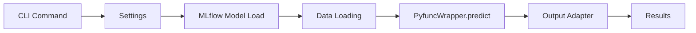
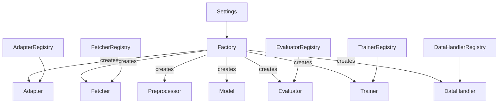

# Modern ML Pipeline 시스템 분석 보고서

## 📋 개요

이 보고서는 Modern ML Pipeline (MMP) 시스템의 전체 구조와 데이터 흐름을 분석하여, 향후 불필요한 주석 정리 작업을 위한 기반 자료를 제공합니다.

**분석 대상**: v5.3+ Phase 시스템 (여러 리팩토링을 거친 현재 상태)
**분석 일시**: 2025-09-07
**분석 목적**: 불필요한 주석, 버전명, 설명 정리를 위한 시스템 이해

---

## 🏗️ 시스템 아키텍처

### 1. 전체 구조
```
modern-ml-pipeline/
├── src/
│   ├── cli/              # CLI 인터페이스 (Typer 기반)
│   ├── pipelines/        # 핵심 파이프라인 (train, inference)
│   ├── factory/          # Factory 패턴으로 컴포넌트 생성
│   ├── components/       # 플러그인형 컴포넌트들
│   ├── settings/         # 설정 로더 및 검증
│   ├── interface/        # 추상 인터페이스 정의
│   ├── models/           # 커스텀 모델 구현
│   ├── serving/          # FastAPI 서빙 엔드포인트
│   └── utils/            # 공통 유틸리티
├── configs/              # 환경별 인프라 설정
├── recipes/              # 모델별 워크플로우 정의
└── templates/            # Jinja2 템플릿
```

### 2. 핵심 설계 원칙

#### 🔄 Factory Pattern + Registry Pattern
- **Factory**: 모든 컴포넌트를 통일된 방식으로 생성
- **Registry**: 플러그인 형태로 컴포넌트 자동 등록
- **캐싱**: 동일 컴포넌트 재사용으로 성능 최적화

#### 📊 Settings = Config + Recipe
- **Config**: 환경별 인프라 설정 (DB, MLflow, Feature Store 등)
- **Recipe**: 환경 독립적 워크플로우 (모델, 전처리, 평가 등)
- **분리 설계**: 동일 Recipe를 여러 환경에서 재사용 가능

#### 🔌 컴포넌트 기반 모듈성
- 각 컴포넌트가 독립적으로 교체 가능
- Interface 기반 추상화로 일관된 API 제공
- Registry를 통한 동적 로딩

---

## 📄 템플릿 시스템 분석

### 1. Config Template (config.yaml.j2)
**위치**: `src/cli/templates/configs/config.yaml.j2` (204줄)

#### 주요 구성 요소:
- **Environment**: 환경별 기본 설정
- **MLflow**: 실험 추적 설정
- **Data Source**: DB/Storage 연결 설정  
- **Feature Store**: Feast 연동 설정
- **Serving**: API 서빙 설정
- **Output**: 결과 저장 위치 설정

#### 주석 현황:
```yaml
# Configuration for {{ env_name }} environment  # 템플릿 주석
# Environment-specific settings are defined in each adapter/store config  # 설명 주석
# Registry는 feature/entity 정의를 저장하는 메타데이터 DB  # 상세 설명
# 실제 데이터가 아닌 "어떤 feature가 있는지" 정보만 저장  # 추가 설명
```

### 2. Recipe Template (recipe.yaml.j2)
**위치**: `src/cli/templates/recipes/recipe.yaml.j2` (118줄)

#### 주요 구성 요소:
- **Model**: 모델 클래스 및 하이퍼파라미터
- **Data**: 데이터 소스 및 인터페이스
- **Preprocessor**: 전처리 파이프라인
- **Evaluation**: 평가 메트릭 및 검증 방법
- **Metadata**: 작성자, 생성일시, 설명

#### 주석 현황:
```yaml
# Recipe: {{ recipe_name }}  # 기본 헤더
# Generated: {{ timestamp }}  # 생성 정보
# Optuna 튜닝 설정  # 기능 설명
# 모든 파라미터 고정값  # 모드 설명  
# 처치 변수 (causal task 전용)  # 태스크별 설명
```

---

## 🖥️ CLI 시스템 분석

### 1. 진입점 (main_commands.py)
**위치**: `src/cli/main_commands.py` (163줄)

#### 구조:
```python
app = typer.Typer()  # 메인 CLI 앱
├── init          # 프로젝트 초기화
├── get-config    # 환경 설정 생성
├── get-recipe    # 모델 레시피 생성
├── system-check  # 연결 상태 확인
├── train         # 학습 실행
├── batch-inference # 배치 추론
├── serve-api     # API 서빙
└── list/         # 컴포넌트 목록
    ├── adapters
    ├── evaluators
    ├── preprocessors
    └── models
```

#### 주석 현황:
```python
"""
Modern ML Pipeline CLI - Main Commands Router
단순 라우팅만 담당하는 메인 CLI 진입점

CLAUDE.md 원칙 준수:  # 개발 원칙 언급
- 타입 힌트 필수
- Google Style Docstring  
- 단일 책임 원칙
"""

# ASCII Art Banner (7줄)
# Console for rich output
# Main CLI App with custom epilog for banner
```

### 2. 핵심 커맨드들

#### Train Command (`train_command.py`, 115줄)
- **기능**: 학습 파이프라인 실행
- **Phase 표기**: "Phase 5.3 리팩토링" 
- **주요 주석**: 
  - 기능 설명
  - 사용 예제 3가지
  - Jinja 렌더링 보안 검증 언급

#### Init Command (`init_command.py`, 123줄)  
- **기능**: 프로젝트 초기화
- **Phase 표기**: "Phase 2: Simplified project initialization"
- **주요 주석**:
  - CLAUDE.md 원칙 준수 언급
  - 생성되는 구조 상세 설명

#### Get Recipe Command (`get_recipe_command.py`, 127줄)
- **기능**: 대화형 레시피 생성  
- **Phase 표기**: "Phase 4: Environment-independent recipe generation"
- **주요 주석**:
  - 환경 독립적 설계 강조
  - 프로세스 8단계 나열

---

## ⚙️ 파이프라인 시스템 분석

### 1. Train Pipeline (`train_pipeline.py`, 133줄)

#### 핵심 흐름:
```python
def run_train_pipeline(settings, context_params):
    # 1. 재현성 설정 (시드)
    # 2. MLflow 실행 컨텍스트
    # 3. Factory 생성
    # 4. 데이터 로딩
    # 5. 컴포넌트 초기화 (fetcher, datahandler, preprocessor, model, evaluator, trainer)
    # 6. 모델 학습
    # 7. 결과 로깅
    # 8. PyfuncWrapper 생성 (Phase 5)
    # 9. Enhanced Model 저장
    # 10. 메타데이터 저장
```

#### 주석 현황:
- 각 단계별 숫자 주석 (# 1., # 2., ...)
- "🆕" 이모지로 신기능 표시
- "Factory를 통해", "순수 로직" 등 설계 의도 설명
- RichConsoleManager 관련 주석

### 2. Inference Pipeline (`inference_pipeline.py`, 197줄)

#### 핵심 흐름:
```python
def run_inference_pipeline(settings, run_id, data_path, context_params):
    # 1. MLflow 실행 컨텍스트
    # 2. 모델 로드  
    # 3. 데이터 로딩 (CLI data_path 우선, Jinja 렌더링 지원)
    # 4. 예측 실행
    # 5. 메타데이터 추가
    # 6. 결과 저장
```

#### 주석 현황:
- "Phase 5.3: --data-path로 직접 데이터 경로를 지정"
- "🆕 Phase 3: SQL 문자열이 Jinja2 템플릿인지 감지"
- 보안 검증 관련 상세 주석
- 에러 처리 시나리오별 주석

---

## 🏭 Factory 시스템 분석

### 1. Factory Class (`factory.py`, 571줄)

#### 핵심 책임:
- 모든 컴포넌트의 통합 생성
- Registry 패턴과 연동
- 컴포넌트 캐싱
- 설정 기반 자동 타입 결정

#### 주요 메서드:
```python
create_data_adapter()     # 데이터 어댑터
create_fetcher()          # Feature Store 연동
create_preprocessor()     # 전처리 파이프라인
create_model()            # ML 모델
create_evaluator()        # 평가기
create_trainer()          # 학습기
create_datahandler()      # 데이터 핸들러
create_pyfunc_wrapper()   # MLflow 래퍼
```

#### 주석 현황:
```python
"""
현대화된 Recipe 설정(settings.recipe)에 기반하여 모든 핵심 컴포넌트를 생성하는 중앙 팩토리 클래스.
일관된 접근 패턴과 캐싱을 통해 효율적인 컴포넌트 생성을 보장합니다.
"""

# 클래스 변수: 컴포넌트 등록 상태 추적
# 현대화된 Recipe 구조 검증
# 자주 사용하는 경로 캐싱 (일관된 접근 패턴)
# 생성된 컴포넌트 캐싱
```

### 2. Settings Loader (`loader.py`, 436줄)

#### 핵심 기능:
- Config + Recipe → Settings 통합
- 환경변수 치환 (`${VAR:default}`)
- 호환성 검증
- 런타임 필드 추가

#### 주석 현황:
```python
"""
Settings Loader - CLI 호환 로딩 로직 (v3.0)
새로운 YAML 구조를 정확히 파싱하고 검증
완전히 재작성됨 - CLI 생성 파일과 100% 호환
"""

# 환경변수 치환 - ${VAR:default} 패턴 지원
# CLI 템플릿에서 사용하는 패턴과 100% 호환
# 전체 문자열이 환경변수인지 확인
```

---

## 🔍 주석 패턴 분석

### 1. 문제가 있는 주석 패턴들

#### A. 과도한 버전/Phase 표기
```python
# Phase 5.3 리팩토링
# Phase 2: Simplified project initialization  
# Phase 4: Environment-independent recipe generation
# 🆕 Phase 3: SQL 문자열이 Jinja2 템플릿인지 감지
# v3.0
# CLI 호환 로딩 로직 (v3.0)
```

#### B. 불필요한 상태/변화 설명
```python
# 완전히 재작성됨 - CLI 생성 파일과 100% 호환
# 새로운 YAML 구조를 정확히 파싱하고 검증
# 현대화된 Recipe 설정(settings.recipe)에 기반하여
```

#### C. 중복적인 설명 주석
```python
# Console for rich output
console = Console()

# 생성된 컴포넌트 캐싱
self._component_cache: Dict[str, Any] = {}
```

#### D. 개발 프로세스 언급
```python
"""
CLAUDE.md 원칙 준수:
- 타입 힌트 필수
- Google Style Docstring
- 단일 책임 원칙
"""
```

### 2. 유지해야 할 주석 패턴들

#### A. 비즈니스 로직 설명
```python
# SQL 파일은 모든 SQL 타입 어댑터와 호환 (sql, bigquery)
# Registry는 feature/entity 정의를 저장하는 메타데이터 DB
# 실제 데이터가 아닌 "어떤 feature가 있는지" 정보만 저장
```

#### B. 보안/검증 관련
```python
# 보안 검증 관련 주석들
# Jinja 렌더링 보안 검증
```

#### C. 알고리즘/로직 설명
```python
# source_uri 패턴을 보고 어댑터가 자동 결정됨
# .sql → SQL adapter, .csv/.parquet → Storage adapter
```

---

## 📊 데이터 플로우 분석

### 1. 학습 파이프라인 플로우

```mermaid
graph LR
    A[CLI Command] --> B[Settings Loader]
    B --> C[Factory]
    C --> D[Data Adapter]
    D --> E[DataFrame]
    E --> F[Fetcher]
    F --> G[DataHandler]  
    G --> H[Preprocessor]
    H --> I[Model]
    I --> J[Trainer]
    J --> K[Evaluator]
    K --> L[PyfuncWrapper]
    L --> M[MLflow]
```


### 2. 추론 파이프라인 플로우


### 3. 컴포넌트 관계도


---

## ⚠️ 주석 정리 우선순위

### 🔴 High Priority (즉시 정리 필요)
1. **Phase/Version 표기** - 모든 Phase 5.x, v3.0 등 버전 표기
2. **리팩토링 언급** - "완전히 재작성됨", "현대화된" 등
3. **개발 원칙 언급** - "CLAUDE.md 원칙 준수" 등
4. **상태 변화 설명** - "새로운 구조", "100% 호환" 등

### 🟡 Medium Priority (검토 후 정리)
1. **중복 설명** - 코드로 명확한 것의 반복 설명
2. **과도한 이모지** - 🆕, ✅ 등의 과도한 사용
3. **임시/테스트 코멘트** - TODO가 아닌 개발 과정 흔적

### 🟢 Low Priority (유지 권장)
1. **비즈니스 로직** - 도메인 지식이 필요한 설명
2. **보안 관련** - 보안 검증 로직 설명
3. **복잡한 알고리즘** - 이해를 돕는 핵심 로직 설명
4. **설정 예시** - 사용자 가이드 역할

---

## 📝 결론 및 권장사항

### 1. 시스템 특징 요약
- **고도로 모듈화된 아키텍처**: Factory + Registry 패턴
- **설정 중심 설계**: Config + Recipe 분리
- **다중 Phase 개발**: 여러 리팩토링을 거친 복잡한 히스토리
- **CLI 중심 사용성**: Typer 기반 직관적 인터페이스

### 2. 주석 정리 전략
1. **일괄 검색**: Phase, v\d+\.\d+, 리팩토링, 현대화, CLAUDE.md 패턴
2. **단계적 접근**: High → Medium → Low 우선순위 순서
3. **기능별 검토**: CLI → Pipeline → Factory → Components 순서
4. **테스트 우선**: 각 수정 후 기능 동작 검증

### 3. 주의사항
- **비즈니스 로직 보존**: Feature Store, PIT join 등 도메인 지식
- **보안 주석 유지**: Jinja 렌더링 보안 검증 관련
- **사용자 가이드 보존**: CLI 도움말, 설정 예시
- **테스트 영향도 확인**: 주석 제거가 테스트에 미치는 영향

이 보고서를 바탕으로 체계적이고 안전한 주석 정리 작업을 수행할 수 있습니다.