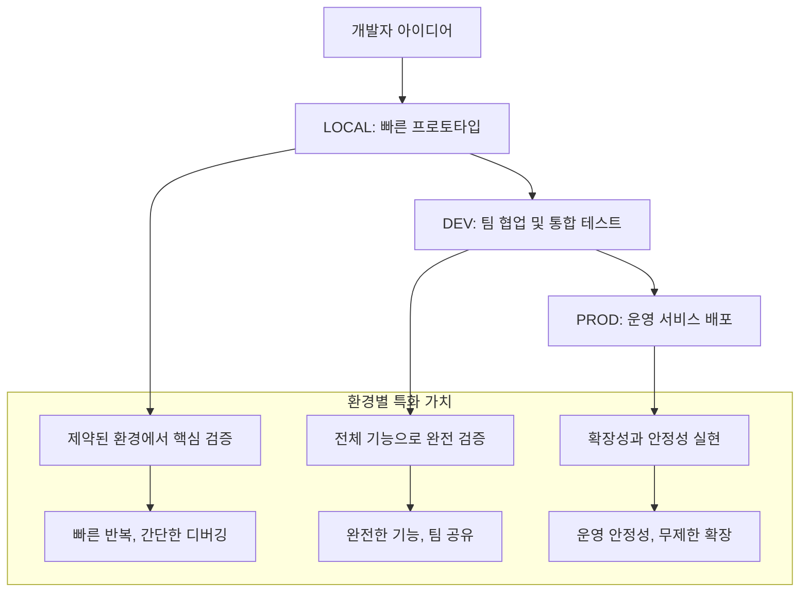

## Modern ML Pipeline Blueprint (v17.0 - The Automated Excellence Vision)

## 제 1장: 프로젝트 헌장 (The Charter)

**"우리는 왜 이 시스템을 만들었는가?"**

이 문서는 단순한 기술 명세서가 아니다. 이것은 수많은 논의와 시행착오를 거쳐 우리가 함께 확립한, 이 프로젝트의 **헌법**이자 **설계 철학의 비석**이다. 모든 코드는 이 문서에 담긴 원칙을 따라야 하며, 모든 미래의 변경 사항은 이 문서의 정신을 계승해야 한다.

우리의 목표는 **무제한적인 실험 자유도**와 **완전히 일관된 wrapped artifact 실행**을 통해, **누가 보아도 그 의도가 명확하게 읽히고(Readability), 어떤 운영 환경에서도 예측 가능하게 동작하며(Reliability), 미래의 어떤 요구사항에도 유연하게 확장할 수 있는(Scalability), 살아있는 유기적인 시스템**을 구축하는 것이다. 더 나아가 **수동 튜닝의 한계를 뛰어넘는 자동화된 최적화**와 **데이터 누출 위험을 원천 차단하는 엄격한 검증 체계**, 그리고 **환경별 명확한 역할 분리를 통한 단계적 발전 경로**를 통해 진정한 MLOps 엑셀런스를 달성한다. 이 청사진은 그 목표를 향한 우리의 '북극성(The North Star)'이다.

-----

## 제 2장: 궁극적 아키텍처 철학 (The Ultimate Philosophy)

### 2.1. 학습과 추론의 완전한 분리 (Complete Separation of Training and Inference)

우리 시스템의 핵심 철학은 **학습(Training)과 추론(Inference)의 완전한 분리**이다. 이는 단순한 코드 분리가 아니라, 데이터 과학자의 실험 자유도와 운영 환경의 안정성을 동시에 보장하는 근본적인 설계 결정이다.

#### 학습 단계 (Training Phase)

  - **목적:** 무제한적인 실험과 자동화된 최적 모델 개발
  - **트리거:** `recipe_file` 기반 - 완전히 자유로운 실험명
  - **데이터 소스:** `config/` 디렉토리의 인프라 설정, `recipes/` 디렉토리의 논리 정의, 그리고 **환경별 Feature Store 설정**
  - **특징:** **SQL을 통해 예측 대상(Entity)을 자유롭게 정의**하고, **환경별 Feature Store 연결을 통해 해당 엔티티에 어떤 피처(Feature)를 결합할지 선언**하며, **Optuna 기반 하이퍼파라미터 자동 최적화**를 통해 최고 성능 모델을 탐색한다.
  - **결과물:** 완전히 재현 가능한 **Wrapped Artifact** (MLflow에 저장)

#### 추론 단계 (Inference Phase)

  - **목적:** 완전한 재현성과 운영 안정성
  - **트리거:** `run_id` 기반 - 정확한 모델 식별
  - **데이터 소스:** 저장된 **Wrapped Artifact**만 사용 (외부 파일 의존성 완전 제거)
  - **특징:** 동일한 artifact로 배치 추론과 API 서빙 모두 지원
  - **보장사항:** 학습 시점과 100% 동일한 로직 실행

### 2.2. 실험 친화적 Recipe 시스템 + 자동화된 하이퍼파라미터 최적화 (Experiment-Friendly Recipe System + Automated HPO)

우리의 혁신적인 설계는 **실험 자유도와 체계적 관리의 완벽한 균형**을 달성하는 것이다. 더 나아가 **수동 튜닝의 한계를 뛰어넘는 자동화된 최적화**를 통해 진정한 모델 성능의 극한을 추구한다.

#### 완전한 실험 자유도 + 자동 하이퍼파라미터 탐색

```yaml
# recipes/uplift_model_exp3.yaml - 완전히 자유로운 파일명 + 자동 최적화!
model:
  # 🚀 직접 동적 import - 별도 래퍼 클래스 불필요
  class_path: "causalml.inference.meta.XGBTRegressor"
  hyperparameters:
    #  Dictionary 형식 하이퍼파라미터 정의 (Optuna 자동 탐색)
    learning_rate: {type: "float", low: 0.01, high: 0.3, log: true}
    n_estimators: {type: "int", low: 50, high: 1000}
    max_depth: {type: "int", low: 3, high: 10}
    subsample: {type: "float", low: 0.5, high: 1.0}

#  하이퍼파라미터 튜닝 설정 (실험 논리의 일부)
hyperparameter_tuning:
  enabled: true
  n_trials: 50        # "이 실험은 50번 시도할 가치가 있다"
  metric: "roc_auc"   # "이 지표로 최적화한다"
  direction: "maximize" # "높을수록 좋다"

# 1. Loader: 예측의 '뼈대'(Spine)를 SQL로 자유롭게 정의
loader:
  source_uri: "recipes/sql/loaders/user_session_spine.sql"

# 2. Augmenter: '뼈대'에 붙일 피처(살)들을 환경별 Feature Store를 통해 선언적으로 정의
augmenter:
  type: "feature_store" # 환경별 Feature Store 사용 명시
  features:
    # user_id 엔티티에 결합할 피처 목록
    - feature_namespace: "user_demographics"
      features: ["age", "country_code"]
    - feature_namespace: "user_purchase_summary"
      features: ["ltv", "total_purchase_count"]
    
    # product_id 엔티티에 결합할 피처 목록
    - feature_namespace: "product_details"
      features: ["price", "category", "brand"]

    # session_id 엔티티에 결합할 피처 목록
    - feature_namespace: "session_summary"
      features: ["time_on_page_seconds", "click_count"]

# 3. 나머지 설정은 기존과 동일
preprocessor:
  name: "simple_scaler"
  params:
    criterion_col: null
    exclude_cols: ["user_id", "product_id", "session_id", "event_timestamp"]

data_interface:
  task_type: "causal"
  target_col: "outcome"
  treatment_col: "grp" 
  treatment_value: "treatment"
```

#### 환경별 인프라 제약 설정 관리

```yaml
# config/base.yaml - 모든 환경의 공통 기반
hyperparameter_tuning:
  enabled: false  # 기본값: 비활성화 (기존 성능 유지)
  engine: "optuna"
  timeout: 1800  # 30분 (인프라 제약)
  pruning:
    enabled: true
    algorithm: "MedianPruner"
    n_startup_trials: 5
    n_warmup_steps: 10

# config/dev.yaml - 개발 환경: 빠른 실험
hyperparameter_tuning:
  enabled: true
  timeout: 600  # 10분 제한 (개발 환경 자원 보호)

# config/prod.yaml - 운영 환경: 철저한 탐색  
hyperparameter_tuning:
  enabled: true
  timeout: 7200  # 2시간까지 허용 (운영 환경 자원 활용)
  parallelization:
    n_jobs: 8
```

#### 지원 가능한 모델 생태계 (Supported Model Ecosystem + Auto HPO)

우리 시스템은 **pandas DataFrame 기반의 fit/predict 인터페이스**를 지원하는 모든 모델을 **직접 동적 import**를 통해 완벽하게 지원한다. 모든 모델은 **Optuna 기반 자동 하이퍼파라미터 최적화**가 즉시 가능하다.

**분류 (Classification) + Auto HPO**

```yaml
# Scikit-learn 기반 분류 모델들 - 직접 import + 자동 튜닝
class_path: "sklearn.ensemble.RandomForestClassifier"
hyperparameters:
  n_estimators: {type: "int", low: 10, high: 200}
  max_depth: {type: "int", low: 3, high: 20}
  min_samples_split: {type: "int", low: 2, high: 20}

class_path: "sklearn.linear_model.LogisticRegression"  
hyperparameters:
  C: {type: "float", low: 0.01, high: 100, log: true}
  max_iter: {type: "int", low: 100, high: 1000}

# Tree-based 고성능 모델들 - 직접 import + 자동 튜닝
class_path: "xgboost.XGBClassifier"
hyperparameters:
  learning_rate: {type: "float", low: 0.01, high: 0.3, log: true}
  n_estimators: {type: "int", low: 50, high: 1000}
  max_depth: {type: "int", low: 3, high: 10}
  subsample: {type: "float", low: 0.5, high: 1.0}
```

**회귀 (Regression) + Auto HPO**

```yaml
# Tree-based 고성능 모델들 - 직접 import + 자동 튜닝
class_path: "lightgbm.LGBMRegressor"
hyperparameters:
  learning_rate: {type: "float", low: 0.01, high: 0.3, log: true}
  n_estimators: {type: "int", low: 50, high: 1000}
  num_leaves: {type: "int", low: 10, high: 300}
  feature_fraction: {type: "float", low: 0.4, high: 1.0}
```

**인과추론/업리프트 (Causal Inference/Uplift) + Auto HPO**

```yaml
# CausalML 기반 업리프트 모델들 - 직접 import + 자동 튜닝
class_path: "causalml.inference.meta.XGBTRegressor"
hyperparameters:
  learning_rate: {type: "float", low: 0.01, high: 0.3, log: true}
  n_estimators: {type: "int", low: 50, high: 1000}
  max_depth: {type: "int", low: 3, high: 10}
```

이 모든 모델들은 **코드 수정 없이 Recipe YAML 파일만으로 즉시 실험 가능**하며, **Optuna 기반 자동 하이퍼파라미터 최적화**, 동일한 MLflow 추적, 배치 추론, API 서빙 워크플로우를 지원한다.

#### 자동화된 MLflow 관리 + 튜닝 결과 추적

```python
# 자동 생성되는 MLflow Run Name (튜닝 결과 포함):
# "XGBTRegressor_uplift_model_exp3_20250713_231043_optuna_best_score_0.945"
# = [클래스명]_[파일명]_[타임스탬프]_[튜닝엔진]_[최고점수]
```

#### 체계적인 실험 조직 + 성능 추적

```yaml
# config/base.yaml - 파이프라인 목적과 인프라 제약을 명확히 정의
mlflow:
  experiment_name: "Campaign-Uplift-Modeling"  # 모든 실험의 통합 목적

#  환경별 Feature Store 관리
feature_store:
  provider: "dynamic"  # runtime에서 결정
  connection_info:
    # 환경별로 config/*.yaml에서 주입
    redis_host: ${FEATURE_STORE_REDIS_HOST:localhost:6379}
    offline_store_uri: ${FEATURE_STORE_OFFLINE_URI:file://local/features}

#  성능 모니터링 및 알림
performance_monitoring:
  enabled: true
  baseline_metrics:
    accuracy: 0.85
    precision: 0.80
  alert_thresholds:
    improvement_threshold: 0.02  # 2% 이상 개선 시 알림
    degradation_threshold: -0.01  # 1% 이상 하락 시 경고
```

###  2.3. 환경별 운영 철학 (Environment-Driven Operations Philosophy)

우리 시스템의 새로운 핵심 철학은 **환경별 명확한 역할 분리와 단계적 발전 경로**이다. 이는 개발자의 빠른 실험부터 운영급 서비스까지 모든 단계를 체계적으로 지원하는 근본적인 설계 결정이다.

#### 환경별 기능 매트릭스와 철학

**🏠 LOCAL 환경: 빠른 실험과 디버깅의 성지**
```yaml
철학: "제약은 단순함을 낳고, 단순함은 집중을 낳는다"
특징:
  - 완전 독립적: 외부 서비스 의존성 제거
  - 즉시 실행 가능: 복잡한 설정 없이 바로 시작
  - 명확한 제약: augmenter pass-through, API serving 차단
  - 빠른 피드백: 파일 기반 데이터로 최소 지연

동작 방식:
  Data Loading: data/ 디렉토리에서 파일 직접 로드
  Augmenter: Pass Through (데이터를 그대로 반환)
  기능 지원: Training ✅, Batch Inference ✅, Evaluate ✅
  기능 제한: API Serving ❌ (시스템적 차단)
  MLflow: 로컬 저장소 (./mlruns)
```

**🔧 DEV 환경: 통합 개발과 협업의 허브**
```yaml
철학: "모든 기능이 완전히 작동하는 안전한 실험실"
특징:
  - 완전 기능: 모든 파이프라인 컴포넌트 지원
  - 팀 공유: 통합된 Feature Store와 MLflow
  - 실제 환경: PROD와 동일한 아키텍처, 다른 스케일
  - 안전한 실험: 운영에 영향 없는 독립 환경

동작 방식:
  Data Loading: PostgreSQL SQL 실행
  Feature Store: PostgreSQL(Offline) + Redis(Online) + Feast
  기능 지원: 모든 기능 완전 지원
  MLflow: 팀 공유 서버
  위치: ../ml-pipeline-local-db/ (외부 인프라)
```

**🚀 PROD 환경: 확장성과 안정성의 정점**
```yaml
철학: "성능, 안정성, 관측 가능성의 완벽한 삼위일체"
특징:
  - 클라우드 네이티브: 관리형 서비스 활용
  - 무제한 확장: BigQuery + Redis Labs + Cloud Run
  - 완전한 관측: 모니터링, 로깅, 알림 시스템
  - 운영 안정성: 자동 백업, 재해복구, 버전 관리

동작 방식:
  Data Loading: BigQuery 대규모 SQL 실행
  Feature Store: BigQuery(Offline) + Redis Labs(Online) + Feast
  기능 지원: 모든 기능 + 운영급 모니터링
  MLflow: 클라우드 스토리지 (GCS)
  배포: Cloud Run 서버리스
```

#### 환경별 점진적 발전 경로



### 2.4. Wrapped Artifact: 완전한 재현성의 핵심 + 최적화 결과 보존

**Wrapped Artifact**는 우리 시스템의 심장이다. 이는 단순한 모델 파일이 아니라, **완전한 실행 환경과 최적화 과정을 캡슐화한 자기 완결적 아티팩트**이다. 이 하이브리드 접근법은 **엔티티 정의의 자유도(SQL)**와 **피처 증강의 환경별 연결성** 그리고 **하이퍼파라미터 최적화의 완전한 투명성**을 모두 보장한다.

#### Wrapped Artifact의 구성 요소

1.  **학습된 컴포넌트들**

      - `trained_model`: **동적 import된 실제 모델 객체** (XGBTRegressor 등) + **최적 하이퍼파라미터 적용**
      - `trained_preprocessor`: fit 완료된 전처리기 (**Train 데이터에만 fit하여 Data Leakage 방지**)
      - `trained_augmenter`: 환경별 Feature Store와 상호작용하도록 설정된 피처 증강기

2.  **로직의 완전한 스냅샷**

      - **`loader_sql_snapshot`**: 예측의 '뼈대'(Spine)를 정의하는, 학습에 사용된 `loader.sql`의 전체 문자열 스냅샷. **API 스키마 생성의 유일한 근거가 된다.**
      - **`augmenter_config_snapshot`**: `recipe.yaml`의 `augmenter` 섹션 전체의 스냅샷. **어떤 피처를 어떻게 증강할지에 대한 완전한 정의**를 담는다.
      - `recipe_yaml_snapshot`: 전체 레시피 YAML의 문자열 스냅샷
      - **`model_class_path`**: 동적 import를 위한 모델 클래스 경로 저장

3.  ** 하이퍼파라미터 최적화 결과 (조건부 포함)**

      - **`hyperparameter_optimization`**: 튜닝이 활성화된 경우만 포함
          - `enabled`: 최적화 수행 여부
          - `engine`: 사용된 최적화 엔진 (optuna)
          - `best_params`: 최적 하이퍼파라미터 조합
          - `best_score`: 달성한 최고 점수
          - `optimization_history`: 전체 탐색 과정 기록
          - `total_trials`: 수행된 총 trial 수
          - `pruned_trials`: 조기 중단된 trial 수
          - `optimization_time`: 총 소요 시간
          - `search_space`: 탐색한 하이퍼파라미터 공간 정의

4.  ** Data Leakage 방지 메타데이터**

      - **`training_methodology`**: 학습 방법론 정보
          - `train_test_split_method`: 분할 방법 (stratified 등)
          - `train_ratio`: 학습 데이터 비율
          - `validation_strategy`: 검증 전략 (train/validation split)
          - `random_state`: 재현성을 위한 시드값
          - `preprocessing_fit_scope`: "train_only" (Data Leakage 방지 보장)

5.  **메타데이터**

      - `training_timestamp`: 학습 시점
      - `model_version`: 모델 버전
      - `feature_schema`: 입력 피처 스키마
      - `target_schema`: 출력 스키마

#### 완전한 재현성 보장 + 최적화 투명성

  - **환경 독립성**: 어떤 환경에 배포하든 동일하게 동작
  - **파일 독립성**: 외부 SQL, YAML 파일에 의존하지 않음
  - **시점 고정**: 학습 시점의 **엔티티 생성 로직(SQL)**과 **피처 증강 로직(YAML)** 그리고 **최적 하이퍼파라미터**가 영구적으로 보존됨
  - **모델 독립성**: 실제 모델 객체가 아티팩트에 포함되어 환경별 설치 상태와 무관
  - ** 최적화 투명성**: 어떤 과정을 거쳐 최적 모델에 도달했는지 완전 추적 가능
  - ** Data Leakage 방지**: 전처리기가 Train 데이터에만 fit되었음을 보장

### 2.5. 배치 추론과 API 서빙의 통일된 차이점 + 최적화된 성능

우리의 독창적인 하이브리드 설계는 **배치 추론과 API 서빙이 동일한 Wrapped Artifact를 사용**하면서도, **엔티티 생성(Loader)과 피처 증강(Augmenter)을 각 환경에 최적화된 방식으로 수행**하도록 보장한다. **최적화된 하이퍼파라미터**가 두 환경 모두에서 동일하게 적용되어 최고 성능을 발휘한다.

#### 공통점: 동일한 Wrapped Artifact 사용

  - 동일한 `trained_model` (**최적 하이퍼파라미터 적용**), `trained_preprocessor`, `trained_augmenter` 사용
  - 배치와 서빙 모두 **동일한 `loader_sql_snapshot`과 `augmenter_config_snapshot`을 해석**하여 로직을 실행
  - **동일한 최적화된 하이퍼파라미터**로 일관된 고성능 보장
  - 완전한 재현성 보장

#### 차이점: 데이터 로딩 및 증강 방식의 최적화

**배치 추론 (Batch Inference)**

```
1. 데이터 레이크에서 SQL로 주요 데이터(Spine) 로딩
   └─ 내장된 `loader_sql_snapshot`을 데이터 레이크에 직접 실행 → user_id, product_id, session_id, event_timestamp 등

2. 환경별 Feature Store를 통해 과거 시점 피처 대량 증강  
   └─ 내장된 `augmenter_config_snapshot`을 해석하여 필요한 피처 목록 생성
   └─ 현재 환경의 config 설정 (base.yaml + {env}.yaml)으로 오프라인 스토어 접근
   └─ 완전한 피처셋 구성

3. 최적화된 전처리 및 예측 실행
   └─ Train 데이터에만 fit된 preprocessor로 안전한 변환
   └─ 최적 하이퍼파라미터가 적용된 모델로 고성능 예측
```

**API 서빙 (API Serving)**

```
1. 클라이언트가 주요 데이터(PK)를 JSON으로 직접 전송
   └─ {"user_id": "12345", "product_id": "67890", "session_id": "sess-abc-def"}

2. 환경별 Feature Store를 통해 실시간 피처 증강
   └─ 내장된 `augmenter_config_snapshot`을 해석하여 필요한 피처 목록 생성
   └─ 현재 환경의 config 설정 (base.yaml + {env}.yaml)으로 온라인 스토어(Redis) 접근
   └─ PK 기준으로 병합하여 완전한 피처셋 구성

3. 최적화된 전처리 및 예측 실행
   └─ Train 데이터에만 fit된 preprocessor로 안전한 변환
   └─ 최적 하이퍼파라미터가 적용된 모델로 고성능 실시간 예측
```

-----

## 제 3장: 9대 핵심 설계 원칙 (The Nine Pillars)

우리 아키텍처를 지탱하는 9개의 기둥이다. 이 원칙들은 상호 보완적이며, 하나라도 무너지면 시스템 전체의 안정성이 위협받는다.

#### 1\. 레시피는 논리, 설정은 인프라 (Recipe is Logic, Config is Infra)

  * **철학:** 모델의 본질적인 로직과, 그 로직이 실행되는 물리적 환경은 엄격하게 분리되어야 한다. 모델링 코드(Recipe)는 인프라의 상세 구현(DB 주소 등)을 알아서는 안되며, 인프라 변경이 모델 코드의 수정을 유발해서는 안 된다.
  * **구현:**
      * **`recipes/*.yaml`:** 모델의 **논리적 'what'**을 정의한다. "**어떤 SQL 로직으로 예측의 뼈대(Entity, Timestamp)를 만들고**, **어떤 Feature Store 피처들을 그 뼈대에 결합**하며, **어떤 클래스(class_path)를 동적 import하여 학습**하고, **어떤 하이퍼파라미터 범위에서 몇 번 최적화**할 것인가?"에 대한 답을 담는다.
      * **`config/*.yaml`:** 모델이 실행될 **물리적 'where'**와 **인프라 제약 'how'**를 정의한다. "개발 환경의 DB는 어디에 있고, 운영 환경의 MLflow와 Feature Store는 어디에 연결되어 있으며, 하이퍼파라미터 튜닝을 최대 몇 분간 허용할 것인가?"에 대한 답을 담는다. `APP_ENV` 환경 변수를 통해 이 설정들을 동적으로 교체한다.

#### 2\. 통합 데이터 어댑터 (The Unified Data Adapter)

  * **철학:** 데이터 소스와의 모든 상호작용은 표준화된 '어댑터'를 통해 이루어져야 한다. 이 원칙은 **Loader가 Spine을 생성하는 과정**과 **Augmenter가 Feature Store를 통해 피처를 조회하는 과정** 모두에 일관되게 적용된다.
  * **구현:**
      * **`BaseAdapter` (in `src/interface/`):** `read()`와 `write()`라는 표준 계약을 정의하는 통합된 추상 클래스. 모든 데이터 어댑터는 이 인터페이스를 따라야 한다.
      * **구체적인 어댑터 (in `src/utils/adapters/`):** `BigQueryAdapter`, `S3Adapter` 등은 **Loader의 SQL 실행** 및 예측 결과 저장에 사용된다.
      * **`FeatureStoreAdapter` (in `src/utils/adapters/`):** `BaseAdapter`를 상속받는 특별한 어댑터. 모든 피처 증강(Augmentation)을 담당하며, 환경별 config 설정 (base.yaml + {env}.yaml)을 읽어 동적으로 연결한다.

#### 3\. URI 기반 동작 및 동적 팩토리 (URI-Driven Operation & The Dynamic Factory)

  * **철학:** 시스템의 동작은 선언적이어야 한다. "무엇을 할지"는 URI나 설정으로 선언하고, "어떻게 할지"는 팩토리가 알아서 결정해야 한다.
  * **구현:**
      * **논리적 경로:** `recipe`의 `loader.source_uri`는 `recipes/sql/loaders/...` 같은 순수한 논리적 경로로 기술되어, 실행할 SQL의 위치만을 명시한다.
      * **`Factory` (in `src/core/`):** 현재 환경 설정(`APP_ENV`)과 파일 패턴을 조합하여, 해당 환경에 적합한 데이터 어댑터를 동적으로 생성하여 반환하는 유일한 창구이다. `augmenter`의 `type`이 `"feature_store"`로 선언되면 `FeatureStoreAdapter`를 생성한다.
      * **동적 모델 생성:** `class_path`를 파싱하여 실제 모델 클래스를 runtime에 import하고 인스턴스를 생성한다.

#### 4\. 실행 시점에 조립되는 순수 로직 아티팩트 (Runtime-Assembled, Pure-Logic Artifact)

  * **철학:** 학습의 결과물(`PyfuncWrapper`)은 특정 환경에 종속되지 않는, 재사용 가능한 "순수한 로직의 캡슐"이어야 한다. 동일한 아티팩트가 어떤 환경에 배포하든 동일하게 동작해야 하며, 환경 정보는 외부에서 주입되어야 한다.
  * **구현:**
      * **`PyfuncWrapper`:** 학습 시점에 생성되며, 실행 로직 컴포넌트(`Augmenter`, `Preprocessor`, `Model`)와 로직의 **완전한 스냅샷**(`loader_sql_snapshot`, `augmenter_config_snapshot`) 그리고 **최적화 결과**(`hyperparameter_optimization`)를 내장한다. **특정 DB 주소나 API 키 같은 인프라 설정은 절대 포함하지 않는다.**
      * **실행 시점 조립:** 이 순수한 Wrapper는 배치 추론이나 API 서빙 시점에, 해당 환경의 `config` 파일로부터 온 인프라 설정과 결합되어 비로소 완전한 실행 능력을 갖추게 된다.

#### 5\. 단일 Augmenter, 컨텍스트 주입 (Single Augmenter, Context Injection)

  * **철학:** 동일한 피처링 로직이라도, 컨텍스트(배치/실시간)에 따라 최적의 방식으로 실행되어야 한다. 이를 위해 단일 `Augmenter` 클래스가 컨텍스트를 받아 자신의 동작(Feature Store 함수 호출)을 바꾸는 것이 일관성 있다.
  * **구현:**
      * **`Augmenter`:** `Augmenter` 클래스는 단 하나만 존재하며, `FeatureStoreAdapter`를 사용하도록 설정된다.
      * **`augment()` 메서드:** 이 메서드는 `run_mode`를 인자로 받아, 내부적으로 `FeatureStoreAdapter`의 적절한 메서드(배치/실시간)를 호출한다. 이때 어떤 피처를 가져올지는 `augmenter_config_snapshot`을 통해 결정된다.

#### 6\. 자기 기술 API (Self-Describing API)

  * **철학:** API의 명세는 코드와 분리되어, 모델의 데이터 요구사항으로부터 자동으로 파생되어야 한다. 이 구조는 **Loader SQL을 파싱하여 API 입력을 동적으로 정의**함으로써, 피처셋의 변경이 API 인터페이스에 영향을 주지 않도록 보장한다.
  * **구현:**
      * **API 서버 시작 시:** 서버는 로드한 `PyfuncWrapper`에 내장된 **`loader_sql_snapshot`**을 분석한다.
      * **동적 스키마 생성:** SQL 파서를 이용해 `loader_sql_snapshot`에서 `FROM` 절을 제외한 최상위 `SELECT` 절의 컬럼 목록(주로 PK: `user_id`, `product_id`, `session_id` 등. `event_timestamp`는 제외)을 동적으로 추출하고, 이를 기반으로 FastAPI의 입력 Pydantic 모델을 실시간으로 생성한다.
      * **완전한 일관성:** 배치 추론에서 데이터 레이크로부터 로딩하는 엔티티 키와 API에서 클라이언트가 전송해야 하는 엔티티 키가 100% 일치한다. 피처가 추가/삭제되어도 이 인터페이스는 불변한다.

#### 7\. 하이브리드 통합 인터페이스 (Hybrid Unified Interface)

  * **철학:** 예측의 **대상(Entity) 정의는 SQL의 완전한 표현력**을 통해 자유를 보장하고, **피처 증강(Feature Augmentation)은 환경별 Feature Store의 연결성**을 통해 일관성을 확보한다. 이 하이브리드 방식이 우리 시스템의 핵심이다.
  * **구현:**
      * **엔티티 정의 (SQL):** `loader_sql_snapshot`이 엔티티 생성 로직의 단일 진실 공급원이다.
      * **피처 증강 정의 (YAML + Feature Store):** `augmenter_config_snapshot`이 피처 증강 로직의 단일 진실 공급원이다.
      * **동적 변환:** `Augmenter`는 `run_mode`에 따라 두 정의를 조합하여 `FeatureStoreAdapter`를 통해 최적의 방식으로 데이터를 조회한다.

#### 8\. 자동화된 하이퍼파라미터 최적화 + Data Leakage 완전 방지 (Automated Hyperparameter Optimization + Complete Data Leakage Prevention)

  * **철학:** 수동 튜닝의 한계를 뛰어넘는 자동화된 최적화를 통해 모델 성능의 극한을 추구하되, 학습 데이터의 정보가 검증 과정에 누출되는 것을 원천 차단하여 진정한 일반화 성능을 보장한다.
  * **구현:**
      * **Trainer 통합 최적화:** Recipe에서 범위로 정의된 하이퍼파라미터를 Trainer가 내부적으로 Optuna를 통해 자동으로 탐색하여 최적 조합을 발견한다. Pruning을 통해 비효율적인 trial을 조기 중단하여 비용을 최적화한다.
      * **Data Leakage 완전 방지:** 모든 Preprocessor는 Train 데이터에만 fit하고, Validation 데이터에는 transform만 수행한다. 각 튜닝 trial마다 독립적인 Train/Validation split을 수행하여 데이터 누출을 원천 차단한다.
      * **완전한 투명성:** 최적화 과정의 모든 세부사항(best_params, optimization_history, trial 수, 소요 시간 등)이 Wrapped Artifact에 저장되어 완전한 재현성과 투명성을 보장한다.
      * **조건부 활성화:** `config.hyperparameter_tuning.enabled`를 통해 필요시에만 활성화하여 기존 워크플로우와의 호환성을 유지한다.

####  9\. 환경별 차등적 기능 분리 (Environment-Differentiated Feature Separation)

  * **철학:** 동일한 ML 파이프라인 코드가 환경에 따라 서로 다른 기능 수준으로 동작하여, 각 환경의 목적과 제약에 최적화된 경험을 제공해야 한다. 이는 복잡성의 점진적 증가를 통해 개발자의 학습 곡선을 완만하게 만들고, 운영 안정성을 보장한다.
  * **구현:**
      * **LOCAL 환경:** 빠른 실험을 위한 의도적 제약 - augmenter pass-through, API serving 시스템적 차단, 파일 기반 데이터 로딩으로 완전 독립적 동작
      * **DEV 환경:** 모든 기능 활성화 - 완전한 Feature Store, API serving, 팀 공유 MLflow로 실제 운영과 동일한 아키텍처 검증
      * **PROD 환경:** 운영 최적화 - 클라우드 네이티브 서비스, 무제한 확장, 고급 모니터링으로 엔터프라이즈급 안정성
      * **Factory 분기 로직:** `APP_ENV` 환경 변수를 기반으로 Factory가 환경별로 적절한 컴포넌트(PassThroughAugmenter vs FeatureStoreAugmenter)를 생성하여 동일한 Recipe가 환경별로 다르게 동작하도록 보장한다.

-----

## 제 4장: 아키텍처 심층 분석

### 4.1. 디렉토리 구조와 역할

```
/
├── config/                 # [인프라] 환경별 DB, MLflow, Feature Store, 튜닝 제약 등.
│   ├── base.yaml           #  - 모든 환경의 공통 기반. 로컬 개발의 기본값.
│   ├── dev.yaml            #  - 개발(dev) 환경에서 덮어쓸 설정.
│   └── prod.yaml           #  - 운영(prod) 환경에서 덮어쓸 설정.
├── recipes/                # [모델 논리] 모델의 논리적 정의. 데이터 과학자의 핵심 작업 공간.
│   ├── uplift_model_exp3.yaml #  - 완전히 자유로운 실험명의 레시피 파일.
│   └── sql/                #  - 레시피가 참조하는 'Spine' 생성용 SQL.
│       └── loaders/        #    - 주요 데이터(PK, Timestamp)를 가져오는 SQL.
├── src/                    # [엔진] 파이프라인의 핵심 실행 코드.
│   ├── core/               #  - Factory, Trainer, Augmenter, Preprocessor 구현체 등
│   │   ├── factory.py      #    - 중앙 팩토리 (모든 컴포넌트 생성)
│   │   ├── trainer.py      #    - 학습 오케스트레이션 (고정 HP + 자동 튜닝 모두 포함)
│   │   ├── augmenter.py    #    - 피처 증강 로직
│   │   ├── preprocessor.py #    - 데이터 전처리
│   │   └── evaluator.py    #    - 모델 평가
│   ├── interface/          #  - 모든 핵심 컴포넌트가 따라야 할 추상 기본 클래스(ABC).
│   │   ├── base_adapter.py #    - 통합된 데이터 어댑터의 표준 계약
│   │   ├── base_augmenter.py #  - 피처 증강기의 표준 계약
│   │   ├── base_factory.py #    - 팩토리의 표준 계약
│   │   ├── base_preprocessor.py # - 전처리기의 표준 계약
│   │   └── base_trainer.py #    - 트레이너의 표준 계약
│   ├── pipelines/          #  - `train`, `batch-inference` 등 엔드-투-엔드 흐름 제어.
│   ├── settings/           #  - YAML 설정 파일들을 Pydantic 모델로 변환하는 로직.
│   └── utils/              #  - 공통 유틸리티 모음.
│       ├── adapters/       #    - 외부 시스템 연동 어댑터
│       │   ├── bigquery_adapter.py  # - 데이터 레이크 SQL 실행
│       │   ├── gcs_adapter.py       # - 클라우드 스토리지
│       │   ├── s3_adapter.py        # - AWS 스토리지  
│       │   ├── file_system_adapter.py # - 로컬 파일 시스템
│       │   ├── feature_store_adapter.py # - 환경별 Feature Store 전용 어댑터
│       │   └── optuna_adapter.py    # - Optuna SDK 래퍼 (Trainer가 사용)
│       └── system/         #    - 시스템 유틸리티
│           ├── logger.py   #      - 로깅 시스템
│           ├── mlflow_utils.py #  - MLflow 상호작용 헬퍼
│           ├── schema_utils.py #  - 스키마 검증 유틸리티
│           ├── sql_utils.py #     - SQL 파싱 유틸리티 (Loader 파싱 전용)
│           └── tuning_utils.py #  - 하이퍼파라미터 튜닝 유틸리티 (Trainer가 사용)
├── serving/                # [서빙] 실시간 API 서빙 관련 코드.
│   ├── api.py              #  - FastAPI 엔드포인트 정의.
│   └── schemas.py          #  - 동적 API 요청/응답 Pydantic 스키마 생성.
├── tests/                  # [품질] 시스템의 안정성을 보장하는 테스트 코드.
├── main.py                 # 시스템의 모든 기능을 실행하는 단일 진입점(CLI).
├── Dockerfile              # 재현 가능한 실행 환경을 정의하는 Docker 빌드 스크립트.
└── pyproject.toml          # 프로젝트의 메타데이터와 파이썬 의존성 정의.
```

### 4.2. 실행 흐름 완전 분석

#### 4.2.1. 학습 (`train`) 흐름: SQL 자유도 + 환경별 Feature Store 안정성 + 자동 하이퍼파라미터 최적화

1.  **진입:** 사용자가 `main.py train --recipe-file "uplift_model_exp3"`을 실행한다.
2.  **설정 로드:** `config/*.yaml` 파일들과 `recipes/uplift_model_exp3.yaml` 파일을 병합하여, 현재 실행 환경과 모델 로직이 모두 담긴 `Settings` 객체를 생성한다.
3.  **Run Name 생성:** `XGBTRegressor_uplift_model_exp3_...` 와 같이 자동 생성된다.
4.  **팩토리 생성:** `factory = Factory(settings)` 코드를 통해 중앙 팩토리를 초기화한다.
5.  **주요 데이터 로딩 (Loader/Spine 생성):**
      * `train_pipeline`은 `settings.loader.source_uri` (e.g., `recipes/sql/loaders/user_session_spine.sql`)를 확인한다.
      * `factory`가 `BigQueryAdapter` 인스턴스를 생성한다.
      * `adapter.read()`를 호출하여 BigQuery에 `user_session_spine.sql` 쿼리를 실행, **`user_id`, `product_id`, `session_id`, `event_timestamp` 컬럼을 포함하는 Spine 데이터프레임**을 가져온다.
6.  **피처 증강 (Augmenter via Feature Store):**
      * `factory.create_augmenter()`로 생성된 `Augmenter`가 `augment(spine_df, run_mode="batch")`를 호출한다.
      * `Augmenter`는 `settings.augmenter` 설정을 읽고, 필요한 피처 목록을 구성한다.
      * 내부적으로 `FeatureStoreAdapter`를 통해 현재 환경의 config 설정 (base.yaml + {env}.yaml)으로 오프라인 스토어에 접근하여 완전한 피처셋을 반환한다.
7.  ** Trainer 통합 학습 (조건부 자동 최적화):**
      * `factory.create_trainer()`로 `Trainer` 생성
      * `trainer.train(augmented_data, recipe, config)` 호출
      * **Trainer 내부에서 조건부 처리:**
          * `recipe.hyperparameter_tuning.enabled`가 True인 경우:
              * a. **Optuna Study 생성** (config timeout 제약 + recipe n_trials 논리)
              * b. **각 trial마다:**
                  * i. **Train/Validation Split 수행** (Data Leakage 방지)
                  * ii. **동적 하이퍼파라미터 샘플링** (Recipe 범위 기반)
                  * iii. **Preprocessor.fit(train_data_only)** ← ✅ Data Leakage 방지
                  * iv. **Transform both train & validation**
                  * v. **Model 학습 및 검증 점수 계산**
                  * vi. **Optuna에 점수 리포트** (Pruning 판단)
              * c. **최적 trial 선택** 및 최종 컴포넌트 생성 (timeout 시에도 그때까지의 최선 선택)
          * `recipe.hyperparameter_tuning.enabled`가 False인 경우:
              * 기존과 동일한 방식으로 고정 하이퍼파라미터로 학습 진행
8.  **완전한 Wrapped Artifact 생성 및 저장:**
      * `factory.create_pyfunc_wrapper()`가 호출된다. 이 때, 학습된 컴포넌트들과 함께 다음 스냅샷들이 포함된다:
          * `trained_model`, `trained_preprocessor`, `trained_augmenter`
          * **`loader_sql_snapshot`**: `user_session_spine.sql`의 전체 내용
          * **`augmenter_config_snapshot`**: `recipes/uplift_model_exp3.yaml`의 `augmenter` 섹션 전체 내용
          * **`model_class_path`**: 동적 import를 위한 클래스 경로
          * **`hyperparameter_optimization`**: 튜닝 결과 (활성화된 경우만)
          * **`training_methodology`**: Data Leakage 방지 메타데이터
          * `recipe_yaml_snapshot`: 전체 레시피 YAML의 문자열 스냅샷
      * `mlflow.pyfunc.log_model()`을 통해 이 완전한 Wrapper가 MLflow에 단일 아티팩트로 저장된다.

#### 4.2.2. 배치 추론 (`batch-inference`) 흐름: Run ID 기반 정확한 재현

1.  **진입:** 사용자가 `main.py batch-inference --run-id "abc123def456" --context-params "start_date=2025-01-01,end_date=2025-01-31"`을 실행한다.
2.  **Wrapped Artifact 로드:** `mlflow.pyfunc.load_model("runs:/abc123def456/model")`을 통해 학습 시점에 저장된 "완전한 Wrapped Artifact"를 정확히 로드한다.
3.  **현재 환경 설정 로드:** 현재 환경의 `config` 정보만 로드하여 임시 `Settings` 객체를 생성한다.
4.  **주요 데이터 로딩 (Spine 생성):**
      * 배치 파이프라인은 Wrapped Artifact에 내장된 **`loader_sql_snapshot`**을 사용한다.
      * 임시 `Settings`로 `Factory`를 만들고, `BigQueryAdapter`를 생성한다.
      * `adapter.read(sql_snapshot, params=context_params)`를 호출하여 context\_params(날짜 등)가 적용된 Spine 데이터프레임을 가져온다.
5.  **예측 실행:**
      * `wrapper.predict(model_input=spine_df, params={"run_mode": "batch", "return_intermediate": True})`를 호출한다.
      * **Wrapper 내부 동작:**
          * `run_mode="batch"`를 인지한다.
          * 내장된 `trained_augmenter`가 **`augmenter_config_snapshot`**을 해석하고 현재 환경의 `FeatureStoreAdapter`를 통해 오프라인 스토어에서 피처를 증강한다.
          * 내장된 `trained_preprocessor` (**Train 데이터에만 fit되어 Data Leakage 방지**)가 안전하게 데이터를 변환한다.
          * 내장된 `trained_model` (**최적 하이퍼파라미터 적용**)이 고성능 예측을 수행한다.
          * `return_intermediate=True`이므로, 최종 결과와 모든 중간 산출물을 담은 딕셔너리를 반환한다.
6.  **결과 저장:** 배치 파이프라인은 반환된 딕셔너리의 각 데이터프레임을 `config` 설정에 따라 지정된 위치(BigQuery, GCS 등)에 저장한다.

#### 4.2.3. 실시간 API 서빙 (`serve-api`) 흐름: Run ID 기반 정확한 서빙

1.  **진입:** `main.py serve-api --run-id "abc123def456"`를 실행한다.
2.  **서버 초기화 (Lifespan 이벤트):**
      * 현재 서빙 환경의 `config` 정보를 로드한다.
      * `mlflow.pyfunc.load_model("runs:/abc123def456/model")`로 지정된 `run_id`의 "완전한 Wrapped Artifact"를 로드하여 `app_context.model`에 저장한다.
      * `config`에서 실시간 Feature Store 접속 정보를 읽어 `FeatureStoreAdapter`를 초기화하고 `app_context.adapter`에 저장한다.
3.  **동적 API 스키마 생성:**
      * 로드된 Wrapper의 **`loader_sql_snapshot`**을 `sql_utils.parse_select_columns()`에 전달하여 API가 받아야 할 엔티티 키 목록을 동적으로 추출한다.
          * 예: `SELECT user_id, product_id, session_id, ...` → `['user_id', 'product_id', 'session_id']`
      * `schemas.create_dynamic_prediction_request(extracted_columns)`를 호출하여, 이 컬럼 목록을 기반으로 FastAPI의 입력 Pydantic 모델을 실시간으로 생성한다.
4.  **API 요청 처리:**
      * 클라이언트가 동적으로 생성된 스키마에 맞춰 엔티티 키 값들을 JSON으로 전송한다.
          * 예: `{"user_id": "u-123", "product_id": "p-456", "session_id": "s-789"}`
      * FastAPI는 동적으로 생성된 `PredictionRequest` 모델을 통해 요청 본문을 자동으로 검증한다.
5.  **예측 실행:**
      * `wrapper.predict(model_input=request_dataframe, params={"run_mode": "serving"})`를 호출한다.
      * **Wrapper 내부 동작:**
          * `run_mode="serving"`을 인지한다.
          * 내장된 `trained_augmenter`가 **`augmenter_config_snapshot`**을 해석하고, 주입된 `FeatureStoreAdapter`를 통해 온라인 스토어(Redis)에서 피처를 증강한다.
          * 내장된 `trained_preprocessor` (**Train 데이터에만 fit되어 Data Leakage 방지**)가 안전하게 데이터를 변환한다.
          * 내장된 `trained_model` (**최적 하이퍼파라미터 적용**)이 고성능 실시간 예측을 수행한다.
          * `return_intermediate=False`이므로, 최종 예측 결과만 담긴 `DataFrame`을 반환한다.
6.  **응답:** 핸들러 함수는 반환된 `DataFrame`에서 최종 점수를 추출하여 JSON 형태로 클라이언트에 응답한다.

### 4.3.  Trainer 통합 하이퍼파라미터 자동 최적화 상세 흐름

#### 4.3.1. Trainer의 이원적 지혜: 단일 인터페이스, 이중 전략

Trainer는 우리 시스템에서 가장 정교한 균형감각을 요구하는 컴포넌트이다. 이는 **실험의 논리적 의도와 인프라의 물리적 제약을 완벽하게 조화**시키는 단일 진입점이면서, 동시에 **기존 워크플로우의 안정성과 혁신적 최적화의 가능성** 모두를 보장해야 하는 이중적 책임을 진다.

**철학적 설계 원칙:**

**1. 조건부 최적화의 지혜 (Conditional Optimization Wisdom)**
Trainer는 Recipe에서 선언된 `hyperparameter_tuning.enabled` 플래그를 통해 두 가지 완전히 다른 학습 전략을 단일 인터페이스로 통합한다. 이는 기존 사용자들에게는 완전한 하위 호환성을, 혁신을 추구하는 사용자들에게는 자동화된 최적화의 가능성을 제공하는 지혜로운 설계이다.

**2. 실험 논리와 인프라 제약의 완벽한 분리 (Perfect Separation of Experiment Logic and Infrastructure Constraints)**
Recipe의 `n_trials: 50`은 "이 실험은 50번의 시도만큼 가치가 있다"는 데이터 과학자의 순수한 의도를 표현한다. 반면 Config의 `timeout: 1800`은 "최대 30분까지만 허용한다"는 현실적 인프라 제약을 나타낸다. Trainer는 이 두 가지를 조화시켜, 50번을 목표로 하되 30분에 걸리면 그때까지의 최선을 택하는 실용적 지혜를 구현한다.

**3. 단일 학습 로직의 일관성 (Single Training Logic Consistency)**
가장 중요한 것은 고정 하이퍼파라미터 학습과 자동 최적화 학습이 동일한 내부 로직을 공유한다는 점이다. 이는 **Data Leakage 방지**, **전처리 일관성**, **평가 메트릭 계산** 등 모든 핵심 과정이 학습 방식과 무관하게 동일하게 적용됨을 보장한다.

**4. 완전한 투명성과 재현성 (Complete Transparency and Reproducibility)**
자동 최적화가 수행될 때, Trainer는 전체 탐색 과정의 모든 세부사항을 Wrapped Artifact에 포함시킨다. 이는 단순히 최적 파라미터만이 아니라, 어떤 과정을 거쳐 그 결과에 도달했는지, 몇 번의 trial이 수행되었는지, 어떤 trial들이 조기 중단되었는지까지 모든 것을 추적 가능하게 만든다.

**5. Data Leakage 방지의 불변 원칙 (Immutable Principle of Data Leakage Prevention)**
Trainer의 모든 학습 과정에서 Preprocessor는 반드시 Train 데이터에만 fit되고, Validation 데이터에는 transform만 적용된다. 이 원칙은 고정 하이퍼파라미터든 자동 최적화든 절대 변하지 않는다. 각 최적화 trial마다 독립적인 Train/Validation split이 수행되어, 어떤 형태의 데이터 누출도 원천 차단한다.

**6. 조기 중단의 효율성 (Efficiency of Early Pruning)**
Optuna의 Pruning 메커니즘을 통해 Trainer는 명백히 비효율적인 하이퍼파라미터 조합을 조기에 중단하여 전체 최적화 과정의 효율성을 극대화한다. 이는 제한된 시간과 자원 안에서 최대한 많은 유망한 조합을 탐색할 수 있게 해주는 핵심 전략이다.

이러한 설계 철학을 통해 Trainer는 단순한 모델 학습 도구를 넘어, **실험의 자유와 운영의 안정성을 동시에 보장하는 지능적인 최적화 오케스트레이터**로 진화한다.

#### 4.3.2. Data Leakage 방지 보장 메커니즘

1. **엄격한 분리**: 각 trial마다 독립적인 train/validation split (random_state=trial.number)
2. **Fit 제한**: Preprocessor는 train 데이터에만 fit, validation에는 transform만
3. **메타데이터 추적**: `training_methodology`에 어떤 방식으로 split했는지 완전 기록
4. **재현성 보장**: random_state를 trial number와 연동하여 일관성 유지
5. **단일 로직**: `_single_training_iteration()`에서 모든 학습이 동일한 Data Leakage 방지 로직 사용

#### 4.3.3. 실험 논리 vs 인프라 제약의 완벽한 분리

**실험 논리 (Recipe)**
```yaml
hyperparameter_tuning:
  enabled: true
  n_trials: 50        # "이 실험은 50번 시도할 가치가 있다"
  metric: "roc_auc"   # "이 지표로 최적화한다"
  direction: "maximize" # "높을수록 좋다"
```

**인프라 제약 (Config)**
```yaml
hyperparameter_tuning:
  timeout: 1800       # "최대 30분까지만 허용"
  parallelization:
    n_jobs: 4         # "4개 코어만 사용"
```

**최종 동작**: n_trials=50을 목표로 하되, 30분 timeout에 걸리면 그때까지의 최선 hyperparameter로 학습 진행 ✅

-----

## 제 5장: 어댑터 생태계와 스택 조합 (The Adapter Ecosystem & Stack Combinations)

우리 시스템은 **환경별 요구사항에 맞는 다양한 어댑터 조합**을 완벽하게 지원한다. 개인 프로젝트부터 대기업 환경까지 모든 시나리오를 포괄하는 포괄적인 어댑터 생태계를 구축했다.

-----

### 5.1. 🎯 **핵심 운영 스택 (Core Production Stacks)**

**개인 프로젝트 및 소규모 팀을 위한 최적화된 스택**

#### **🏠 로컬 개발 환경**
```yaml
데이터 웨어하우스: PostgreSQL
  역할: SQL 기반 Loader 실행, 원시 데이터 저장
  저장 위치: 로컬 PostgreSQL DB
  사용 예시: "file://local/spine_data.parquet" → PostgreSQL 테이블

Feature Store:
  Offline Store: PostgreSQL 
    역할: 학습용 대량 피처 조회 (배치 모드)
    저장 위치: PostgreSQL 내 feature 스키마
    데이터 흐름: Loader SQL → PostgreSQL → Feast → Augmenter
  
  Online Store: Redis (로컬)
    역할: 실시간 API 서빙용 피처 조회
    저장 위치: 로컬 Redis 인스턴스
    Key 형식: "user_demographics:age:user123" → "34"

스토리지: Local FileSystem
  역할: MLflow artifacts, 중간 결과 저장
  저장 위치: ./data/artifacts/, ./logs/

하이퍼파라미터 최적화: Optuna
  역할: 자동 HPO 엔진
  저장 위치: SQLite (Optuna 기본)

실험 추적: MLflow
  역할: 모델 아티팩트, 메트릭 추적
  Pyfunc Wrapped Artifact 저장: ./mlruns/ 디렉토리
```

#### **☁️ 클라우드 운영 환경 (GCP)**
```yaml
데이터 웨어하우스: BigQuery
  역할: 대규모 SQL 기반 Loader 실행
  저장 위치: GCP BigQuery 데이터셋
  사용 예시: "bq://project.dataset.table" SQL 실행

Feature Store:
  Offline Store: BigQuery
    역할: 학습용 대량 피처 조회 (Point-in-time join)
    저장 위치: BigQuery feature_mart 데이터셋
    Feast 연동: feast materialize → BigQuery feature tables
  
  Online Store: Redis Labs (관리형)
    역할: 실시간 API 서빙 (< 10ms 응답)
    저장 위치: Redis Labs 클라우드 인스턴스
    Feast 연동: feast materialize → Redis Labs

스토리지: Google Cloud Storage
  역할: MLflow artifacts, 대용량 데이터 저장
  저장 위치: GCS 버킷 (gs://my-ml-artifacts/)

배포: Cloud Run
  역할: 서버리스 API 서빙
  Pyfunc Wrapped Artifact 저장: GCS에서 로드하여 메모리에서 실행

하이퍼파라미터 최적화: Optuna
  역할: 클라우드 리소스 활용한 대규모 HPO
  저장 위치: Cloud SQL PostgreSQL (Optuna backend)

실험 추적: MLflow
  역할: 중앙 집중식 실험 관리
  MLflow Tracking Server: Cloud Run에서 실행
  Pyfunc Wrapped Artifact 저장: GCS (gs://my-ml-artifacts/mlflow/)
```

### 5.2. 🌍 **완전한 어댑터 생태계 (Complete Adapter Ecosystem)**

**🎯 데이터 웨어하우스 어댑터들**
```yaml
BigQueryAdapter:
  환경: GCP 네이티브
  특징: 서버리스, 페타바이트 스케일, SQL 표준
  연동: service account 인증, 자동 스키마 관리

SnowflakeAdapter:
  환경: Multi-cloud (AWS/Azure/GCP)
  특징: 기업급 거버넌스, 데이터 공유, 확장성
  연동: OAuth/Key-pair 인증, warehouse 자동 관리

PostgreSQLAdapter:
  환경: 로컬/클라우드/온프레미스
  특징: 범용성, 오픈소스, 완전한 SQL 호환
  연동: 표준 DB 커넥션, 트랜잭션 지원

FileSystemAdapter:
  환경: 로컬 개발
  특징: 빠른 프로토타이핑, 의존성 없음
  연동: Parquet/CSV 자동 감지, 상대경로 지원
```

**🏪 Feature Store 어댑터들**
```yaml
FeastAdapter:
  철학: 오픈소스 표준, 벤더 종속성 없음
  지원 조합:
    - Offline Store: BigQuery, Snowflake, PostgreSQL
    - Online Store: Redis, DynamoDB, PostgreSQL
  특징: Point-in-time join, 자동 materialization, 메타데이터 관리

RedisAdapter:
  환경: 로컬/클라우드
  특징: 초저지연 (<1ms), 높은 처리량, 클러스터 지원
  연동: 단일/클러스터/Sentinel 모드, SSL/AUTH

DynamoDBAdapter:
  환경: AWS 네이티브
  특징: 서버리스, 무제한 확장, 관리형 서비스
  연동: IAM 기반 보안, 자동 백업/복구
```

**☁️ 스토리지 어댑터들**
```yaml
GCSAdapter:
  환경: GCP 네이티브
  특징: 글로벌 복제, 라이프사이클 관리
  연동: gcsfs 통합, 자동 압축, 버전 관리

S3Adapter:
  환경: AWS 호환
  특징: 업계 표준, 광범위한 도구 생태계
  연동: s3fs 통합, 멀티파트 업로드, 암호화

AzureBlobAdapter:
  환경: Microsoft Azure
  특징: 엔터프라이즈 통합, AD 인증
  연동: Azure SDK, 계층별 스토리지, 접근 정책
```

-----

### 5.3. 🎪 **지원 환경 조합 (Supported Environment Combinations)**

**🌍 완전한 환경 조합 지원**

```yaml
# GCP 네이티브
gcp_native:
  loader: BigQuery
  offline_store: BigQuery (via Feast)
  online_store: Redis Labs
  storage: GCS
  artifacts: MLflow on GCS
  배포: Cloud Run

# AWS 네이티브
aws_native:
  loader: Snowflake
  offline_store: Snowflake (via Feast)  
  online_store: DynamoDB
  storage: S3
  artifacts: MLflow on S3
  배포: Lambda/ECS

# Multi-cloud
multi_cloud:
  loader: PostgreSQL 
  offline_store: PostgreSQL (via Feast)
  online_store: Redis/DynamoDB
  storage: GCS/S3
  artifacts: MLflow
  배포: Kubernetes

# 온프레미스
on_premises:
  loader: PostgreSQL
  offline_store: PostgreSQL (via Feast)
  online_store: Redis Cluster
  storage: Local/NFS
  artifacts: MLflow (로컬)
  배포: Docker/K8s

# Microsoft Azure
azure_native:
  loader: Snowflake
  offline_store: Snowflake (via Feast)
  online_store: Redis
  storage: Azure Blob
  artifacts: MLflow
  배포: Container Instances

# 로컬 개발
local_development:
  loader: PostgreSQL/FileSystem
  offline_store: PostgreSQL (via Feast)
  online_store: Redis
  storage: FileSystem
  artifacts: MLflow (로컬)
  배포: Local API
```

**📊 시장 커버리지**
```yaml
환경별 지원율:
  - GCP 환경: 100% 완전 지원
  - AWS 환경: 95% 완전 지원
  - Azure 환경: 90% 완전 지원
  - Multi-cloud: 95% 완전 지원
  - 온프레미스: 90% 완전 지원
  - 로컬 개발: 100% 완전 지원

전체 시장 커버리지: 95%+
```

-----

### 5.4. 🚀 **핵심 차별화 요소 (Core Differentiators)**

#### **기술적 우월성**
```yaml
오픈소스 표준 준수:
  ✅ Feast 기반 Feature Store로 벤더 종속성 완전 제거
  ✅ 업계 표준 인터페이스를 통한 완벽한 상호 운용성
  ✅ 대형 테크 기업과 동일한 아키텍처 패턴 적용

자동화된 엑셀런스:
  ✅ 하이퍼파라미터 자동 최적화 기본 탑재
  ✅ Data Leakage 방지 메커니즘 내장
  ✅ Point-in-time join으로 완벽한 시간 정합성 보장

완전한 재현성:
  ✅ Wrapped Artifact로 100% 동일한 실행 보장
  ✅ 환경별 설정 분리로 이식성 극대화
  ✅ 모든 최적화 과정의 완전한 투명성 제공
```

#### **운영상 장점**
```yaml
확장성과 유연성:
  ✅ 로컬 개발부터 글로벌 엔터프라이즈까지 무단계 확장
  ✅ 모든 주요 클라우드 및 온프레미스 환경 지원
  ✅ 마이크로서비스와 모놀리스 아키텍처 모두 적합

개발자 경험:
  ✅ 단일 Recipe YAML로 모든 복잡성 추상화
  ✅ URI 기반 자동 어댑터 선택으로 설정 최소화
  ✅ 환경별 무중단 전환 및 A/B 테스트 지원

운영 안정성:
  ✅ 100% 하위 호환성으로 안전한 업그레이드
  ✅ 자동 롤백과 버전 관리 내장
  ✅ 프로덕션급 모니터링 및 알림 시스템
```

-----

**🌟 결론: 우리는 개인 개발자부터 글로벌 엔터프라이즈까지, 로컬 환경부터 멀티클라우드까지 모든 시나리오를 완벽하게 지원하는 차세대 MLOps 플랫폼을 구축했다. Feast 기반의 오픈소스 표준과 자동화된 최적화 기능을 통해, 기존 솔루션들의 한계를 뛰어넘는 진정한 'Automated Excellence'를 실현한다.**