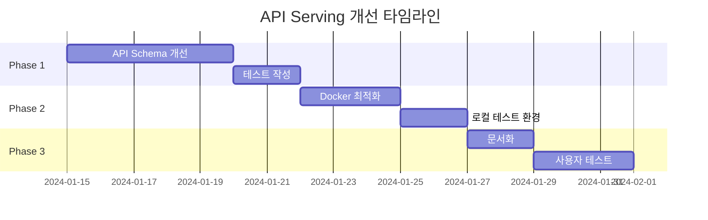

# API Serving & Docker 개선 계획

## 📋 Executive Summary

Modern ML Pipeline의 API 서빙 기능과 Docker 컨테이너화를 개선하여, 사용자가 쉽게 모델을 서빙할 수 있도록 지원하는 계획입니다. MMP는 ML 도구에 집중하고, 인프라 배포는 사용자의 책임으로 명확히 분리합니다.

## 🎯 개선 목표

1. **DataInterface 기반 API 스키마 자동 생성** - target_column 자동 제외
2. **프로덕션 최적화 Dockerfile** - 깔끔하고 효율적인 컨테이너
3. **명확한 책임 분리** - MMP는 도구 제공, 배포는 사용자 책임

## 🔄 현재 상태 vs 목표 상태

### 현재 상태 분석
```yaml
현재 구현:
  API Schema:
    - ✅ DataInterface 스키마 부분 지원
    - ❌ target_column 수동 제거 필요
    - ✅ 동적 Pydantic 모델 생성
  
  Docker:
    - ✅ Multi-stage Dockerfile 템플릿
    - ✅ 환경변수 기반 설정
    - ❌ 최적화 미흡
  
  문서:
    - ❌ 배포 가이드 부족
    - ❌ 책임 경계 불명확
```

### 목표 상태
```yaml
개선 후:
  API Schema:
    - ✅ target_column 자동 제외
    - ✅ Recipe YAML 완벽 동기화
    - ✅ OpenAPI 스키마 자동 생성
  
  Docker:
    - ✅ 프로덕션 최적화 이미지
    - ✅ 보안 강화 (non-root user)
    - ✅ 효율적인 레이어 캐싱
  
  문서:
    - ✅ 간단명료한 사용 가이드
    - ✅ 명확한 책임 경계
```

## 📝 구현 계획

### Phase 1: API Schema 개선

#### 1.1 DataInterface 기반 스키마 생성 개선

**파일: `src/serving/schema_generator.py`** (신규)
```python
from typing import Dict, Any, Type, List
from pydantic import BaseModel, Field, create_model

class APISchemaGenerator:
    """Recipe의 DataInterface를 기반으로 API 스키마를 자동 생성"""
    
    def __init__(self, recipe_settings: Dict[str, Any]):
        self.data_interface = recipe_settings.get('data', {}).get('data_interface', {})
        self.task_type = recipe_settings.get('task_choice', 'classification')
    
    def generate_request_schema(self) -> Type[BaseModel]:
        """
        API 요청 스키마 생성 (target_column 제외)
        
        Returns:
            동적으로 생성된 Pydantic 모델
        """
        fields = {}
        
        # 1. Entity columns (필수)
        for col in self.data_interface.get('entity_columns', []):
            fields[col] = (str, Field(..., description=f"Entity: {col}"))
        
        # 2. Feature columns (target 제외)
        target_col = self.data_interface.get('target_column')
        feature_cols = self.data_interface.get('feature_columns', [])
        
        for col in feature_cols:
            if col != target_col:  # target 자동 제외
                fields[col] = (Any, Field(..., description=f"Feature: {col}"))
        
        # 3. Task-specific columns
        if self.task_type == 'timeseries':
            ts_col = self.data_interface.get('timestamp_column')
            if ts_col and ts_col != target_col:
                fields[ts_col] = (str, Field(..., description="Timestamp"))
        
        return create_model('PredictionRequest', **fields)
    
    def generate_response_schema(self) -> Type[BaseModel]:
        """API 응답 스키마 생성"""
        return create_model(
            'PredictionResponse',
            prediction=(Any, Field(..., description="Model prediction")),
            confidence=(float | None, Field(None, description="Prediction confidence")),
            model_version=(str, Field(..., description="Model version"))
        )
```

#### 1.2 서빙 엔드포인트 개선

**파일: `src/serving/_lifespan.py`** (수정)
```python
def setup_api_context(run_id: str, settings: Settings):
    """개선된 API 컨텍스트 설정"""
    try:
        # 모델 로드
        model_uri = f"runs:/{run_id}/model"
        app_context.model = mlflow.pyfunc.load_model(model_uri)
        
        # PyfuncWrapper에서 recipe 정보 추출
        wrapped_model = app_context.model.unwrap_python_model()
        recipe_snapshot = wrapped_model.recipe_yaml_snapshot
        
        # 스키마 생성기 초기화
        generator = APISchemaGenerator(yaml.safe_load(recipe_snapshot))
        
        # 동적 스키마 생성 (target 자동 제외)
        app_context.PredictionRequest = generator.generate_request_schema()
        app_context.PredictionResponse = generator.generate_response_schema()
        
        # OpenAPI 문서에 반영
        app_context.openapi_schema = generator.generate_openapi_spec()
        
        logger.info(f"API 스키마 생성 완료: {list(app_context.PredictionRequest.__fields__.keys())}")
        
    except Exception as e:
        logger.error(f"API 컨텍스트 설정 실패: {e}")
        raise
```

### Phase 2: Docker 최적화

#### 2.1 Dockerfile 템플릿 개선

**파일: `src/cli/templates/docker/Dockerfile.j2`** (개선)

현재 템플릿과 비교한 **주요 개선사항**:

1. **가상환경 분리**: 시스템 Python 대신 격리된 venv 사용 (의존성 충돌 방지)
2. **레이어 캐싱 최적화**: 의존성과 코드 분리로 빌드 시간 단축
3. **보안 강화**: UID 명시, 권한 최소화
4. **불필요한 stage 제거**: scheduler stage 제거 (사용자가 필요시 추가)
5. **환경변수 개선**: 더 명확한 기본값 설정

```dockerfile
# ============================================
# Production Dockerfile for {{ project_name }}
# Generated by Modern ML Pipeline
# ============================================

ARG PYTHON_VERSION=3.11

# ============================================
# Stage 1: Dependencies Builder
# ============================================
FROM python:${PYTHON_VERSION}-slim AS builder

# 빌드 도구 설치 (최소한만)
RUN apt-get update && apt-get install -y --no-install-recommends \
    build-essential \
    curl \
    && rm -rf /var/lib/apt/lists/*

# uv 설치 (빠른 패키지 관리)
RUN curl -LsSf https://astral.sh/uv/install.sh | sh
ENV PATH="/root/.cargo/bin:$PATH"

WORKDIR /build

# 의존성 파일만 먼저 복사 (캐싱 최적화)
COPY pyproject.toml README.md ./

# 가상환경에 의존성 설치 (시스템 Python 오염 방지)
RUN uv venv /opt/venv && \
    . /opt/venv/bin/activate && \
    uv pip install --no-cache-dir -e ".[serving]"

# ============================================
# Stage 2: Runtime Base
# ============================================
FROM python:${PYTHON_VERSION}-slim AS runtime

# 런타임 필수 패키지만 설치
RUN apt-get update && apt-get install -y --no-install-recommends \
    curl \
    && rm -rf /var/lib/apt/lists/*

# 보안: non-root 사용자 (UID 고정)
RUN useradd -m -u 1001 -g 0 mlapp

WORKDIR /app

# 빌더에서 가상환경 복사
COPY --from=builder --chown=1001:0 /opt/venv /opt/venv
ENV PATH="/opt/venv/bin:$PATH"
ENV PYTHONPATH=/app
ENV PYTHONUNBUFFERED=1

# 앱 코드 복사
COPY --chown=1001:0 configs/ ./configs/
COPY --chown=1001:0 recipes/ ./recipes/
COPY --chown=1001:0 sql/ ./sql/
COPY --chown=1001:0 data/ ./data/

# MLflow 및 로그 디렉토리
RUN mkdir -p /app/mlruns /app/logs /app/artifacts && \
    chown -R 1001:0 /app && \
    chmod -R g=u /app

USER 1001

# ============================================
# Stage 3: API Serving (기본)
# ============================================
FROM runtime AS api

EXPOSE 8000

# 헬스체크
HEALTHCHECK --interval=30s --timeout=10s --start-period=40s --retries=3 \
    CMD curl -f http://localhost:8000/health || exit 1

# 환경변수 (명확한 기본값)
ENV MODEL_RUN_ID=""
ENV CONFIG_PATH="configs/production.yaml"
ENV HOST="0.0.0.0"
ENV PORT="8000"

# 실행 (sh -c 제거, 직접 실행)
ENTRYPOINT ["mmp", "serve-api"]
CMD ["--host", "0.0.0.0", "--port", "8000"]

# ============================================
# Stage 4: Training (선택적)
# ============================================
FROM runtime AS training

# 학습용 환경변수
ENV RECIPE_PATH="recipes/production_model.yaml"
ENV CONFIG_PATH="configs/production.yaml"
ENV DATA_PATH="data/train.csv"

CMD ["mmp", "train", "--recipe-path", "${RECIPE_PATH}", "--config-path", "${CONFIG_PATH}", "--data-path", "${DATA_PATH}"]

# ============================================
# Stage 5: Batch Inference (선택적)
# ============================================
FROM runtime AS inference

# 추론용 환경변수
ENV MODEL_RUN_ID=""
ENV CONFIG_PATH="configs/production.yaml"
ENV DATA_PATH=""

CMD ["mmp", "batch-inference", "--run-id", "${MODEL_RUN_ID}", "--config-path", "${CONFIG_PATH}", "--data-path", "${DATA_PATH}"]

# ============================================
# Default: API Serving
# ============================================
FROM api AS final
```

#### 2.2 개발용 Docker Compose

**파일: `src/cli/templates/docker/docker-compose.yml`** (개선)

```yaml
version: '3.8'

services:
  # API 서빙 서비스
  model-api:
    build:
      context: .
      dockerfile: Dockerfile
      target: api  # 명시적 타겟 지정
    image: {{ project_name }}:latest
    container_name: {{ project_name }}-api
    ports:
      - "${API_PORT:-8000}:8000"
    environment:
      - MODEL_RUN_ID=${MODEL_RUN_ID}
      - CONFIG_PATH=${CONFIG_PATH:-configs/development.yaml}
      - MLFLOW_TRACKING_URI=${MLFLOW_TRACKING_URI:-http://mlflow:5000}
      - LOG_LEVEL=${LOG_LEVEL:-INFO}
    volumes:
      - ./configs:/app/configs:ro
      - ./mlruns:/app/mlruns
      - ./logs:/app/logs
    networks:
      - ml-network
    restart: unless-stopped
    depends_on:
      mlflow:
        condition: service_healthy

  # MLflow 서버 (개발용)
  mlflow:
    image: python:3.11-slim
    container_name: {{ project_name }}-mlflow
    command: >
      sh -c "pip install --no-cache-dir mlflow psycopg2-binary && 
             mlflow server 
             --host 0.0.0.0 
             --port 5000 
             --backend-store-uri ${MLFLOW_BACKEND_URI:-sqlite:///mlflow/mlflow.db}
             --default-artifact-root ${MLFLOW_ARTIFACT_ROOT:-/mlflow/artifacts}"
    ports:
      - "${MLFLOW_PORT:-5000}:5000"
    volumes:
      - mlflow-data:/mlflow
    networks:
      - ml-network
    healthcheck:
      test: ["CMD", "curl", "-f", "http://localhost:5000/health"]
      interval: 30s
      timeout: 10s
      retries: 3
    restart: unless-stopped

networks:
  ml-network:
    driver: bridge

volumes:
  mlflow-data:
```

### Phase 3: 사용자 문서 개선

#### 3.1 프로젝트 README 템플릿에 Docker 가이드 추가

**파일: `src/cli/templates/project/README.md.j2`** (Docker 섹션 추가)

기존 README 템플릿의 "고급 기능" 섹션에 다음 내용을 추가:

```markdown
### 🐳 Docker 이미지 빌드 및 배포

#### 로컬 테스트 (Docker Compose)

```bash
# 1. 환경변수 설정
export MODEL_RUN_ID=abc123def456  # 학습된 모델의 run_id

# 2. Docker Compose로 로컬 실행
docker-compose up -d

# 3. API 테스트
curl http://localhost:8000/health
curl http://localhost:8000/docs  # OpenAPI 문서
```

#### 프로덕션 이미지 빌드

```bash
# 1. 이미지 빌드 (API 서빙용)
docker build -t {{ project_name }}:latest .

# 2. 특정 스테이지 빌드
docker build --target training -t {{ project_name }}:training .  # 학습용
docker build --target inference -t {{ project_name }}:inference .  # 배치 추론용

# 3. 이미지 실행
docker run -d \
  --name {{ project_name }}-api \
  -p 8000:8000 \
  -e MODEL_RUN_ID=abc123def456 \
  -e MLFLOW_TRACKING_URI=http://mlflow-server:5000 \
  -e CONFIG_PATH=configs/production.yaml \
  {{ project_name }}:latest
```

#### 이미지 최적화 팁

**빌드 시간 단축**:
```bash
# BuildKit 활성화 (빠른 빌드)
DOCKER_BUILDKIT=1 docker build -t {{ project_name }}:latest .

# 캐시 활용
docker build --cache-from {{ project_name }}:latest -t {{ project_name }}:v2 .
```

**이미지 크기 확인**:
```bash
docker images {{ project_name }}
# REPOSITORY        TAG       SIZE
# {{ project_name }}  latest    487MB  # 목표: <500MB
```

#### 환경변수 설정

**필수 환경변수**:
| 변수명 | 설명 | 예시 |
|--------|------|------|
| MODEL_RUN_ID | MLflow Run ID | abc123def456 |
| MLFLOW_TRACKING_URI | MLflow 서버 주소 | http://mlflow:5000 |
| CONFIG_PATH | Config 파일 경로 | configs/production.yaml |

**선택 환경변수**:
| 변수명 | 설명 | 기본값 |
|--------|------|--------|
| HOST | API 서버 호스트 | 0.0.0.0 |
| PORT | API 서버 포트 | 8000 |
| LOG_LEVEL | 로그 레벨 | INFO |

#### 배포 옵션

빌드된 이미지는 다양한 플랫폼에 배포 가능:

- **Docker 단독**: 위 예시 참고
- **Kubernetes**: 자체 매니페스트 작성 필요
- **AWS ECS**: Task Definition 생성
- **GCP Cloud Run**: `gcloud run deploy`
- **Azure Container Instances**: `az container create`

**주의**: MMP는 도구를 제공합니다. 실제 배포는 귀하의 인프라에 맞게 진행하세요.
```

## 🎯 성공 지표

### 기술적 지표
- [ ] API 응답 시간 < 100ms (p95)
- [ ] 컨테이너 이미지 크기 < 500MB
- [ ] 메모리 사용량 < 1GB

### 사용성 지표
- [ ] 5분 내 로컬 테스트 가능
- [ ] 10분 내 프로덕션 배포 가능
- [ ] 문서 읽고 즉시 이해 가능

## 📅 타임라인



## ✅ 체크리스트

### 구현 항목
- [ ] DataInterface 기반 API 스키마 자동 생성
- [ ] target_column 자동 제외 로직
- [ ] 프로덕션 최적화 Dockerfile
- [ ] Docker Compose 템플릿
- [ ] 간단명료한 사용 문서

### 제외 항목 (사용자 책임)
- ❌ Kubernetes 매니페스트
- ❌ CI/CD 파이프라인
- ❌ 인프라 배포 스크립트
- ❌ 환경별 설정 관리

## 🔗 참고 자료

- [FastAPI Production](https://fastapi.tiangolo.com/deployment/)
- [Docker Best Practices](https://docs.docker.com/develop/dev-best-practices/)
- [MLflow Model Serving](https://mlflow.org/docs/latest/models.html#deploy-mlflow-models)