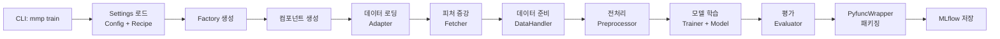
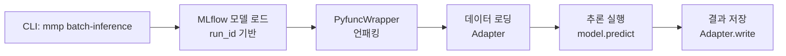

# Modern ML Pipeline - 프로젝트 구조 및 파이프라인 흐름 분석

## 📊 Executive Summary

Modern ML Pipeline (MMP)은 **구성 중심 설계(Configuration-Driven Design)**와 **플러그인 아키텍처**를 기반으로 한 확장 가능한 ML 프레임워크입니다. YAML 설정 파일을 통해 다양한 ML 워크플로우를 정의하고 실행할 수 있으며, MLflow와 통합되어 실험 추적과 모델 서빙을 지원합니다.

## 🏗️ 전체 아키텍처 개요

```
┌─────────────────────────────────────────────────────────────┐
│                        CLI Layer                             │
│                    (Typer-based Commands)                    │
├─────────────────────────────────────────────────────────────┤
│                      Settings Layer                          │
│               (Config + Recipe → Settings)                   │
├─────────────────────────────────────────────────────────────┤
│                      Factory Layer                           │
│            (Component Creation & Orchestration)              │
├─────────────────────────────────────────────────────────────┤
│                    Component Layer                           │
│  ┌──────────┬───────────┬────────────┬──────────┬─────────┐│
│  │ Adapter  │ Fetcher   │DataHandler │ Trainer  │Evaluator││
│  │          │           │            │          │         ││
│  │          │Preprocessor│           │  Model   │         ││
│  └──────────┴───────────┴────────────┴──────────┴─────────┘│
├─────────────────────────────────────────────────────────────┤
│                    Interface Layer                           │
│              (Abstract Base Classes/Contracts)               │
├─────────────────────────────────────────────────────────────┤
│                   Infrastructure Layer                       │
│            (MLflow, Database, Storage, APIs)                 │
└─────────────────────────────────────────────────────────────┘
```

## 📁 디렉토리 구조

```
modern-ml-pipeline/
├── src/
│   ├── __main__.py              # 진입점
│   ├── cli/                     # CLI 명령어 구현
│   │   ├── commands/            # 개별 명령어 모듈
│   │   └── utils/               # CLI 유틸리티
│   ├── components/              # 핵심 컴포넌트
│   │   ├── adapter/             # 데이터 I/O 어댑터
│   │   ├── datahandler/         # 데이터 준비/분할
│   │   ├── evaluator/           # 평가 메트릭
│   │   ├── fetcher/             # 피처 증강
│   │   ├── preprocessor/       # 전처리 변환
│   │   └── trainer/             # 학습 오케스트레이션
│   ├── factory/                 # 팩토리 패턴 구현
│   ├── interface/               # 추상 기본 클래스
│   ├── models/                  # 커스텀 모델 구현
│   ├── pipelines/               # 파이프라인 실행 로직
│   ├── serving/                 # API 서빙 (FastAPI)
│   ├── settings/                # 설정 관리
│   └── utils/                   # 유틸리티 함수
├── configs/                     # 환경 설정 파일
├── recipes/                     # 워크플로우 정의 파일
└── tests/                       # 테스트 코드
```

## 🔄 주요 파이프라인 흐름

### 1. 학습 파이프라인 (Train Pipeline)

```python
# src/pipelines/train_pipeline.py 흐름
```



**상세 실행 단계:**

1. **설정 로드**: Recipe(워크플로우) + Config(인프라) YAML 파일 파싱
2. **Factory 초기화**: Settings 기반으로 Factory 인스턴스 생성
3. **컴포넌트 생성**: Factory가 Registry를 통해 필요한 컴포넌트 동적 생성
4. **데이터 파이프라인**:
   - Adapter: SQL/CSV/Parquet 등 데이터 소스에서 읽기
   - Fetcher: Feature Store 또는 외부 소스에서 피처 증강
   - DataHandler: Train/Test 분할, 타겟 분리
   - Preprocessor: 스케일링, 인코딩, 결측치 처리
5. **학습**: Trainer가 Model 인스턴스와 데이터로 학습 수행
6. **평가**: Evaluator가 메트릭 계산
7. **패키징**: PyfuncWrapper로 모든 컴포넌트 캡슐화
8. **저장**: MLflow에 모델과 메타데이터 저장

### 2. 추론 파이프라인 (Inference Pipeline)

```python
# src/pipelines/inference_pipeline.py 흐름
```



### 3. API 서빙 (API Serving)

```python
# src/serving/router.py 흐름
```

```mermaid
graph LR
    A[CLI: mmp serve-api] --> B[FastAPI 앱 시작]
    B --> C[MLflow 모델 로드]
    C --> D[API 엔드포인트<br/>활성화]
    D --> E[/predict<br/>실시간 예측]
    D --> F[/health<br/>상태 확인]
    D --> G[/model/metadata<br/>모델 정보]
```

## 🏭 Factory 패턴과 Registry 시스템

### Factory 클래스

```python
class Factory:
    """중앙 컴포넌트 생성 관리자"""
    
    def __init__(self, settings: Settings):
        self._ensure_components_registered()  # 레지스트리 초기화
        self.settings = settings
        self._component_cache = {}  # 생성된 컴포넌트 캐싱
    
    def create_data_adapter(self):
        # URI 패턴 분석 → 적절한 어댑터 선택
        # AdapterRegistry.create(adapter_type, settings)
    
    def create_model(self):
        # class_path에서 동적 임포트
        # sklearn, xgboost, torch 등 외부 라이브러리 모델 생성
```

### Registry 패턴

각 컴포넌트 타입별 독립적인 Registry:

```python
class AdapterRegistry:
    adapters: Dict[str, Type[BaseAdapter]] = {}
    
    @classmethod
    def register(cls, adapter_type: str, adapter_class: Type[BaseAdapter]):
        """자가 등록 패턴"""
        cls.adapters[adapter_type] = adapter_class
    
    @classmethod
    def create(cls, adapter_type: str, *args, **kwargs):
        """팩토리 메서드"""
        return cls.adapters[adapter_type](*args, **kwargs)
```

**자가 등록 메커니즘:**
- 각 컴포넌트 모듈이 임포트될 때 자동으로 Registry에 등록
- 중앙 등록 로직 불필요 → 낮은 결합도
- 플러그인 방식으로 새 컴포넌트 추가 가능

## 📋 Interface 계층 (계약 정의)

### 핵심 인터페이스

```python
# 데이터 I/O 계약
class BaseAdapter(ABC):
    @abstractmethod
    def read(self, source: str) -> pd.DataFrame: ...
    @abstractmethod
    def write(self, df: pd.DataFrame, target: str): ...

# ML 모델 계약
class BaseModel(ABC):
    @abstractmethod
    def fit(self, X: pd.DataFrame, y: pd.Series): ...
    @abstractmethod
    def predict(self, X: pd.DataFrame) -> pd.DataFrame: ...

# 데이터 처리 계약
class BaseDataHandler(ABC):
    @abstractmethod
    def prepare_data(self, df) -> Tuple[X, y, additional]: ...
    @abstractmethod
    def split_data(self, df) -> Tuple[train_df, test_df]: ...

# 전처리 계약
class BasePreprocessor(ABC):
    @abstractmethod
    def fit(self, X: pd.DataFrame): ...
    @abstractmethod
    def transform(self, X: pd.DataFrame) -> pd.DataFrame: ...
```

## 🔧 컴포넌트 의존성 흐름

```
Settings (Config + Recipe)
    ↓
Factory
    ↓ (creates via Registry)
┌──────────────────────────────┐
│  Component Instances          │
├──────────────────────────────┤
│  Adapter ← Settings           │
│  Fetcher ← Settings           │
│  DataHandler ← Settings       │
│  Preprocessor ← Settings      │
│  Trainer ← Settings           │
│  Model ← Settings             │
│  Evaluator ← Settings         │
└──────────────────────────────┘
    ↓
PyfuncWrapper (encapsulates all)
    ↓
MLflow Model Registry
```

## 🎯 주요 설계 패턴

### 1. **Configuration-Driven Design**
- YAML 파일로 전체 워크플로우 정의
- 코드 변경 없이 동작 변경 가능
- Recipe (워크플로우) + Config (인프라) 분리

### 2. **Factory Pattern**
- 중앙집중식 객체 생성 관리
- 설정 기반 동적 컴포넌트 생성
- 캐싱을 통한 성능 최적화

### 3. **Registry Pattern**
- 컴포넌트별 독립적인 레지스트리
- 자가 등록(self-registration) 메커니즘
- 플러그인 방식 확장성

### 4. **Dependency Injection**
- Settings 객체를 통한 의존성 주입
- 느슨한 결합(loose coupling)
- 테스트 용이성

### 5. **Template Method Pattern**
- BaseDataHandler의 split_and_prepare 메서드
- 공통 워크플로우 + 구체 구현 분리

### 6. **Wrapper Pattern**
- PyfuncWrapper로 전체 파이프라인 캡슐화
- MLflow 호환성 보장
- 추론 시 일관성 유지

## 💡 아키텍처 특징

### 강점
1. **확장성**: Registry 패턴으로 새 컴포넌트 쉽게 추가
2. **유연성**: YAML 설정으로 다양한 ML 워크플로우 지원
3. **재사용성**: 컴포넌트 단위 재사용 가능
4. **추적성**: MLflow 통합으로 실험 관리
5. **타입 안정성**: Interface 계층의 명확한 계약
6. **운영 준비**: API 서빙, 배치 추론 즉시 가능

### 설계 원칙
- **Separation of Concerns**: 각 컴포넌트가 단일 책임
- **Open/Closed Principle**: 확장에는 열려있고 수정에는 닫혀있음
- **Dependency Inversion**: 추상화에 의존, 구체 구현에 독립적
- **Don't Repeat Yourself**: 공통 로직은 base 클래스에 집중

## 🚀 실행 플로우 예시

### 학습 실행
```bash
mmp train \
    --recipe-path recipes/model.yaml \
    --config-path configs/dev.yaml \
    --data-path data/train.csv
```

### 배치 추론
```bash
mmp batch-inference \
    --config-path configs/prod.yaml \
    --run-id <mlflow_run_id> \
    --data-path data/test.csv
```

### API 서빙
```bash
mmp serve-api \
    --host 0.0.0.0 \
    --port 8000
```

## 📊 결론

Modern ML Pipeline은 **엔터프라이즈급 ML 시스템**의 요구사항을 충족하는 잘 설계된 프레임워크입니다. 구성 중심 설계와 플러그인 아키텍처를 통해 다양한 ML 워크플로우를 지원하면서도, 명확한 인터페이스와 의존성 관리로 유지보수성을 확보했습니다. 특히 Factory-Registry 패턴의 조합은 확장성과 유연성을 동시에 제공하는 핵심 설계입니다.