# Modern ML Pipeline - CLI 워크플로우 분석 보고서

**생성일**: 2025년 9월 7일  
**분석 범위**: src/cli/ 디렉토리 전체 구조 및 사용자 워크플로우  
**분석 목적**: CLI 진입점과 사용자 유도 워크플로우 상세 분석

## 📋 목차

1. [CLI 아키텍처 개요](#1-cli-아키텍처-개요)
2. [명령어별 워크플로우 분석](#2-명령어별-워크플로우-분석)
3. [사용자 경험(UX) 시스템](#3-사용자-경험ux-시스템)
4. [템플릿 기반 설정 생성](#4-템플릿-기반-설정-생성)
5. [사용자 워크플로우 매핑](#5-사용자-워크플로우-매핑)
6. [CLI 혁신점 및 특징](#6-cli-혁신점-및-특징)
7. [사용자 여정 분석](#7-사용자-여정-분석)

---

## 1. CLI 아키텍처 개요

### 1.1 디렉토리 구조

```
src/cli/
├── main_commands.py           # 진입점 및 명령어 라우팅
├── commands/                  # 개별 명령어 구현
│   ├── init_command.py        # 프로젝트 초기화
│   ├── get_config_command.py  # 환경 설정 생성
│   ├── get_recipe_command.py  # 모델 레시피 생성
│   ├── train_command.py       # 학습 실행
│   ├── inference_command.py   # 배치 추론
│   ├── serve_command.py       # API 서빙
│   ├── system_check_command.py # 시스템 검증
│   └── list_commands.py       # 컴포넌트 목록
├── utils/                     # 유틸리티 클래스
│   ├── interactive_ui.py      # 대화형 UI 컴포넌트
│   ├── config_builder.py      # 설정 빌더
│   ├── recipe_builder.py      # 레시피 빌더
│   ├── template_engine.py     # 템플릿 엔진
│   └── system_checker.py      # 시스템 검증
└── templates/                 # Jinja2 템플릿
    ├── configs/               # 설정 템플릿
    ├── recipes/               # 레시피 템플릿
    ├── docker/                # Docker 템플릿
    └── project/               # 프로젝트 템플릿
```

### 1.2 핵심 설계 원칙

1. **단계적 유도 (Progressive Guidance)**: 사용자를 복잡성에서 단순성으로 안내
2. **대화형 인터페이스 (Interactive Interface)**: 모든 설정을 대화형으로 생성
3. **템플릿 기반 생성**: Jinja2를 활용한 동적 파일 생성
4. **분리된 관심사**: 환경(Config)과 비즈니스 로직(Recipe) 분리
5. **검증 우선**: 생성된 설정의 연결성을 사전 검증

---

## 2. 명령어별 워크플로우 분석

### 2.1 프로젝트 초기화 (`init`)

**파일**: `src/cli/commands/init_command.py:15-117`

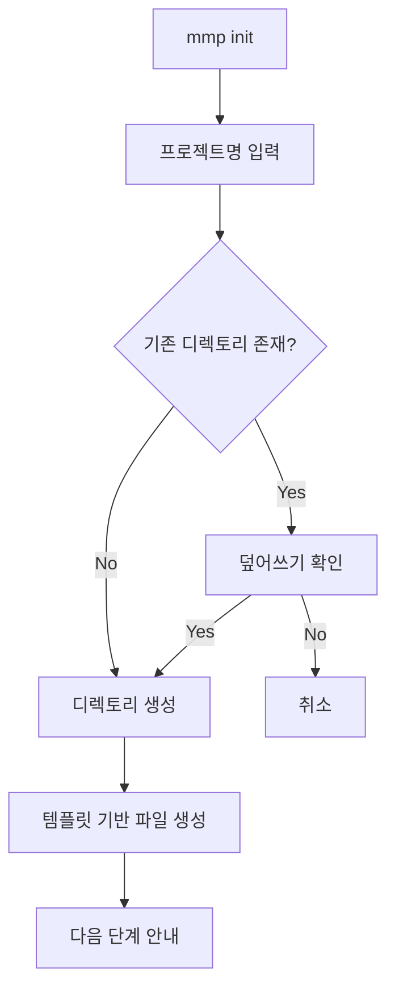

**생성 파일**:
```bash
project_name/
├── data/
├── configs/
├── recipes/
├── sql/
├── docker-compose.yml
├── Dockerfile
├── pyproject.toml
├── README.md
└── .gitignore
```

**사용자 유도 메시지**:
```bash
cd project_name
mmp get-config        # 환경 설정 생성
mmp get-recipe        # 모델 레시피 생성
mmp train -r recipes/<recipe>.yaml -e <env>  # 학습 실행
```

### 2.2 환경 설정 생성 (`get-config`)

**파일**: `src/cli/commands/get_config_command.py:14-90`

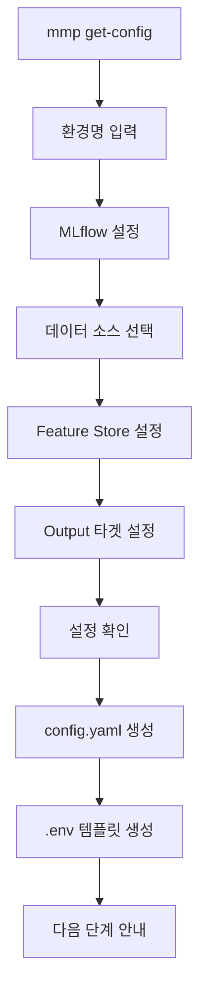

**대화형 선택 옵션**:

| 단계 | 옵션 | 기본값 |
|------|------|--------|
| MLflow | 사용/미사용 | 사용 |
| 데이터소스 | PostgreSQL, BigQuery, Local Files, S3, GCS | Local Files |
| Feature Store | 없음, Feast | 없음 |
| Output Storage | PostgreSQL, BigQuery, Local Files, S3, GCS | Local Files |

**생성 파일**:
- `configs/{env_name}.yaml`: 환경별 설정
- `.env.{env_name}.template`: 환경 변수 템플릿

### 2.3 모델 레시피 생성 (`get-recipe`)

**파일**: `src/cli/commands/get_recipe_command.py:13-121`

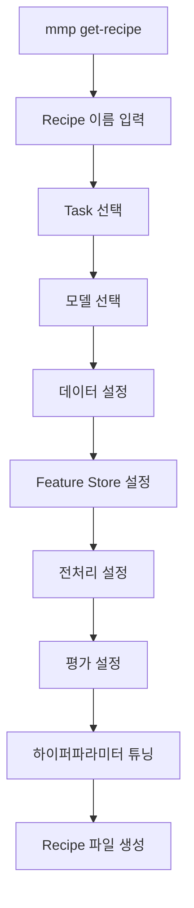

**Task별 사용 가능 모델**:
- **Classification**: RandomForest, XGBoost, CatBoost, LightGBM
- **Regression**: LinearRegression, RandomForest, XGBoost, SVR
- **Timeseries**: ARIMA, Prophet, LSTM
- **Clustering**: KMeans, DBSCAN, GaussianMixture
- **Causal**: DoubleMachineLearning, LinearDML

**전처리 옵션 (논리적 순서)**:
1. **Missing Value Handling**: SimpleImputer
2. **Encoding**: OneHotEncoder, OrdinalEncoder, CatBoostEncoder
3. **Feature Engineering**: PolynomialFeatures, TreeBasedFeatures
4. **Scaling**: StandardScaler, MinMaxScaler, RobustScaler

### 2.4 시스템 검증 (`system-check`)

**파일**: `src/cli/commands/system_check_command.py:16-90`

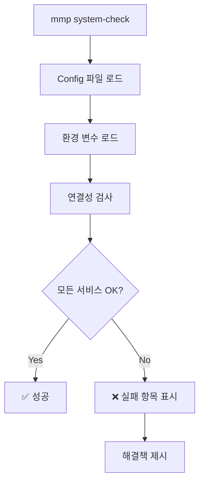

**검증 항목**:
- MLflow Tracking Server 연결
- 데이터 소스 연결 (DB/Storage)
- Feature Store 연결 (Feast/Tecton)
- Artifact Storage 접근성
- API Serving 설정 검증

### 2.5 학습 실행 (`train`)

**파일**: `src/cli/commands/train_command.py:19-111`

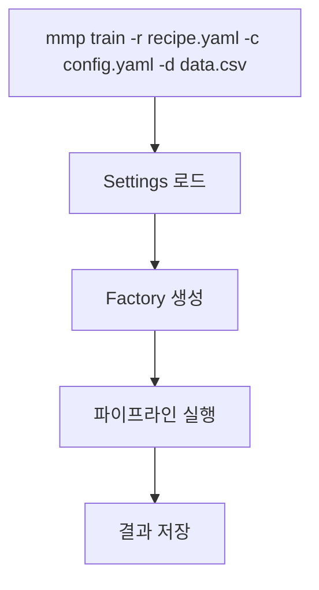

**매개변수 처리**:
- **Recipe 파일**: 모델과 전처리 설정
- **Config 파일**: 환경별 인프라 설정
- **Data Path**: 학습 데이터 경로 (Jinja 템플릿 지원)
- **Context Params**: 동적 파라미터 (JSON 형식)

---

## 3. 사용자 경험(UX) 시스템

### 3.1 InteractiveUI 클래스

**파일**: `src/cli/utils/interactive_ui.py:22-310`

**핵심 UI 컴포넌트**:

```python
class InteractiveUI:
    def select_from_list()        # 번호 선택 리스트
    def confirm()                 # Y/N 확인
    def text_input()             # 텍스트 입력 (검증 포함)
    def number_input()           # 숫자 입력 (범위 검증)
    def show_table()             # 테이블 형태 정보 표시
    def show_panel()             # 패널 형태 안내 표시
    def show_success/error/warning/info()  # 상태별 메시지
```

**Rich 라이브러리 활용**:
- **컬러 출력**: 성공(green), 에러(red), 경고(yellow), 정보(blue)
- **테이블 표시**: 모델 목록, 설정 요약
- **진행 상황**: 스피너, 프로그레스 바
- **패널**: 중요 정보 강조 표시

### 3.2 사용자 안내 시스템

**단계별 안내 메시지 예시**:

1. **초기화 완료 후**:
```bash
🚀 다음 단계:
cd project_name
mmp get-config        # 환경 설정 생성  
mmp get-recipe        # 모델 레시피 생성
mmp train -r recipes/<recipe>.yaml -e <env>  # 학습 실행
```

2. **설정 생성 완료 후**:
```bash
💡 다음 단계:
1. 환경 변수 파일 준비: cp .env.local.template .env.local
2. .env.local 파일을 편집하여 실제 인증 정보 입력
3. 시스템 연결 테스트: mmp system-check -c configs/local.yaml
4. Recipe 생성: mmp get-recipe
```

3. **레시피 생성 완료 후**:
```bash
✅ Recipe가 성공적으로 생성되었습니다!
📄 파일 경로: recipes/my_model.yaml
🎯 Task: Classification
🤖 모델: RandomForestClassifier

💡 다음 단계:
1. Recipe 파일 확인: cat recipes/my_model.yaml
2. 학습 실행: mmp train -r recipes/my_model.yaml -c configs/local.yaml -d data/train.csv
```

---

## 4. 템플릿 기반 설정 생성

### 4.1 TemplateEngine 시스템

**파일**: `src/cli/utils/template_engine.py:19-155`

**기능**:
```python
class TemplateEngine:
    def render_template()        # Jinja2 렌더링
    def write_rendered_file()    # 렌더링 후 파일 저장
    def copy_static_file()       # 정적 파일 복사
    def list_templates()         # 템플릿 목록 조회
```

**Jinja2 설정**:
- `autoescape=False`: HTML 이스케이프 비활성화
- `trim_blocks=True`: 블록 끝 공백 제거
- `lstrip_blocks=True`: 블록 시작 공백 제거
- `keep_trailing_newline=True`: 마지막 개행 유지

### 4.2 템플릿 파일 구조

**Config 템플릿** (`src/cli/templates/configs/config.yaml.j2`):
- 환경별 MLflow 설정
- 데이터 소스별 어댑터 설정
- Feature Store 통합 (Feast)
- Output 타겟 설정
- 환경 변수 치환 지원

**Recipe 템플릿** (`src/cli/templates/recipes/recipe.yaml.j2`):
- Task별 모델 설정
- 하이퍼파라미터 튜닝 설정 (Optuna)
- 데이터 인터페이스 설정
- 전처리 파이프라인
- 평가 메트릭 설정

### 4.3 동적 설정 생성

**ConfigBuilder** (`src/cli/utils/config_builder.py`):
- 대화형 플로우로 사용자 선택 수집
- 선택 사항을 템플릿 컨텍스트로 변환
- 환경 변수 템플릿 자동 생성
- 데이터 소스별 맞춤 설정

**RecipeBuilder** (`src/cli/utils/recipe_builder.py`):
- 모델 카탈로그 기반 모델 선택
- Task별 특화 설정 (causal, timeseries 등)
- 전처리 단계별 파라미터 설정
- 하이퍼파라미터 튜닝 설정

---

## 5. 사용자 워크플로우 매핑

### 5.1 초보자 워크플로우

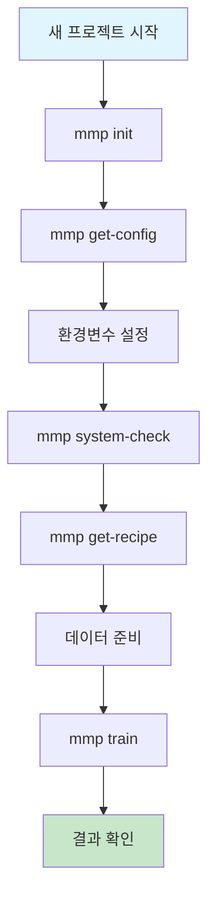

### 5.2 고급 사용자 워크플로우

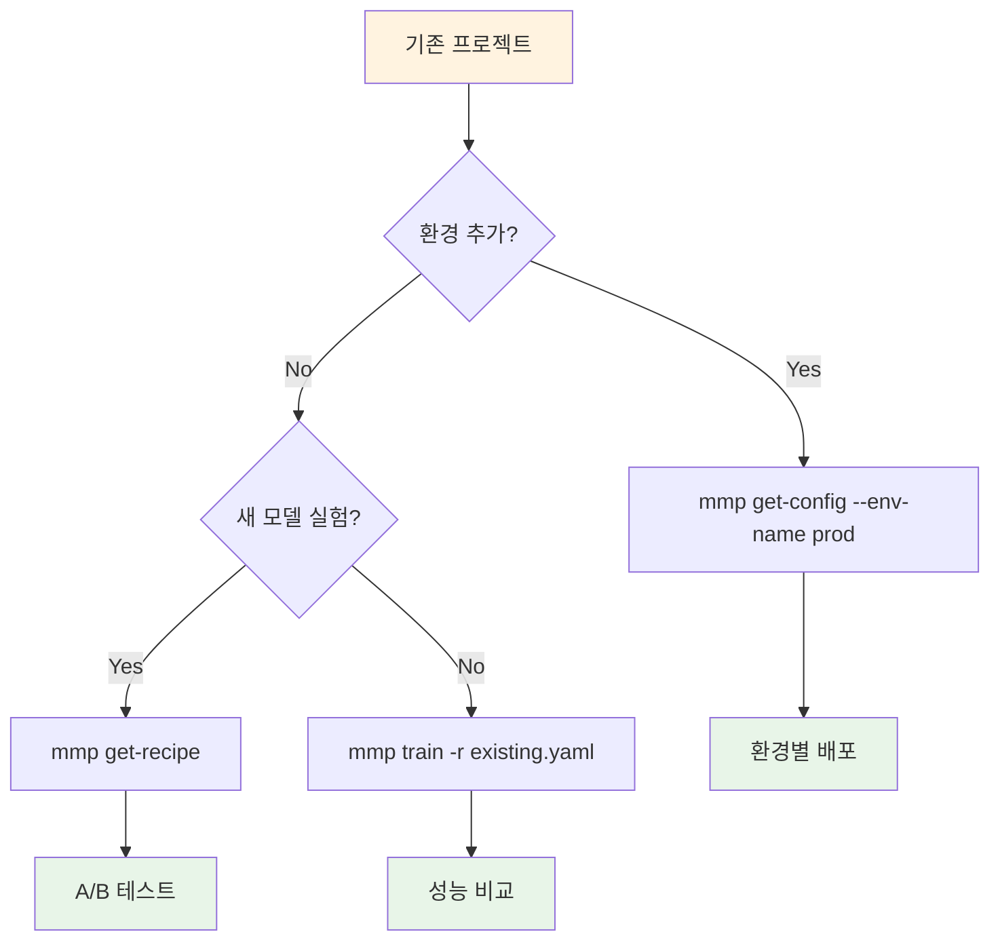

### 5.3 프로덕션 워크플로우

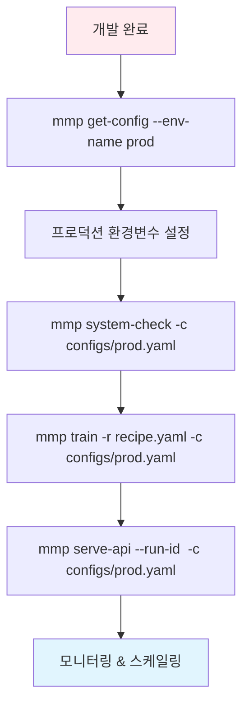

---

## 6. CLI 혁신점 및 특징

### 6.1 설계 혁신점

#### 1. **환경-비즈니스 로직 분리**
- **Config**: 환경별 인프라 설정 (dev, staging, prod)
- **Recipe**: 환경 독립적 모델 설정
- **재사용성**: 동일 Recipe를 여러 환경에서 사용

#### 2. **점진적 복잡성 관리**
- **init** → **get-config** → **get-recipe** → **train** 순서
- 각 단계에서 다음 단계 명확히 안내
- 복잡한 설정을 대화형으로 단순화

#### 3. **템플릿 기반 코드 생성**
- Jinja2 기반 동적 설정 생성
- 사용자 선택에 따른 맞춤 설정
- 일관된 설정 구조 보장

#### 4. **검증 우선 접근법**
- `system-check`를 통한 연결성 사전 검증
- 실행 전 오류 발견 및 해결
- 명확한 해결책 제시

### 6.2 사용자 친화적 특징

#### 1. **Rich 기반 시각적 UI**
- 컬러풀한 출력과 명확한 상태 표시
- 테이블, 패널을 활용한 정보 구조화
- 진행 상황 및 스피너 표시

#### 2. **맥락적 도움말**
- 각 단계별 상세한 안내 메시지
- 예제 명령어 제공
- 오류 시 구체적 해결책 제시

#### 3. **유연한 입력 방식**
- 대화형 모드와 CLI 파라미터 모드 지원
- 기본값 제공으로 빠른 시작 지원
- 검증 기능으로 잘못된 입력 방지

#### 4. **단계별 확인 시스템**
- 각 단계 완료 후 설정 요약 표시
- 진행 전 사용자 확인 요청
- 되돌리기 및 재시작 옵션

---

## 7. 사용자 여정 분석

### 7.1 첫 사용자 여정 (Zero to Hero)

**목표**: ML 초보자도 10분 내 첫 모델 학습

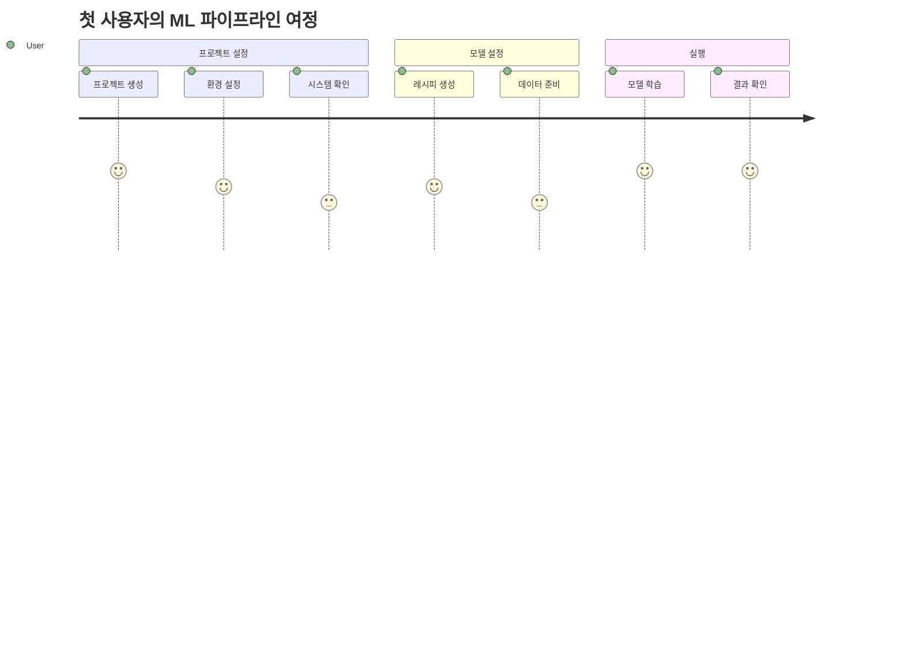

**각 단계별 소요 시간**:
1. **프로젝트 생성** (1분): `mmp init` → 기본 구조 생성
2. **환경 설정** (2분): `mmp get-config` → 대화형 설정 생성
3. **환경변수 설정** (1분): `.env` 파일 편집
4. **시스템 확인** (30초): `mmp system-check` → 연결성 검증
5. **모델 레시피** (3분): `mmp get-recipe` → 모델 및 전처리 설정
6. **데이터 준비** (1분): CSV 파일 배치
7. **모델 학습** (1-5분): `mmp train` → 실제 학습 실행
8. **결과 확인** (30초): MLflow UI 확인

### 7.2 경험자 여정 (Production Ready)

**목표**: 기존 사용자가 프로덕션 환경으로 확장

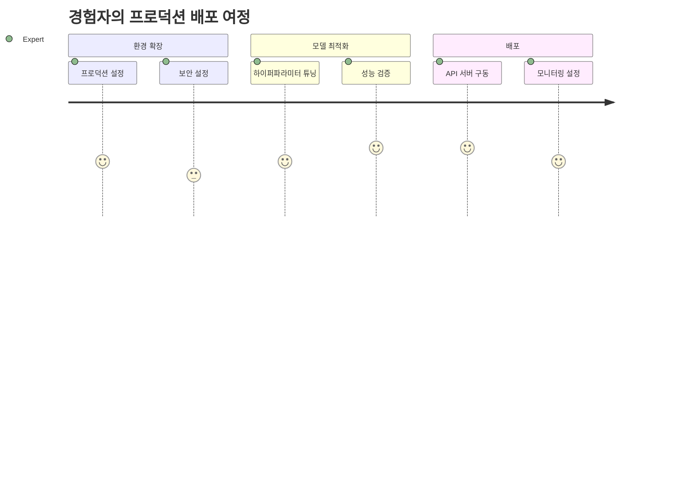

### 7.3 팀 협업 여정 (Team Collaboration)

**목표**: 여러 팀원이 일관된 환경에서 협업

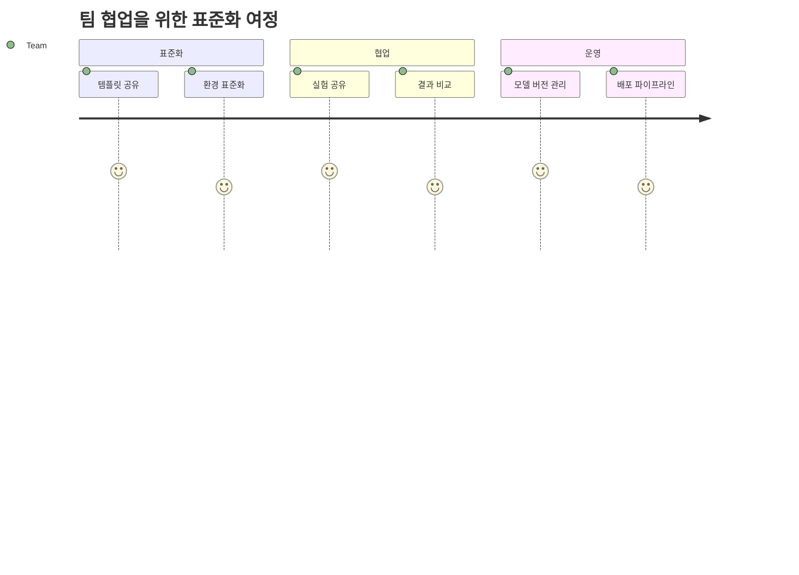

---

## 8. 결론 및 혁신성 평가

### 8.1 CLI 시스템의 핵심 가치

1. **진입 장벽 제거**: 복잡한 MLOps를 대화형 인터페이스로 단순화
2. **일관성 보장**: 템플릿 기반 설정으로 표준화된 구조
3. **점진적 학습**: 초보자부터 전문가까지 단계적 성장 지원
4. **검증 우선**: 실행 전 연결성 확인으로 실패 최소화
5. **환경 분리**: Config/Recipe 분리로 재사용성 극대화

### 8.2 기존 MLOps 도구와의 차별점

| 측면 | 기존 도구 | Modern ML Pipeline CLI |
|------|----------|----------------------|
| **설정 방식** | YAML 직접 편집 | 대화형 생성 |
| **학습 곡선** | 가파름 | 점진적 |
| **환경 관리** | 혼재 | Config/Recipe 분리 |
| **오류 처리** | 실행 후 발견 | 사전 검증 |
| **사용자 경험** | CLI 전문가 대상 | 모든 레벨 지원 |
| **재사용성** | 환경별 중복 | 환경 독립적 |

### 8.3 혁신적 특징 요약

1. **대화형 설정 생성**: 복잡한 YAML을 대화형으로 생성
2. **검증 우선 접근**: 실행 전 연결성 검증으로 안정성 보장
3. **환경-로직 분리**: Config(환경)와 Recipe(비즈니스) 완전 분리
4. **Rich UI**: 터미널에서도 풍부한 사용자 경험 제공
5. **점진적 가이드**: 각 단계별 명확한 다음 액션 제시
6. **템플릿 기반**: Jinja2로 일관된 설정 구조 보장

이 CLI 시스템은 **MLOps의 민주화**를 달성한 혁신적 도구로, 기술적 복잡성을 사용자 친화적 인터페이스 뒤로 숨기면서도 전문가 수준의 기능을 제공하는 균형 잡힌 설계를 보여줍니다.

---

**보고서 작성자**: Claude Code Assistant  
**분석 완료일**: 2025년 9월 7일  
**버전**: 1.0