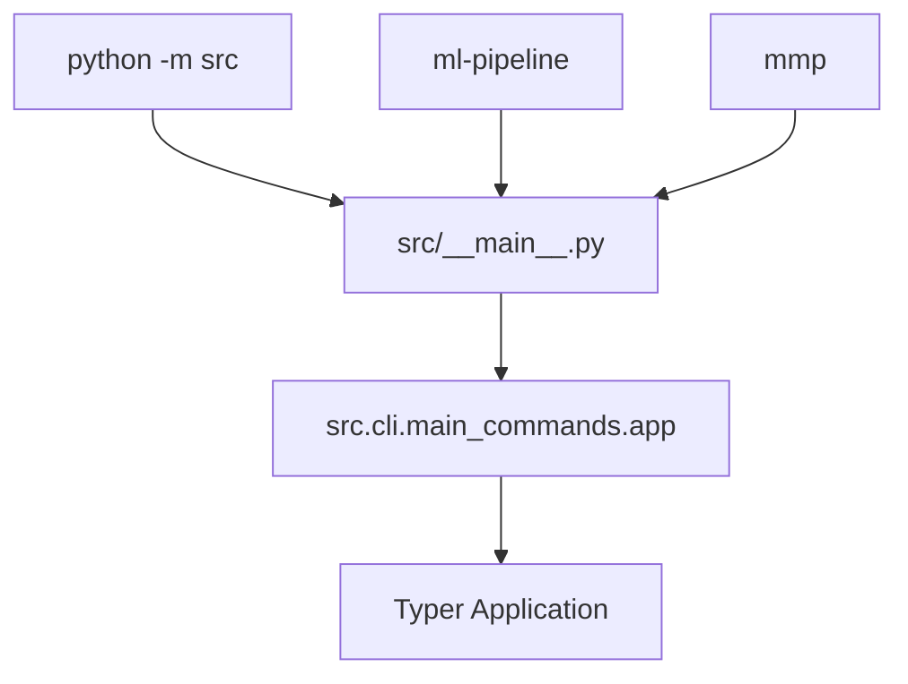
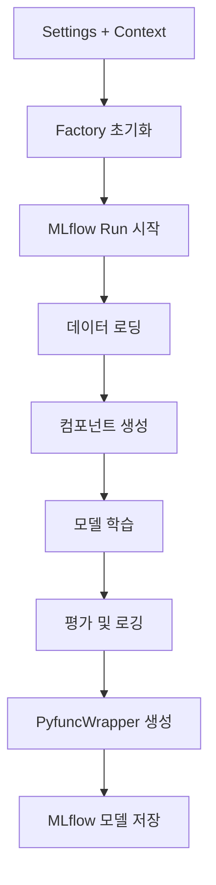
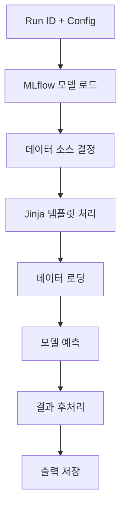
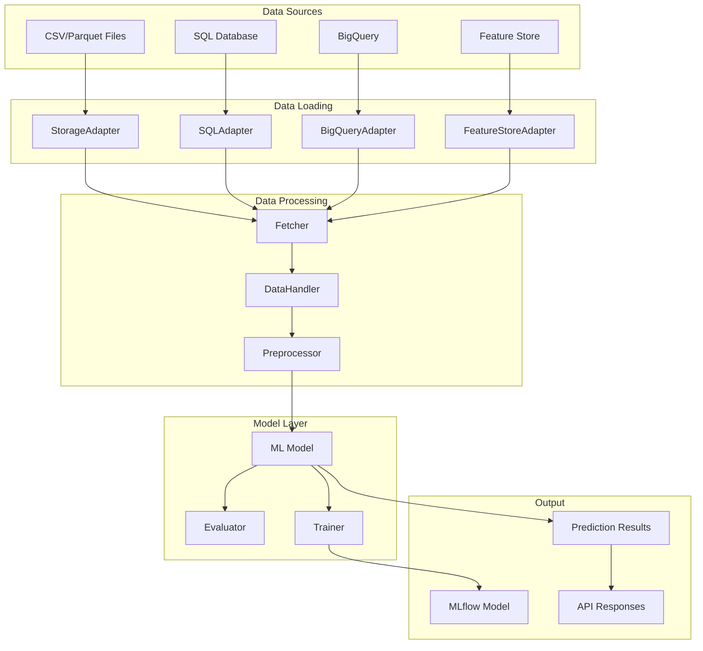
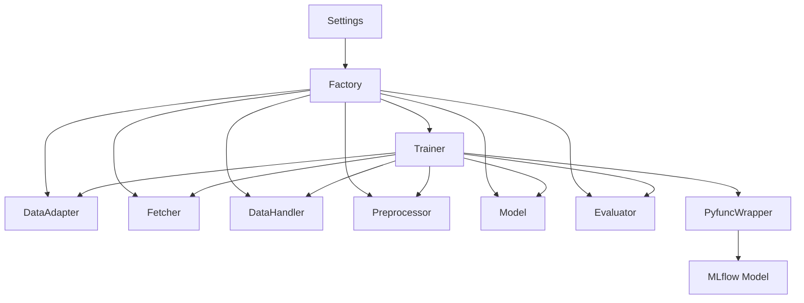
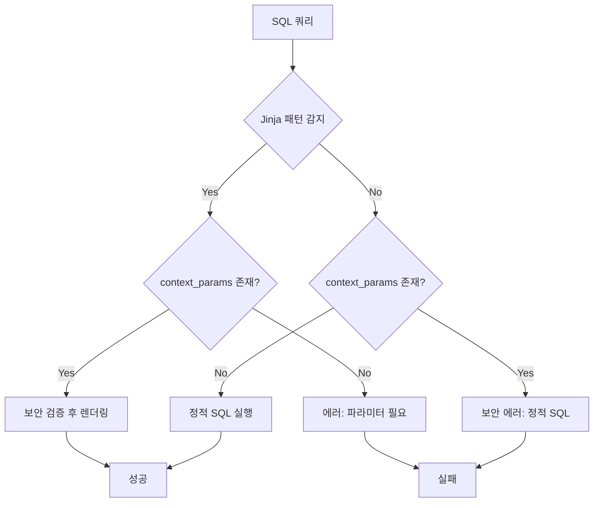

# Modern ML Pipeline - End-to-End 파이프라인 분석 보고서

**생성일**: 2025년 9월 7일  
**분석 범위**: CLI → Pipeline 전체 갈래 파이프라인  
**분석 방법**: 소스코드 구조 분석, 데이터 플로우 추적, Sequential Thinking 적용

## 📋 목차

1. [시스템 개요](#1-시스템-개요)
2. [CLI 진입점 및 명령어 체계](#2-cli-진입점-및-명령어-체계)
3. [핵심 파이프라인 아키텍처](#3-핵심-파이프라인-아키텍처)
4. [Factory 패턴 및 컴포넌트 생성](#4-factory-패턴-및-컴포넌트-생성)
5. [데이터 플로우 및 의존성 관계](#5-데이터-플로우-및-의존성-관계)
6. [MLflow 통합 및 모델 아티팩트](#6-mlflow-통합-및-모델-아티팩트)
7. [보안 및 동적 쿼리 처리](#7-보안-및-동적-쿼리-처리)
8. [확장성 및 모듈화](#8-확장성-및-모듈화)
9. [주요 혁신점 및 결론](#9-주요-혁신점-및-결론)

---

## 1. 시스템 개요

**Modern ML Pipeline**은 설정 기반의 현대적 MLOps 플랫폼으로, 머신러닝 모델의 학습부터 서빙까지 전체 라이프사이클을 일관된 아키텍처로 지원하는 시스템입니다.

### 1.1 핵심 특징

- **설정 중심 아키텍처**: Recipe + Config 파일로 모든 동작 제어
- **전체 파이프라인 재현성**: MLflow PyfuncWrapper를 통한 완전한 캡슐화
- **다양한 실행 모드**: CLI, 배치 추론, API 서빙 지원
- **확장 가능한 컴포넌트**: Registry 패턴 기반 플러그인 아키텍처
- **엔터프라이즈급 보안**: 동적 쿼리 보안 검증 시스템

### 1.2 기술 스택

```
Frontend: Typer (CLI), FastAPI (API)
Backend: Python 3.11+, MLflow, Pandas, Scikit-learn
Data: SQL, Parquet, CSV, BigQuery, Feature Store (Feast)
Infrastructure: Docker, Redis, PostgreSQL
```

---

## 2. CLI 진입점 및 명령어 체계

### 2.1 진입점 구조



**파일 경로**: `src/__main__.py:15-29`

### 2.2 주요 명령어

| 명령어 | 기능 | 구현 파일 |
|--------|------|----------|
| `init` | 프로젝트 초기화 | `src/cli/commands/init_command.py` |
| `train` | 학습 파이프라인 실행 | `src/cli/commands/train_command.py` |
| `batch-inference` | 배치 추론 실행 | `src/cli/commands/inference_command.py` |
| `serve-api` | API 서버 실행 | `src/cli/commands/serve_command.py` |
| `get-config` | 설정 파일 생성 | `src/cli/commands/get_config_command.py` |
| `get-recipe` | 모델 레시피 생성 | `src/cli/commands/get_recipe_command.py` |
| `system-check` | 시스템 연결 상태 검사 | `src/cli/commands/system_check_command.py` |

### 2.3 명령어 실행 예시

```bash
# 학습 실행
mmp train --recipe-path recipes/model.yaml --config-path configs/dev.yaml --data-path data/train.csv

# 배치 추론
mmp batch-inference --run-id abc123 --config-path configs/prod.yaml --data-path data/inference.csv

# API 서버 실행
mmp serve-api --run-id abc123 --config-path configs/prod.yaml --host localhost --port 8080
```

---

## 3. 핵심 파이프라인 아키텍처

### 3.1 Train Pipeline 구조

**파일 경로**: `src/pipelines/train_pipeline.py:18-133`



#### 주요 단계별 세부사항

1. **Data Loading Phase**
   ```python
   data_adapter = factory.create_data_adapter()
   df = data_adapter.read(settings.recipe.data.loader.source_uri)
   ```

2. **Component Creation Phase**
   ```python
   fetcher = factory.create_fetcher()
   datahandler = factory.create_datahandler()
   preprocessor = factory.create_preprocessor()
   model = factory.create_model()
   evaluator = factory.create_evaluator()
   trainer = factory.create_trainer()
   ```

3. **Training Execution**
   ```python
   trained_model, trained_preprocessor, metrics, training_results = trainer.train(...)
   ```

### 3.2 Inference Pipeline 구조

**파일 경로**: `src/pipelines/inference_pipeline.py:27-225`



#### 데이터 소스 우선순위

1. **CLI data_path**: 명령어에서 직접 지정한 경우
2. **Jinja Template 렌더링**: .sql.j2 파일 + context_params
3. **Fallback**: 학습 시 저장된 loader_sql_snapshot

### 3.3 Serving API 구조

**파일 경로**: `src/serving/`

- **FastAPI 기반**: 비동기 REST API 서버
- **실시간 추론**: `/predict` 엔드포인트
- **헬스체크**: `/health` 엔드포인트
- **모델 정보**: `/model/info` 엔드포인트

---

## 4. Factory 패턴 및 컴포넌트 생성

### 4.1 Factory 클래스 설계

**파일 경로**: `src/factory/factory.py:21-643`

Factory 클래스는 시스템의 핵심으로, 모든 컴포넌트의 생성과 설정을 중앙 집중 관리합니다.

```python
class Factory:
    def __init__(self, settings: Settings):
        self._ensure_components_registered()  # Registry 초기화
        self.settings = settings
        self._component_cache = {}  # 캐싱
```

### 4.2 주요 컴포넌트 생성 메서드

| 메서드 | 반환 타입 | 기능 |
|--------|----------|------|
| `create_data_adapter()` | BaseAdapter | 데이터 소스 어댑터 |
| `create_fetcher()` | BaseFetcher | 피처 추출기 |
| `create_datahandler()` | BaseDataHandler | Task별 데이터 처리 |
| `create_preprocessor()` | BasePreprocessor | 전처리 파이프라인 |
| `create_model()` | Any | ML 모델 |
| `create_evaluator()` | BaseEvaluator | Task별 평가기 |
| `create_trainer()` | BaseTrainer | 학습 로직 |

### 4.3 자동 어댑터 선택 로직

```python
def _detect_adapter_type_from_uri(self, source_uri: str) -> str:
    """URI 패턴 기반 어댑터 자동 선택"""
    uri_lower = source_uri.lower()
    
    if uri_lower.endswith('.sql') or 'select' in uri_lower:
        return 'sql'
    elif uri_lower.startswith('bigquery://'):
        return 'bigquery'
    elif any(uri_lower.startswith(prefix) for prefix in ['s3://', 'gs://']):
        return 'storage'
    elif any(uri_lower.endswith(ext) for ext in ['.csv', '.parquet', '.json']):
        return 'storage'
    else:
        return 'storage'  # 기본값
```

### 4.4 동적 클래스 로딩

```python
def _create_from_class_path(self, class_path: str, hyperparameters: Dict[str, Any]):
    """클래스 경로로부터 동적 객체 생성"""
    module_path, class_name = class_path.rsplit('.', 1)
    module = importlib.import_module(module_path)
    model_class = getattr(module, class_name)
    return model_class(**processed_params)
```

---

## 5. 데이터 플로우 및 의존성 관계

### 5.1 전체 데이터 플로우



### 5.2 컴포넌트 간 의존성 관계



### 5.3 Registry 기반 확장성

각 컴포넌트는 Registry 패턴을 통해 확장 가능:

- **AdapterRegistry**: sql, storage, bigquery, feature_store
- **EvaluatorRegistry**: classification, regression, timeseries, clustering, causal
- **DataHandlerRegistry**: tabular, timeseries, deeplearning
- **FetcherRegistry**: pass_through, feature_store
- **TrainerRegistry**: default, custom

---

## 6. MLflow 통합 및 모델 아티팩트

### 6.1 PyfuncWrapper 아키텍처

**파일 경로**: `src/factory/factory.py:571-642`

PyfuncWrapper는 이 시스템의 핵심 혁신으로, 전체 ML 파이프라인을 단일 MLflow 아티팩트로 캡슐화합니다.

```python
def create_pyfunc_wrapper(
    trained_model,          # 학습된 ML 모델
    trained_datahandler,    # Task별 데이터 처리 로직
    trained_preprocessor,   # 전처리 파이프라인
    trained_fetcher,        # 피처 추출 로직
    training_df,           # 스키마 생성용 학습 데이터
    training_results       # 학습 결과 메타데이터
) -> PyfuncWrapper
```

### 6.2 완전한 재현성 보장

1. **Signature 자동 생성**
   ```python
   signature, data_schema = create_enhanced_model_signature_with_schema(
       training_df, 
       data_interface_config
   )
   ```

2. **DataInterface 스키마 검증**
   ```python
   data_interface_schema = create_data_interface_schema_for_storage(
       data_interface=self._recipe.data.data_interface,
       df=training_df,
       task_choice=self._recipe.task_choice
   )
   ```

3. **전체 파이프라인 저장**
   ```python
   log_enhanced_model_with_schema(
       python_model=pyfunc_wrapper,
       signature=pyfunc_wrapper.signature,
       data_schema=pyfunc_wrapper.data_schema,
       input_example=df.head(5),
       pip_requirements=pip_reqs
   )
   ```

### 6.3 추론 시 모델 로딩

```python
# 단일 아티팩트로 전체 파이프라인 로드
model = mlflow.pyfunc.load_model(f"runs:/{run_id}/model")

# 전체 파이프라인 자동 실행
predictions = model.predict(df)
```

---

## 7. 보안 및 동적 쿼리 처리

### 7.1 Jinja Template 보안 아키텍처

**파일 경로**: `src/pipelines/inference_pipeline.py:17-130`

시스템은 동적 SQL 처리에서 보안을 매우 신중하게 다룹니다.

### 7.2 Template Detection 로직

```python
def _is_jinja_template(sql_text: str) -> bool:
    """SQL 텍스트가 Jinja 템플릿인지 확인"""
    jinja_patterns = [
        r'\{\{.*?\}\}',  # {{ variable }}
        r'\{%.*?%\}',    # 
    ]
    return any(re.search(pattern, sql_text) for pattern in jinja_patterns)
```

### 7.3 보안 검증 메커니즘



### 7.4 보안 규칙

1. **의도적 동적화**: `.sql.j2` 확장자로 명시적 의도 표현
2. **학습-추론 일관성**: 정적 SQL 모델 → 동적 파라미터 금지
3. **명확한 에러 안내**: 보안 위반 시 해결 방법 제시

```python
error_msg = ("보안 위반: 이 모델은 정적 SQL로 학습되어 동적 시점 변경을 지원하지 않습니다.\n"
             "동적 Batch Inference를 원한다면 Jinja template (.sql.j2)로 학습하세요.")
```

---

## 8. 확장성 및 모듈화

### 8.1 Registry 패턴 기반 확장성

각 컴포넌트는 Registry 패턴을 통해 확장 가능:

```python
# 새로운 어댑터 추가
AdapterRegistry.register('custom_adapter', CustomAdapter)

# Factory에서 자동 사용
adapter = factory.create_data_adapter('custom_adapter')
```

### 8.2 Interface 기반 추상화

모든 컴포넌트가 명확한 인터페이스를 따름:

- `BaseAdapter`: 데이터 어댑터 인터페이스
- `BaseFetcher`: 피처 추출 인터페이스  
- `BasePreprocessor`: 전처리 인터페이스
- `BaseEvaluator`: 평가 인터페이스
- `BaseDataHandler`: 데이터 처리 인터페이스

### 8.3 자동 컴포넌트 등록

```python
@classmethod
def _ensure_components_registered(cls) -> None:
    """컴포넌트 자동 등록"""
    if not cls._components_registered:
        import src.components.adapter
        import src.components.evaluator
        import src.components.fetcher
        import src.components.trainer
        import src.components.preprocessor
        import src.components.datahandler
```

### 8.4 Task-based Component Selection

시스템이 `task_choice`를 중심으로 컴포넌트 자동 선택:

```python
task_choice = recipe.task_choice  # classification, regression, timeseries
evaluator = EvaluatorRegistry.create(task_choice, settings)
datahandler = DataHandlerRegistry.get_handler_for_task(task_choice, settings)
```

---

## 9. 주요 혁신점 및 결론

### 9.1 시스템의 핵심 혁신점

#### 1. 전체 파이프라인 아티팩트화
- **혁신점**: 모델뿐만 아니라 전처리, 후처리, 데이터 핸들링까지 모두 포함
- **효과**: 완전한 재현성과 환경 독립성 보장
- **구현**: PyfuncWrapper를 통한 MLflow 통합

#### 2. 보안 중심 동적 쿼리
- **혁신점**: SQL Injection 방지하면서도 유연한 쿼리 지원
- **효과**: 엔터프라이즈급 보안과 유연성의 균형
- **구현**: Jinja Template + 보안 검증 레이어

#### 3. Task-aware 컴포넌트 시스템
- **혁신점**: Classification, Regression, Timeseries 등 Task별 최적화
- **효과**: 도메인별 최적화된 파이프라인 자동 구성
- **구현**: Registry 패턴 + Factory 자동 선택

#### 4. 일관된 추상화 레이어
- **혁신점**: 학습부터 서빙까지 동일한 설정과 컴포넌트 사용
- **효과**: 개발 복잡성 최소화, 운영 일관성 보장
- **구현**: Settings + Factory 패턴

### 9.2 기존 MLOps 도구와의 차별점

| 측면 | 기존 도구 | Modern ML Pipeline |
|------|----------|-------------------|
| **모델 패키징** | 모델만 저장 | 전체 파이프라인 캡슐화 |
| **설정 관리** | 코드 내 하드코딩 | 외부 설정 파일 기반 |
| **확장성** | 코드 수정 필요 | Registry 기반 플러그인 |
| **보안** | 기본적 검증 | 동적 쿼리 보안 시스템 |
| **일관성** | 단계별 다른 도구 | 통합 아키텍처 |

### 9.3 시스템 평가 및 장점

#### 강점
1. **완전한 재현성**: 학습 환경과 추론 환경의 완전한 일치
2. **높은 확장성**: 새로운 컴포넌트 추가 시 최소한의 코드 변경
3. **운영 효율성**: 설정 파일만으로 다양한 환경 및 모델 지원
4. **엔터프라이즈 준비**: 보안, 로깅, 모니터링 등 운영 요구사항 충족
5. **개발자 친화성**: CLI, API, 배치 등 다양한 사용 방식 지원

#### 고려사항
1. **학습 비용**: 초기 설정과 아키텍처 이해 필요
2. **의존성**: MLflow와 강하게 결합된 구조
3. **복잡성**: 소규모 프로젝트에는 과도할 수 있음

### 9.4 결론

**Modern ML Pipeline**은 현대적 MLOps의 모범 사례를 구현한 정교한 시스템입니다. 

특히 **전체 파이프라인의 아티팩트화**, **보안 중심의 동적 쿼리 처리**, **Task별 최적화된 컴포넌트 시스템**은 기존 MLOps 도구들과 차별화되는 핵심 혁신점입니다.

이 시스템은 엔터프라이즈 환경에서 요구되는 재현성, 확장성, 보안성을 모두 만족시키면서도, 개발자 친화적인 인터페이스를 제공하는 균형 잡힌 아키텍처로 평가됩니다.

---

## 📚 참고 문서

- [MLflow Documentation](https://mlflow.org/docs/latest/index.html)
- [Typer Documentation](https://typer.tiangolo.com/)
- [FastAPI Documentation](https://fastapi.tiangolo.com/)
- [Feast Documentation](https://docs.feast.dev/)

---

**보고서 작성자**: Claude Code Assistant  
**분석 완료일**: 2025년 9월 7일  
**버전**: 1.0