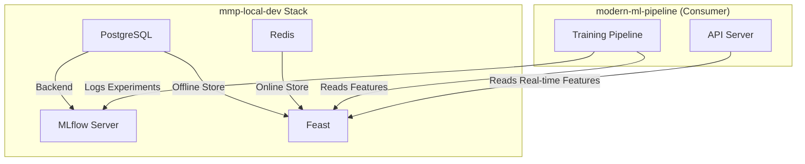
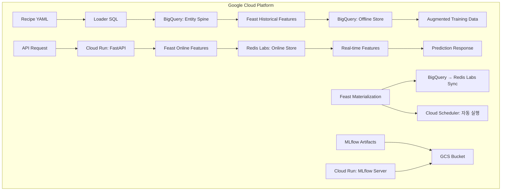

# 🏗️ Infrastructure Stacks: Our Definitive Architecture

**우리 ML 파이프라인을 위한 확정된 인프라 스택 조합 정의서**

이 문서는 `Blueprint v17.0`을 실제 운영하기 위해 우리가 선택하고 검증한 **최적의 인프라 스택 조합**을 정의합니다. 로컬 개발부터 클라우드 운영까지, 모든 환경에서 일관된 아키텍처를 유지하면서도 각 환경에 최적화된 컴포넌트를 사용합니다.

---

## 🎯 **핵심 설계 원칙: "코드로서의 계약"**

우리 아키텍처의 가장 중요한 원칙은 `modern-ml-pipeline`(소비자)과 `mmp-local-dev`(공급자) 간의 **"코드로서의 계약(Contract as Code)"** 입니다.

1.  **단일 진실 공급원 (`dev-contract.yml`):**
    `mmp-local-dev` 저장소의 `dev-contract.yml` 파일이 두 프로젝트 간의 기술적 인터페이스를 정의하는 유일한 진실의 원천입니다.

2.  **아키텍처 일관성:**
    로컬(Docker Compose)과 클라우드(GCP) 환경은 이 계약에 명시된 서비스(PostgreSQL, Redis, MLflow)를 동일한 논리적 구조로 제공합니다.

3.  **양방향 자동 검증:**
    *   `mmp-local-dev`는 `test-integration.py`를 통해 스스로 계약을 준수하는지 검증합니다.
    *   `modern-ml-pipeline`은 `tests/integration/test_dev_contract.py`를 통해 인프라가 계약대로 동작하는지 검증합니다.

4.  **개발 연속성:**
    이 견고한 계약 덕분에, 로컬에서 개발한 코드는 클라우드 환경에서 수정 없이 그대로 동작합니다.

---

## 🏠 **Local Development Stack (`mmp-local-dev`)**

**목표**: 빠른 개발, 완전한 독립성, 비용 제로

`mmp-local-dev` 저장소는 `dev-contract.yml`에 명시된 모든 서비스를 Docker Compose 기반으로 제공하는 완전한 로컬 개발 환경입니다.

### **스택 조합**
```yaml
Provider: mmp-local-dev (GitHub Repository)
Orchestration: Docker Compose
Services:
  - PostgreSQL 15 (Data Warehouse & Feast Offline Store)
  - Redis 7 (Feast Online Store)
  - MLflow Server (Custom Docker Image)
  - Feast
```

### **데이터 흐름 및 역할**


### **컴포넌트별 세부 역할**

#### **🐘 PostgreSQL**
- **역할:** Data Warehouse, Feast 오프라인 스토어, MLflow 백엔드
- **포트:** 5432

#### **⚡ Redis**
- **역할:** Feast 온라인 스토어, 실시간 피처 캐싱
- **포트:** 6379

#### **📊 MLflow**
- **역할:** 실험 추적, 모델 아티팩트 관리
- **포트:** 5000

#### **🎪 Feast**
- **역할:** 피처 오케스트레이션, 학습/서빙 일관성 보장

---

## ☁️ **Cloud Production Stack (GCP)**

**목표**: 확장성, 안정성, 관리 편의성

클라우드 환경은 `dev-contract.yml`에 명시된 논리적 서비스를 GCP의 관리형(Managed) 서비스로 대체하여 구현합니다.

### **스택 조합**
```yaml
Cloud Platform: Google Cloud Platform
Services:
  - BigQuery (Data Warehouse & Feast Offline Store)
  - Redis Labs (Feast Online Store)
  - MLflow on Cloud Run (ML Tracking)
  - Feast on Cloud Run
  - API Server on Cloud Run
```

### **데이터 흐름 및 역할**


### **컴포넌트별 세부 역할**

#### **🏪 BigQuery (Data Warehouse + Offline Store)**
```yaml
역할:
  - 대규모 Loader SQL 실행 → 페타바이트급 Spine 생성
  - Feast Offline Store → 병렬 대량 피처 조회
  - Serverless Point-in-time Join
  - 실시간 데이터 스트리밍 지원

데이터셋 구조:
  - raw_events: 실시간 이벤트 데이터
  - feature_mart: Feast materialized features
  - spine_data: Entity 및 timestamp 정보
  - feast_registry: Feast 메타데이터

위치: us-central1
비용: 쿼리량 기반 (월 ~$20-30)
```

#### **⚡ Redis Labs (Managed Online Store)**
```yaml
역할:
  - 글로벌 Feast Online Store
  - 초저지연 실시간 조회 (< 5ms)
  - 고가용성 클러스터링
  - 자동 백업 및 모니터링

설정:
  - 메모리: 100MB (무료 티어 시작)
  - 확장: 필요시 자동 스케일링
  - 보안: TLS 암호화, VPC 피어링

위치: us-central1 (BigQuery와 동일)
비용: 메모리 기반 (월 ~$15-25)
```

#### **🎪 Feast (Managed Feature Store)**
```yaml
역할:
  - 엔터프라이즈 피처 메타데이터 관리
  - BigQuery ↔ Redis Labs 자동 materialization
  - 피처 lineage 및 governance
  - 성능 모니터링 및 알림

배포: Cloud Run (컨테이너)
스케줄링: Cloud Scheduler
모니터링: Cloud Monitoring 통합
```

#### **☁️ Google Cloud Storage (Artifact Storage)**
```yaml
역할:
  - MLflow 아티팩트 글로벌 저장
  - 대용량 모델 및 데이터 저장
  - 자동 라이프사이클 관리
  - 다중 지역 복제

버킷 구조:
  - ml-artifacts-prod: MLflow 아티팩트
  - ml-data-processed: 처리된 데이터
  - ml-logs-archive: 로그 아카이브

위치: Multi-region (us)
비용: 저장량 기반 (월 ~$5-10)
```

#### **🚀 Cloud Run (Serverless Deployment)**
```yaml
역할:
  - FastAPI 서버리스 배포
  - 자동 스케일링 (0→n instances)
  - MLflow Tracking Server 호스팅
  - 무중단 배포 지원

설정:
  - CPU: 1 vCPU (API), 2 vCPU (MLflow)  
  - Memory: 2GB (API), 4GB (MLflow)
  - Concurrency: 100 requests/instance
  - Min instances: 0 (비용 최적화)

비용: 요청량 기반 (월 ~$10-20)
```

---

## 🔄 **환경 전환 전략**

### **완벽한 환경 전환**
`modern-ml-pipeline`의 코드는 변경 없이, `APP_ENV` 환경변수와 `config/` 디렉토리의 설정 파일만으로 두 환경을 원활하게 전환합니다.

```bash
# 로컬 개발 환경 (mmp-local-dev 사용)
./setup-dev-environment.sh start
APP_ENV=dev uv run python main.py train --recipe-file "my_experiment.yaml"

# 클라우드 운영 환경 (GCP 서비스 사용)
# (GCP 인증 설정 후)
APP_ENV=prod uv run python main.py train --recipe-file "my_experiment.yaml"
```

### **동일한 코드, 다른 인프라**
```yaml
변경되지 않는 것:
  ✅ Recipe YAML 파일
  ✅ `src/` 디렉토리 모든 코드
  ✅ `tests/` 디렉토리 모든 테스트 코드

환경별로 다른 것:
  ⚙️ `config/{env}.yaml` 설정 파일
  ⚙️ 인프라 연결 정보 (환경변수 또는 GCP 인증)
```

---

## 💰 **비용 분석**

### **로컬 개발 환경**
```yaml
하드웨어 요구사항:
  - CPU: 4 cores 이상
  - RAM: 8GB 이상  
  - Storage: 50GB 이상

월 비용: $0 (완전 로컬)
```

### **클라우드 운영 환경**
```yaml
소규모 운영 (월 1000 예측 기준):
  - BigQuery: $25 (5TB 쿼리)
  - Redis Labs: $20 (100MB)
  - Cloud Run: $15 (API + MLflow)
  - GCS: $5 (50GB)
  - 네트워킹: $5
  
총 월 비용: ~$70

중규모 운영 (월 10000 예측 기준):
  - BigQuery: $45 (20TB 쿼리)
  - Redis Labs: $45 (500MB)
  - Cloud Run: $35 (스케일링)
  - GCS: $15 (200GB)
  - 네트워킹: $10
  
총 월 비용: ~$150
```

---

## 🎯 **Why This Stack?**

### **로컬 스택 선택 이유**
```yaml
PostgreSQL vs SQLite:
  ✅ 완전한 SQL 호환성 (BigQuery 유사)
  ✅ 동시 연결 지원 (멀티 프로세스)
  ✅ Feast 공식 지원

Redis vs Memory:
  ✅ 실제 운영환경과 동일한 인터페이스
  ✅ 데이터 지속성 (재시작 후에도 유지)
  ✅ 성능 테스트 가능

Docker Compose vs K8s:
  ✅ 설정 단순성
  ✅ 로컬 자원 효율성
  ✅ 디버깅 편의성
```

### **클라우드 스택 선택 이유**
```yaml
GCP vs AWS/Azure:
  ✅ BigQuery 성능 우수성
  ✅ 서버리스 옵션 풍부
  ✅ ML 도구 통합 우수

BigQuery vs Snowflake:
  ✅ 완전한 서버리스
  ✅ 뛰어난 가격 성능비
  ✅ 실시간 스트리밍 지원

Redis Labs vs DynamoDB:
  ✅ 로컬 Redis와 완전 호환
  ✅ Feast 최적 지원
  ✅ 뛰어난 지연시간

Cloud Run vs GKE:
  ✅ 완전한 서버리스 (관리 부담 없음)
  ✅ 자동 스케일링
  ✅ 비용 효율성 (0→n)
```

---

## 🚀 **시작하기**

자세한 시작 방법은 프로젝트 루트의 `README.md` 파일에 있는 **"빠른 시작"** 섹션을 참조하세요. 모든 설정 과정은 `README.md`와 `setup-dev-environment.sh`를 통해 안내됩니다. 