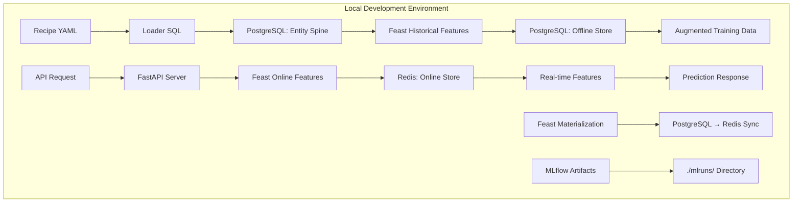
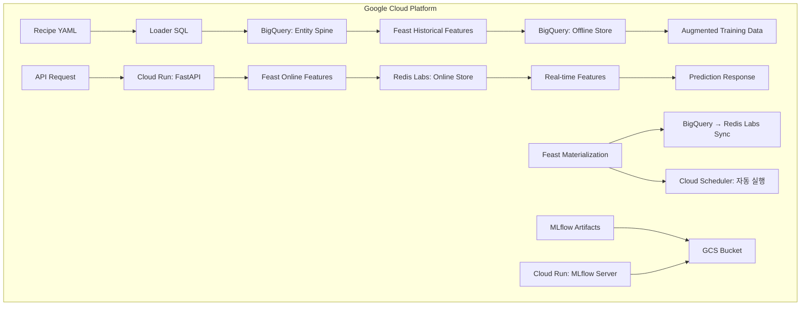

# 🏗️ Infrastructure Stacks: Our Definitive Architecture

**우리 ML 파이프라인을 위한 확정된 인프라 스택 조합 정의서**

이 문서는 `Blueprint v17.0 "Automated Excellence Vision"`을 실제 운영하기 위해 우리가 선택하고 검증한 **최적의 인프라 스택 조합**을 정의합니다. 로컬 개발부터 클라우드 운영까지, 모든 환경에서 일관된 아키텍처를 유지하면서도 각 환경에 최적화된 컴포넌트를 사용합니다.

---

## 🎯 **핵심 설계 원칙**

### 1. **아키텍처 일관성**: 로컬과 클라우드에서 동일한 논리적 구조
### 2. **컴포넌트 호환성**: 환경별로 물리적 구현만 다르고 인터페이스는 동일
### 3. **개발 연속성**: 로컬에서 개발한 것이 클라우드에서 그대로 동작
### 4. **비용 최적화**: 각 환경의 특성에 맞는 가장 경제적인 선택

---

## 🏠 **Local Development Stack**

**목표**: 빠른 개발, 완전한 독립성, 비용 제로

### **스택 조합**
```yaml
OS Platform: Docker Compose
Data Warehouse: PostgreSQL 15
Feature Store Framework: Feast (Open Source)
Feature Offline Store: PostgreSQL 15  
Feature Online Store: Redis 7
Object Storage: Local FileSystem
ML Tracking: MLflow (File-based)
API Framework: FastAPI
Deployment: Local Process

총 컨테이너: 3개 (PostgreSQL, Redis, ML-Pipeline)
총 비용: $0 (완전 로컬)
```

### **데이터 흐름 및 역할**


### **컴포넌트별 세부 역할**

#### **🐘 PostgreSQL (Data Warehouse + Offline Store)**
```yaml
역할:
  - Loader SQL 실행 → Entity Spine 생성
  - Feast Offline Store → 학습용 대량 피처 조회
  - Point-in-time Join 실행
  - 테스트 데이터 저장

데이터베이스 구조:
  - raw_data: 원본 테스트 데이터
  - feature_mart: Feast materialized features  
  - spine_data: Entity 및 timestamp 정보
  - feast_registry: Feast 메타데이터

포트: 5432
컨테이너: postgres:15-alpine
볼륨: ./data/postgres/
```

#### **⚡ Redis (Online Store)**
```yaml
역할:
  - Feast Online Store → 실시간 API 서빙
  - 피처 캐싱 → < 10ms 응답시간
  - Key-Value 피처 저장

데이터 구조:
  - Key: "user_demographics:age:user123"
  - Value: "34"
  - TTL: 24시간 (개발환경)

포트: 6379
컨테이너: redis:7-alpine  
볼륨: ./data/redis/
```

#### **🎪 Feast (Feature Store Orchestration)**
```yaml
역할:
  - 피처 메타데이터 관리
  - PostgreSQL → Redis materialization
  - 학습-서빙 간 일관성 보장
  - Point-in-time join 로직 제공

설정 파일: config/environments/feast/local_feature_store.yaml
Registry: PostgreSQL (feast_registry 스키마)
```

#### **📁 FileSystem (Artifact Storage)**
```yaml
역할:
  - MLflow 아티팩트 저장
  - 로그 및 중간 결과 저장
  - 테스트 데이터 저장

디렉토리 구조:
  - ./mlruns/: MLflow 실험 및 모델
  - ./data/: 원본 및 처리된 데이터
  - ./logs/: 애플리케이션 로그
```

---

## ☁️ **Cloud Production Stack (GCP)**

**목표**: 확장성, 안정성, 관리 편의성

### **스택 조합**
```yaml
Cloud Platform: Google Cloud Platform
Data Warehouse: BigQuery
Feature Store Framework: Feast (Managed)
Feature Offline Store: BigQuery
Feature Online Store: Redis Labs (Managed)
Object Storage: Google Cloud Storage
ML Tracking: MLflow (Cloud Run)
API Framework: FastAPI
Deployment: Cloud Run (Serverless)

월 예상 비용: $50-100 (소규모 운영 기준)
```

### **데이터 흐름 및 역할**


### **컴포넌트별 세부 역할**

#### **🏪 BigQuery (Data Warehouse + Offline Store)**
```yaml
역할:
  - 대규모 Loader SQL 실행 → 페타바이트급 Spine 생성
  - Feast Offline Store → 병렬 대량 피처 조회
  - Serverless Point-in-time Join
  - 실시간 데이터 스트리밍 지원

데이터셋 구조:
  - raw_events: 실시간 이벤트 데이터
  - feature_mart: Feast materialized features
  - spine_data: Entity 및 timestamp 정보
  - feast_registry: Feast 메타데이터

위치: us-central1
비용: 쿼리량 기반 (월 ~$20-30)
```

#### **⚡ Redis Labs (Managed Online Store)**
```yaml
역할:
  - 글로벌 Feast Online Store
  - 초저지연 실시간 조회 (< 5ms)
  - 고가용성 클러스터링
  - 자동 백업 및 모니터링

설정:
  - 메모리: 100MB (무료 티어 시작)
  - 확장: 필요시 자동 스케일링
  - 보안: TLS 암호화, VPC 피어링

위치: us-central1 (BigQuery와 동일)
비용: 메모리 기반 (월 ~$15-25)
```

#### **🎪 Feast (Managed Feature Store)**
```yaml
역할:
  - 엔터프라이즈 피처 메타데이터 관리
  - BigQuery ↔ Redis Labs 자동 materialization
  - 피처 lineage 및 governance
  - 성능 모니터링 및 알림

배포: Cloud Run (컨테이너)
스케줄링: Cloud Scheduler
모니터링: Cloud Monitoring 통합
```

#### **☁️ Google Cloud Storage (Artifact Storage)**
```yaml
역할:
  - MLflow 아티팩트 글로벌 저장
  - 대용량 모델 및 데이터 저장
  - 자동 라이프사이클 관리
  - 다중 지역 복제

버킷 구조:
  - ml-artifacts-prod: MLflow 아티팩트
  - ml-data-processed: 처리된 데이터
  - ml-logs-archive: 로그 아카이브

위치: Multi-region (us)
비용: 저장량 기반 (월 ~$5-10)
```

#### **🚀 Cloud Run (Serverless Deployment)**
```yaml
역할:
  - FastAPI 서버리스 배포
  - 자동 스케일링 (0→n instances)
  - MLflow Tracking Server 호스팅
  - 무중단 배포 지원

설정:
  - CPU: 1 vCPU (API), 2 vCPU (MLflow)  
  - Memory: 2GB (API), 4GB (MLflow)
  - Concurrency: 100 requests/instance
  - Min instances: 0 (비용 최적화)

비용: 요청량 기반 (월 ~$10-20)
```

---

## 🔄 **Environment Switching Strategy**

### **완벽한 환경 전환**
```bash
# 로컬 개발 환경
docker-compose -f docker-compose.local.yml up -d
APP_ENV=local python main.py train --recipe-file "my_experiment"

# 클라우드 운영 환경  
APP_ENV=cloud python main.py train --recipe-file "my_experiment"
```

### **동일한 코드, 다른 인프라**
```yaml
변경되지 않는 것:
  ✅ Recipe YAML 파일들
  ✅ src/ 디렉토리 모든 코드
  ✅ Feast 피처 정의
  ✅ Docker 이미지
  ✅ API 엔드포인트

환경별로 다른 것:
  ⚙️ config/environments/ 설정만
  ⚙️ 인프라 연결 정보만
  ⚙️ 스케일링 파라미터만
```

---

## 💰 **비용 분석**

### **로컬 개발 환경**
```yaml
하드웨어 요구사항:
  - CPU: 4 cores 이상
  - RAM: 8GB 이상  
  - Storage: 50GB 이상

월 비용: $0 (완전 로컬)
```

### **클라우드 운영 환경**
```yaml
소규모 운영 (월 1000 예측 기준):
  - BigQuery: $25 (5TB 쿼리)
  - Redis Labs: $20 (100MB)
  - Cloud Run: $15 (API + MLflow)
  - GCS: $5 (50GB)
  - 네트워킹: $5
  
총 월 비용: ~$70

중규모 운영 (월 10000 예측 기준):
  - BigQuery: $45 (20TB 쿼리)
  - Redis Labs: $45 (500MB)
  - Cloud Run: $35 (스케일링)
  - GCS: $15 (200GB)
  - 네트워킹: $10
  
총 월 비용: ~$150
```

---

## 🎯 **Why This Stack?**

### **로컬 스택 선택 이유**
```yaml
PostgreSQL vs SQLite:
  ✅ 완전한 SQL 호환성 (BigQuery 유사)
  ✅ 동시 연결 지원 (멀티 프로세스)
  ✅ Feast 공식 지원

Redis vs Memory:
  ✅ 실제 운영환경과 동일한 인터페이스
  ✅ 데이터 지속성 (재시작 후에도 유지)
  ✅ 성능 테스트 가능

Docker Compose vs K8s:
  ✅ 설정 단순성
  ✅ 로컬 자원 효율성
  ✅ 디버깅 편의성
```

### **클라우드 스택 선택 이유**
```yaml
GCP vs AWS/Azure:
  ✅ BigQuery 성능 우수성
  ✅ 서버리스 옵션 풍부
  ✅ ML 도구 통합 우수

BigQuery vs Snowflake:
  ✅ 완전한 서버리스
  ✅ 뛰어난 가격 성능비
  ✅ 실시간 스트리밍 지원

Redis Labs vs DynamoDB:
  ✅ 로컬 Redis와 완전 호환
  ✅ Feast 최적 지원
  ✅ 뛰어난 지연시간

Cloud Run vs GKE:
  ✅ 완전한 서버리스 (관리 부담 없음)
  ✅ 자동 스케일링
  ✅ 비용 효율성 (0→n)
```

---

## 🚀 **Getting Started**

### **로컬 환경 시작**
```bash
# 1. 로컬 스택 시작
docker-compose -f docker-compose.local.yml up -d

# 2. 테스트 데이터 준비
bash scripts/setup_local_stack.sh

# 3. 첫 번째 실험
python main.py train --recipe-file "models/classification/random_forest_classifier"
```

### **클라우드 환경 시작**
```bash
# 1. GCP 프로젝트 설정
gcloud projects create ml-pipeline-prod
gcloud config set project ml-pipeline-prod

# 2. 필요한 API 활성화
gcloud services enable bigquery.googleapis.com run.googleapis.com

# 3. 환경 변수 설정
export APP_ENV=cloud

# 4. 첫 번째 배포
python main.py train --recipe-file "models/classification/random_forest_classifier"
```

---

**🏆 결론: 이 스택 조합은 개발 편의성, 운영 안정성, 비용 효율성을 모두 만족하는 우리만의 최적해입니다!** 