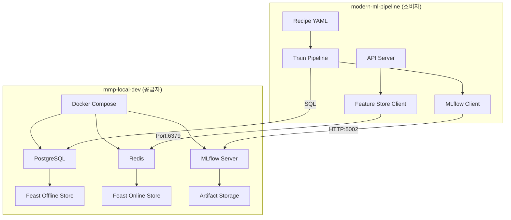

# 🔗 mmp-local-dev 연동 가이드

이 문서는 **modern-ml-pipeline**과 **mmp-local-dev** 간의 완전한 연동을 위한 종합 가이드입니다. 개발 환경에서 PostgreSQL, Redis, MLflow를 활용한 완전한 ML 파이프라인을 구축하는 모든 과정을 다룹니다.

---

## 🎯 **연동 아키텍처 개요**



**핵심 원칙:**
- **modern-ml-pipeline**: ML 로직과 레시피 정의
- **mmp-local-dev**: 인프라 서비스 제공 (PostgreSQL, Redis, MLflow)
- **dev-contract.yml**: 두 프로젝트 간 기술적 계약서

---

## 🚀 **1. 초기 설정 및 설치**

### 1.1. setup-dev-environment.sh 활용

**modern-ml-pipeline**의 `setup-dev-environment.sh`가 모든 설정을 자동화합니다:

```bash
# modern-ml-pipeline 디렉토리에서 실행
./setup-dev-environment.sh

# 🔄 이 스크립트가 자동으로 수행하는 작업들:
# 1. ../mmp-local-dev 디렉토리 확인/생성
# 2. mmp-local-dev 저장소 clone (없는 경우)
# 3. mmp-local-dev/.env 파일 생성
# 4. Docker Compose 서비스 시작
# 5. 헬스체크 및 연결 확인
```

### 1.2. 수동 설정 (고급 사용자용)

자동 스크립트가 실패하거나 수동 제어가 필요한 경우:

```bash
# 1. mmp-local-dev 저장소 clone
cd ..
git clone https://github.com/your-org/mmp-local-dev.git
cd mmp-local-dev

# 2. 환경변수 파일 생성
cat > .env << EOF
POSTGRES_HOST=localhost
POSTGRES_PORT=5432
POSTGRES_USER=mlpipeline_user
POSTGRES_DB=mlpipeline_db
POSTGRES_PASSWORD=secure_password_123
REDIS_HOST=localhost
REDIS_PORT=6379
MLFLOW_TRACKING_URI=http://localhost:5002
EOF

# 3. 서비스 시작
docker-compose up -d

# 4. 서비스 확인
docker-compose ps
```

---

## ⚙️ **2. 환경변수 설정 및 관리**

### 2.1. mmp-local-dev 환경변수 (.env)

`mmp-local-dev/.env` 파일의 표준 설정:

```bash
# 🐘 PostgreSQL 설정
POSTGRES_HOST=localhost
POSTGRES_PORT=5432
POSTGRES_USER=mlpipeline_user
POSTGRES_DB=mlpipeline_db
POSTGRES_PASSWORD=secure_password_123

# ⚡ Redis 설정
REDIS_HOST=localhost
REDIS_PORT=6379

# 📊 MLflow 설정
MLFLOW_TRACKING_URI=http://localhost:5002

# 🔒 추가 보안 설정 (선택적)
POSTGRES_PASSWORD_FILE=/run/secrets/postgres_password
REDIS_PASSWORD=redis_secure_password_456
```

### 2.2. modern-ml-pipeline 환경변수 설정

**방법 1: 자동 감지 (권장)**
```bash
# modern-ml-pipeline이 ../mmp-local-dev/.env 파일을 자동으로 읽어옴
APP_ENV=dev uv run python main.py train --recipe-file my_experiment.yaml
```

**방법 2: 명시적 설정**
```bash
# 환경변수를 직접 설정
export MLFLOW_TRACKING_URI=http://localhost:5002
export POSTGRES_HOST=localhost
export POSTGRES_USER=mlpipeline_user
export POSTGRES_PASSWORD=secure_password_123

APP_ENV=dev uv run python main.py train --recipe-file my_experiment.yaml
```

**방법 3: .env 파일 사용**
```bash
# modern-ml-pipeline/.env 파일 생성 (mmp-local-dev/.env와 별도)
cat > .env << EOF
APP_ENV=dev
MLFLOW_TRACKING_URI=http://localhost:5002
EOF

uv run python main.py train --recipe-file my_experiment.yaml
```

---

## 🧪 **3. MLflow 실험 관리**

### 3.1. 실험명 지정 및 HTTP 전송

**실험명 설정:**
```yaml
# config/dev.yaml
mlflow:
  tracking_uri: http://localhost:5002
  experiment_name: "My-Awesome-Experiment-2025"  # 🎯 실험명 커스터마이징
```

**실험 실행:**
```bash
# 1. 실험 실행
APP_ENV=dev uv run python main.py train --recipe-file recipes/models/classification/xgboost_classifier.yaml

# 2. 실행 결과 확인
# ✅ MLflow UI: http://localhost:5002
# ✅ 실험명: "My-Awesome-Experiment-2025"
# ✅ Run ID: 자동 생성 (예: aa871f712e36441bb94110368fa09f13)
```

**HTTP 전송 과정:**
```python
# 내부적으로 수행되는 MLflow HTTP 통신
import mlflow

# 1. 실험 생성/확인
mlflow.set_tracking_uri("http://localhost:5002")
mlflow.set_experiment("My-Awesome-Experiment-2025")

# 2. Run 시작
with mlflow.start_run() as run:
    # 3. 메트릭 로깅 (HTTP POST)
    mlflow.log_metric("accuracy", 0.95)
    
    # 4. 파라미터 로깅 (HTTP POST)
    mlflow.log_params({"learning_rate": 0.1, "n_estimators": 100})
    
    # 5. 아티팩트 업로드 (HTTP POST - Multipart)
    mlflow.pyfunc.log_model("model", python_model=wrapper)
```

### 3.2. 실험 추적 및 관리

```bash
# MLflow UI 접근
open http://localhost:5002

# CLI를 통한 실험 확인
mlflow experiments list --tracking-uri http://localhost:5002

# 특정 실험의 Run 목록 확인
mlflow runs list --experiment-name "My-Awesome-Experiment-2025" --tracking-uri http://localhost:5002
```

---

## 📦 **4. 아티팩트 저장 및 관리**

### 4.1. 아티팩트 저장 경로 예상

**표준 저장 구조:**
```
mmp-local-dev/
├── mlflow-artifacts/              # 🎯 아티팩트 루트 디렉토리
│   ├── [experiment-id]/           # 실험별 디렉토리 (예: 4/)
│   │   ├── [run-id]/              # Run별 디렉토리
│   │   │   ├── artifacts/         # 모델 아티팩트
│   │   │   │   ├── MLmodel        # MLflow 모델 메타데이터
│   │   │   │   ├── python_model.pkl  # PyfuncWrapper 직렬화
│   │   │   │   ├── requirements.txt  # Python 의존성
│   │   │   │   ├── conda.yaml        # Conda 환경
│   │   │   │   └── python_env.yaml   # Python 환경
│   │   │   └── metadata/          # Run 메타데이터
│   │   └── [another-run-id]/
│   └── [another-experiment-id]/
```

**실제 예시:**
```bash
# 실험 실행 후 생성되는 경로 (예시)
mmp-local-dev/mlflow-artifacts/4/aa871f712e36441bb94110368fa09f13/artifacts/

# 아티팩트 내용 확인
ls -la ../mmp-local-dev/mlflow-artifacts/4/aa871f712e36441bb94110368fa09f13/artifacts/
# 출력:
# MLmodel
# python_model.pkl
# requirements.txt
# conda.yaml
# python_env.yaml
```

### 4.2. 아티팩트 저장 과정

**1. HTTP 기반 아티팩트 업로드:**
```python
# PyfuncWrapper 저장 시 내부 동작
def log_model():
    # 1. 로컬에서 임시 디렉토리에 모델 직렬화
    temp_dir = "/tmp/mlflow_temp_model"
    
    # 2. MLflow 서버로 HTTP POST (multipart/form-data)
    response = requests.post(
        "http://localhost:5002/api/2.0/mlflow/model-versions/create-file",
        files={"file": open(f"{temp_dir}/python_model.pkl", "rb")},
        data={"run_id": run_id, "path": "artifacts/python_model.pkl"}
    )
    
    # 3. 서버가 mlflow-artifacts/ 디렉토리에 저장
    # 경로: mlflow-artifacts/{experiment_id}/{run_id}/artifacts/
```

**2. 아티팩트 접근 URL:**
```bash
# 아티팩트 직접 접근 URL
http://localhost:5002/get-artifact?path=artifacts/python_model.pkl&run_uuid={run_id}

# 모델 다운로드
curl "http://localhost:5002/get-artifact?path=artifacts&run_uuid=aa871f712e36441bb94110368fa09f13" -o model.zip
```

### 4.3. 아티팩트 백업 및 관리

```bash
# 전체 아티팩트 백업
cd ../mmp-local-dev
tar -czf mlflow-artifacts-backup-$(date +%Y%m%d).tar.gz mlflow-artifacts/

# 특정 실험만 백업
tar -czf experiment-4-backup.tar.gz mlflow-artifacts/4/

# 아티팩트 정리 (오래된 실험 삭제)
find mlflow-artifacts/ -type d -name "*" -mtime +30 -exec rm -rf {} \;
```

---

## 🔧 **5. 연동 검증 및 트러블슈팅**

### 5.1. 연동 상태 종합 확인

```bash
# 🔍 전체 시스템 헬스체크
cd ../mmp-local-dev && python test-integration.py

# 📊 개별 서비스 확인
# PostgreSQL
docker exec mmp-local-dev-postgresql-1 pg_isready -U mlpipeline_user

# Redis
docker exec mmp-local-dev-redis-1 redis-cli ping

# MLflow
curl -s http://localhost:5002/health
```

### 5.2. 일반적인 문제 해결

**문제 1: 포트 충돌**
```bash
# 현재 포트 사용 상태 확인
lsof -i :5002  # MLflow
lsof -i :5432  # PostgreSQL  
lsof -i :6379  # Redis

# Apple AirPlay 비활성화 (5000 포트 해제)
sudo launchctl unload -w /System/Library/LaunchDaemons/com.apple.AirPlayXPCHelper.plist
```

**문제 2: 아티팩트 저장 실패**
```bash
# 권한 확인
ls -la ../mmp-local-dev/mlflow-artifacts/
sudo chown -R $(whoami) ../mmp-local-dev/mlflow-artifacts/

# 디스크 공간 확인
df -h ../mmp-local-dev/
```

**문제 3: MLflow 연결 실패**
```bash
# MLflow 서버 재시작
cd ../mmp-local-dev
docker-compose restart mlflow

# 로그 확인
docker-compose logs mlflow | tail -20

# 네트워크 연결 테스트
telnet localhost 5002
```

### 5.3. 개발 환경 초기화

```bash
# 🔄 전체 환경 리셋
cd ../mmp-local-dev
docker-compose down -v  # 볼륨까지 삭제
docker-compose up -d

# 🗂️ 아티팩트만 정리
rm -rf mlflow-artifacts/*

# 🔧 설정 파일 재생성
cd ../modern-ml-pipeline
./setup-dev-environment.sh
```

---

## 📋 **6. dev-contract.yml 기반 호환성 보장**

### 6.1. 계약 내용 확인

`mmp-local-dev/dev-contract.yml`이 정의하는 계약:

```yaml
version: "1.0"

provides_env_variables:
  - POSTGRES_HOST      # ✅ localhost
  - POSTGRES_PORT      # ✅ 5432
  - POSTGRES_USER      # ✅ mlpipeline_user
  - POSTGRES_DB        # ✅ mlpipeline_db
  - POSTGRES_PASSWORD  # ✅ secure_password_123
  - REDIS_HOST         # ✅ localhost
  - REDIS_PORT         # ✅ 6379
  - MLFLOW_TRACKING_URI # ✅ http://localhost:5002

provides_services:
  - name: "postgresql"  # ✅ Port 5432
  - name: "redis"       # ✅ Port 6379  
  - name: "mlflow"      # ✅ Port 5002 (수정됨)
```

### 6.2. 호환성 검증

```bash
# mmp-local-dev 측 검증
cd ../mmp-local-dev
python test-integration.py

# modern-ml-pipeline 측 검증  
cd ../modern-ml-pipeline
pytest tests/integration/test_dev_contract.py -v
```

### 6.3. 버전 호환성 관리

```python
# modern-ml-pipeline에서 계약 버전 확인
def check_contract_compatibility():
    contract_file = "../mmp-local-dev/dev-contract.yml"
    with open(contract_file) as f:
        contract = yaml.safe_load(f)
    
    required_version = "1.0"
    actual_version = contract.get("version")
    
    assert actual_version >= required_version, \
        f"mmp-local-dev 버전 {actual_version}는 최소 요구 버전 {required_version}보다 낮습니다"
```

---

## 🎯 **7. 고급 활용 패턴**

### 7.1. 다중 실험 병렬 실행

```bash
# 여러 실험을 동시에 실행
for model in "xgboost" "lightgbm" "catboost"; do
    APP_ENV=dev uv run python main.py train \
        --recipe-file "recipes/models/classification/${model}_classifier.yaml" &
done
wait  # 모든 실험 완료 대기
```

### 7.2. 실험 결과 자동 비교

```python
import mlflow
import pandas as pd

# 실험 결과 비교 스크립트
def compare_experiments():
    mlflow.set_tracking_uri("http://localhost:5002")
    experiment = mlflow.get_experiment_by_name("My-Awesome-Experiment-2025")
    
    runs = mlflow.search_runs(experiment_ids=[experiment.experiment_id])
    comparison = runs[["metrics.accuracy", "params.learning_rate", "params.n_estimators"]]
    
    return comparison.sort_values("metrics.accuracy", ascending=False)
```

### 7.3. 아티팩트 자동 백업

```bash
# 일일 백업 크론잡 (crontab -e)
0 2 * * * cd /path/to/mmp-local-dev && tar -czf backup/mlflow-$(date +\%Y\%m\%d).tar.gz mlflow-artifacts/
```

---

## ✅ **8. 체크리스트: 완벽한 연동 확인**

### 8.1. 초기 설정 체크리스트

- [ ] `./setup-dev-environment.sh` 성공적 실행
- [ ] `docker-compose ps`에서 모든 서비스 `Up` 상태
- [ ] `http://localhost:5002` MLflow UI 접근 가능
- [ ] `../mmp-local-dev/.env` 파일 생성 확인
- [ ] `dev-contract.yml` 계약 준수 확인

### 8.2. 실험 실행 체크리스트

- [ ] `APP_ENV=dev` 환경변수 설정
- [ ] 실험명이 MLflow UI에서 올바르게 표시
- [ ] Run ID 자동 생성 및 아티팩트 저장 확인
- [ ] `../mmp-local-dev/mlflow-artifacts/` 디렉토리에 파일 생성
- [ ] 배치 추론 및 API 서빙 정상 동작

### 8.3. 문제 해결 체크리스트

- [ ] 포트 충돌 검사 (`lsof -i :5002`)
- [ ] 로그 확인 (`docker-compose logs`)
- [ ] 디스크 공간 확인 (`df -h`)
- [ ] 권한 확인 (`ls -la mlflow-artifacts/`)
- [ ] 네트워크 연결 테스트 (`curl http://localhost:5002/health`)

---

**🎉 이제 modern-ml-pipeline과 mmp-local-dev가 완벽하게 연동되었습니다!** 

모든 ML 실험이 견고하고 재현 가능한 인프라 위에서 실행되며, 개발부터 운영까지 일관된 환경을 보장받게 됩니다. 