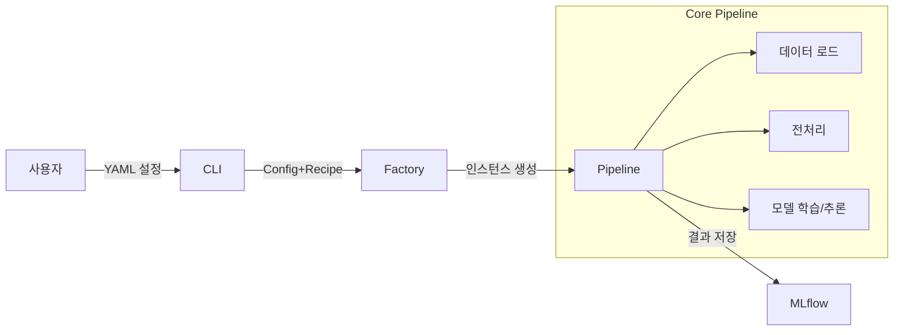

# 🏗 아키텍처 가이드 (Architecture Guide)

Modern ML Pipeline의 설계 철학과 핵심 구조를 설명합니다.

---

## 1. 핵심 설계 철학

이 프로젝트는 **확장성**과 **재현성**을 최우선으로 설계되었습니다.

1.  **설정과 코드의 분리 (Config-Driven)**
    - 비즈니스 로직(모델링)과 인프라 설정(환경)을 완벽히 분리합니다.
    - 코드를 수정하지 않고 YAML 파일만으로 실험을 제어합니다.

2.  **플러그인 아키텍처 (Registry Pattern)**
    - 모든 컴포넌트(모델, 전처리기, 평가기)는 `Registry`에 등록되어 관리됩니다.
    - 새로운 기능을 추가할 때 기존 코드를 건드리지 않고, 새 모듈만 추가하면 됩니다. (OCP 원칙 준수)

3.  **팩토리 패턴 (Factory Pattern)**
    - 복잡한 객체 생성 로직을 `Factory` 클래스에 위임하여, 클라이언트(CLI, Pipeline) 코드를 단순하게 유지합니다.

---

## 2. 디렉토리 구조 (Source Layout)

```
src/
├── cli/                    # 1. 진입점 (Command Line Interface)
├── settings/               # 2. 설정 관리 (Config & Recipe 파싱)
├── pipelines/              # 3. 파이프라인 (전체 실행 흐름 제어)
├── factory/                # 4. 객체 생성 (Component 조립)
├── components/             # 5. 핵심 모듈 (Adapter, Trainer, Evaluator 등)
├── models/                 # 6. 모델 래퍼 (Sklearn, XGBoost 등)
└── serving/                # 7. API 서버 (FastAPI)
```

---

## 3. 컴포넌트 계층 구조 (3-Tier)

시스템의 복잡도를 관리하기 위해 컴포넌트를 3가지 계층으로 나누어 관리합니다.

### Tier 1: Atomic (원자적 컴포넌트)
- **특징**: 가장 기본이 되는 단위. 다른 컴포넌트에 의존하지 않음.
- **예시**: `Adapter`(읽기/쓰기), `Evaluator`(채점), `Fetcher`(추가 데이터 조회)

### Tier 2: Composite (조립형 컴포넌트)
- **특징**: Tier 1 컴포넌트나 설정을 조합하여 동작함.
- **예시**: `Trainer`(모델 + 데이터), `DataHandler`(데이터 분할 로직)

### Tier 3: Orchestrator (관리형 컴포넌트)
- **특징**: 여러 하위 단계를 순차적으로 실행하며 관리함.
- **예시**: `Preprocessor` (여러 전처리 스텝을 순서대로 실행)

---

## 4. 데이터 흐름도


