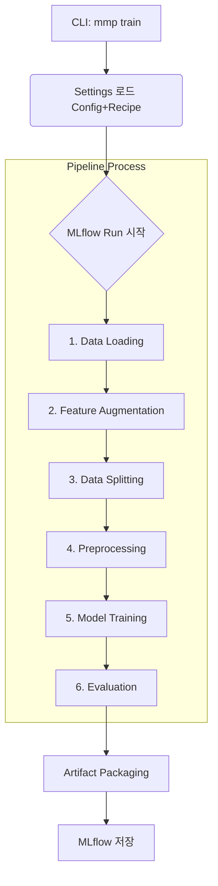
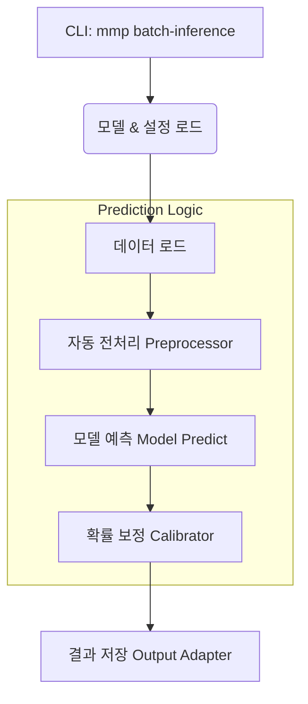

# 🌊 파이프라인 흐름 (Pipeline Flow)

Modern ML Pipeline이 내부적으로 어떻게 동작하는지, **학습(Training)**과 **추론(Inference)** 프로세스를 시각적으로 설명합니다.

---

## 1. 학습 파이프라인 (Training Pipeline)

데이터를 읽어서 모델을 만들고 저장하는 전체 과정입니다.

### 단계별 상세 설명

1.  **Data Loading (Adapter)**
    - CSV, Parquet 파일이나 SQL DB에서 원본 데이터를 가져옵니다.
    
2.  **Feature Augmentation (Fetcher)**
    - (선택) Feature Store(Feast)나 다른 소스에서 추가 정보를 가져와 데이터에 붙입니다.

3.  **Data Splitting (DataHandler)**
    - 데이터를 4가지 용도로 쪼갭니다. (Data Leakage 방지 핵심!)
    - **Train (학습)**: 모델 공부용
    - **Validation (검증)**: 하이퍼파라미터 튜닝용
    - **Test (평가)**: 최종 성적표용
    - **Calibration (보정)**: 확률값 보정용 (선택)

4.  **Preprocessing (Preprocessor)**
    - 결측치를 채우거나(Imputer), 범주형을 숫자로 바꾸는(Encoder) 작업을 수행합니다.
    - **중요**: `Train` 데이터로만 학습(fit)하고, 나머지 데이터는 변환(transform)만 합니다.

5.  **Model Training (Trainer)**
    - 선택한 모델(XGBoost, LightGBM 등)을 학습시킵니다.
    - Optuna가 켜져 있다면 최적의 파라미터를 찾을 때까지 반복합니다.

6.  **Evaluation (Evaluator)**
    - 따로 떼어둔 `Test` 데이터로 최종 성능(Accuracy, MAE 등)을 채점합니다.

7.  **MLflow 저장 (PyfuncWrapper)**
    - 학습된 모델, 전처리기, 설정 파일 등을 하나의 **"MLflow 패키지"**로 묶어서 저장합니다.
    - 덕분에 나중에 이 모델을 불러오면 전처리까지 자동으로 수행됩니다.

---

## 2. 추론 파이프라인 (Inference Pipeline)

저장된 모델을 불러와서 새로운 데이터에 대한 결과를 예측합니다.

### 핵심 포인트

- **자동 재현성**: 학습할 때 썼던 **전처리기(Preprocessor)**가 모델 안에 들어있습니다. 따라서 추론할 때 전처리 코드를 따로 짤 필요가 없습니다.
- **일관된 환경**: 학습 당시의 설정(Recipe)을 그대로 복원하여 예측을 수행합니다.

---

## 3. 데이터 흐름 요약

| 단계 | Training (학습) | Inference (추론) |
|------|-----------------|------------------|
| **입력** | 원본 데이터 (Raw Data) + 정답(Target) | 새로운 데이터 (Target 없음) |
| **전처리** | 패턴을 **학습(fit)**하고 변환(transform) | 학습된 패턴으로 **변환(transform)**만 수행 |
| **모델** | 데이터로 가중치를 **업데이트** | 고정된 가중치로 **예측**만 수행 |
| **출력** | 학습된 모델 파일 (`model.pkl`) | 예측 결과 파일 (`predictions.csv`) |
