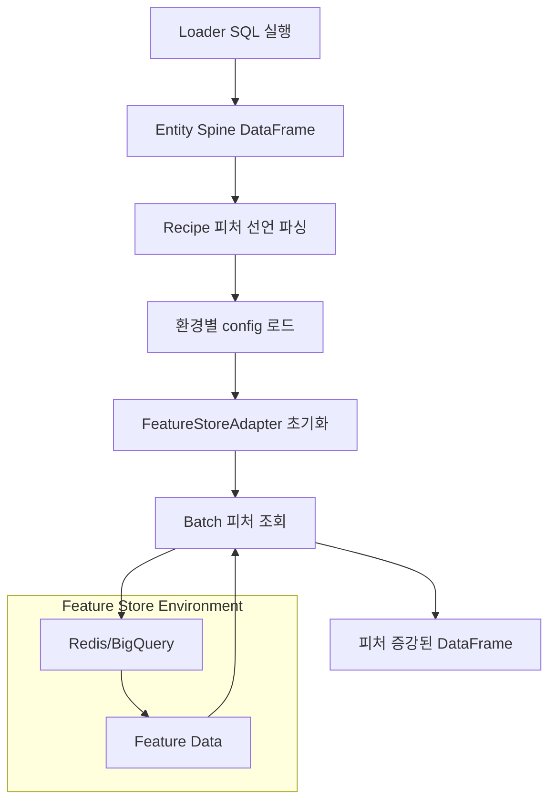
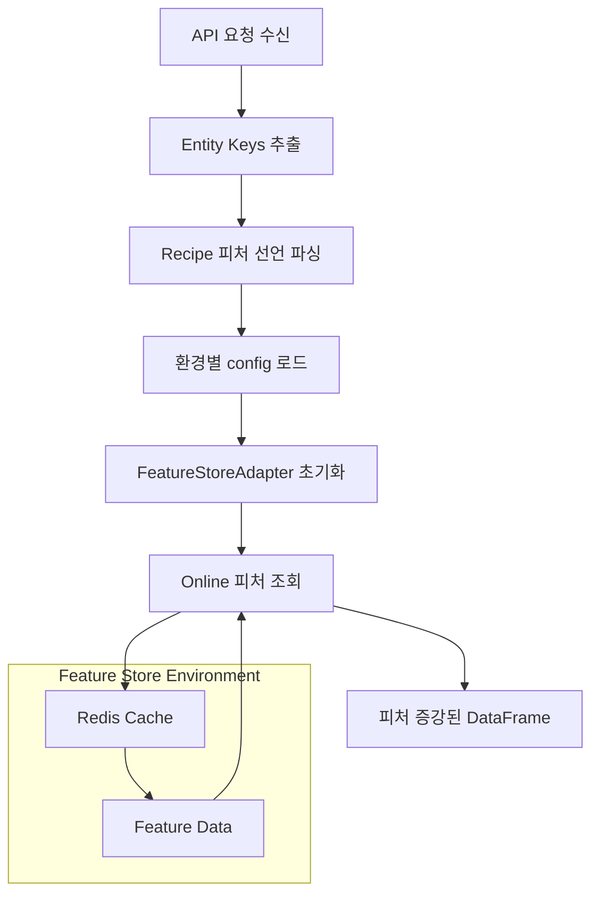
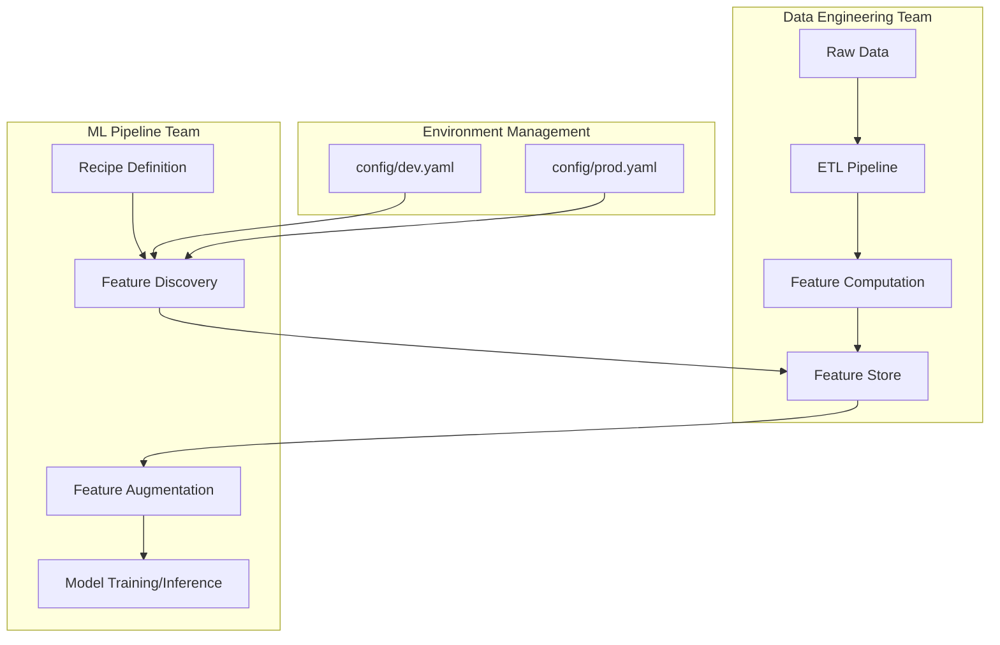

## The Unified Data Architecture: Environment-Driven Feature Store Contract

### 제 1장: 데이터 헌장 (The Data Charter)

**"우리의 파이프라인은 어떤 데이터 위에서 동작해야 하는가?"**

이 문서는 `Modern ML Pipeline Blueprint (v16.0)`의 잠재력을 최대한 발휘하기 위해, 우리 시스템이 기대하고 요구하는 **환경별 Feature Store 아키텍처의 이상적인 상태와 상호작용 방식**을 정의하는 전략적 설계도이다. Blueprint가 **'어떻게(How)'** 실행되는지에 대한 해답이라면, 이 문서는 **'무엇을(What)'** 읽고 쓰는가에 대한 명확한 청사진을 제공한다.

우리의 목표는 훈련-서빙 스큐를 원천적으로 제거하는 것이다. 이를 위해 우리는 **환경별로 독립적으로 관리되는 Feature Store**를 통해 그 진실을 훈련과 서빙 양쪽에 일관되게 공급하는, 예측 가능하고 확장 가능한 데이터 아키텍처를 구축한다. **Feature Store의 실제 구현과 데이터는 각 환경의 데이터 엔지니어링 팀이 독립적으로 관리하며, 우리의 ML 파이프라인은 이를 소비하는 역할에만 집중한다.**

-----

### 제 2장: 핵심 아키텍처 원칙

이 데이터 아키텍처는 네 가지 흔들림 없는 원칙 위에 세워진다.

#### 1\. 위대한 분리: 엔티티 뼈대 vs. 피처 살

`Blueprint`의 하이브리드 철학을 계승하여, 데이터의 역할은 명확히 분리된다.

  * **엔티티 뼈대 (Entity Spine)**: 예측의 대상. **Data Lake** 안에 존재하며, `Loader SQL`을 통해 자유롭게 정의된다.
  * **피처 살 (Feature Flesh)**: 예측에 사용될 정보. **환경별 Feature Store**를 통해 관리되며, `Augmenter`가 뼈대에 결합시킨다.

#### 2\. 환경별 Feature Store 독립성

**각 환경(dev, staging, prod)의 Feature Store는 완전히 독립적으로 관리되며, ML 파이프라인은 단순한 소비자 역할만 수행한다.**

  * **Feature Store 관리 책임**: 각 환경의 데이터 엔지니어링 팀
  * **ML 파이프라인 책임**: Feature Store에서 피처를 조회하고 소비하는 것만
  * **연결 정보 관리**: `config/` 디렉토리의 환경별 설정 파일

#### 3\. 동적 피처 발견 (Dynamic Feature Discovery)

  * ML 파이프라인은 Feature Store의 스키마나 구조를 사전에 알 필요가 없다.
  * `recipes/` 파일에서 선언한 피처 이름을 통해 runtime에 Feature Store를 조회한다.
  * Feature Store가 제공하는 피처가 변경되어도, ML 파이프라인 코드는 수정할 필요가 없다.

#### 4\. 표준 Feature Store 인터페이스

  * 모든 환경의 Feature Store는 동일한 조회 인터페이스를 제공해야 한다.
  * **Key-Value 조회**: `{namespace}:{feature_name}:{entity_key}` 형식
  * **Batch 조회**: 여러 엔티티에 대한 대량 조회 지원
  * **Online 조회**: 실시간 단일/소량 엔티티 조회 지원

-----

### 제 3장: 환경별 Feature Store 설정 관리

우리의 ML 파이프라인이 최적으로 동작하기 위해, 각 환경별로 Feature Store 연결 정보가 `config/` 디렉토리에 독립적으로 관리된다.

#### 3.1. 기본 설정 구조 (`config/base.yaml`)

```yaml
# config/base.yaml - 모든 환경의 공통 기반
feature_store:
  provider: "redis"  # 기본 provider
  connection_timeout: 5000
  retry_attempts: 3
  
  # 로컬 개발용 기본값
  connection_info:
    redis_host: "localhost:6379"
    redis_db: 0
    redis_password: null
    offline_store_uri: "file://./local_features"
```

#### 3.2. 개발 환경 설정 (`config/dev.yaml`)

```yaml
# config/dev.yaml - 개발 환경 전용
feature_store:
  connection_info:
    redis_host: "dev-redis.company.com:6379"
    redis_db: 1
    redis_password: "${DEV_REDIS_PASSWORD}"
    offline_store_uri: "bq://dev-project.feature_mart"
    
  # 개발 환경 전용 설정
  cache_ttl: 3600
  enable_debug_logging: true
```

#### 3.3. 운영 환경 설정 (`config/prod.yaml`)

```yaml
# config/prod.yaml - 운영 환경 전용
feature_store:
  connection_info:
    redis_host: "prod-redis-cluster.company.com:6379"
    redis_db: 0
    redis_password: "${PROD_REDIS_PASSWORD}"
    offline_store_uri: "bq://prod-project.feature_mart"
    
  # 운영 환경 전용 설정
  connection_pool_size: 100
  cache_ttl: 7200
  enable_monitoring: true
  monitoring_endpoint: "https://monitoring.company.com/features"
```

-----

### 제 4장: Feature Store 표준 인터페이스 계약

각 환경의 Feature Store는 다음 표준 인터페이스를 구현해야 한다.

#### 4.1. Key-Value 조회 계약

**Key 형식:** `{namespace}:{feature_name}:{entity_key}`

```bash
# 예시 Key-Value 구조
user_demographics:age:user123 → 34
user_demographics:country_code:user123 → "KR"
user_purchase_summary:ltv:user123 → 1250.50
product_details:price:product456 → 99.99
session_summary:click_count:session789 → 15
```

#### 4.2. Batch 조회 인터페이스

**목적:** 학습/배치 추론 시 대량 피처 조회

```python
# 표준 Batch 조회 API (Redis MGET 스타일)
def batch_get_features(
    entity_spine: List[Dict[str, Any]],  # [{"user_id": "123", "product_id": "456"}, ...]
    feature_specs: List[Dict[str, Any]]   # [{"namespace": "user_demographics", "features": ["age", "country"]}, ...]
) -> Dict[str, Dict[str, Any]]:
    """
    반환 형식:
    {
        "user123": {
            "user_demographics:age": 34,
            "user_demographics:country_code": "KR",
            "user_purchase_summary:ltv": 1250.50
        },
        "user456": { ... }
    }
    """
```

#### 4.3. Online 조회 인터페이스

**목적:** API 서빙 시 실시간 피처 조회

```python
# 표준 Online 조회 API (Redis GET 스타일)
def online_get_features(
    entity_keys: Dict[str, str],          # {"user_id": "123", "product_id": "456"}
    feature_specs: List[Dict[str, Any]]   # [{"namespace": "user_demographics", "features": ["age", "country"]}, ...]
) -> Dict[str, Any]:
    """
    반환 형식:
    {
        "user_demographics:age": 34,
        "user_demographics:country_code": "KR",
        "product_details:price": 99.99
    }
    """
```

-----

### 제 5장: ML 파이프라인과 Feature Store의 상호작용

#### 5.1. Recipe에서의 피처 선언

```yaml
# recipes/experiment.yaml
augmenter:
  type: "feature_store"
  features:
    # 피처는 namespace와 feature 이름으로만 선언
    - feature_namespace: "user_demographics"
      features: ["age", "country_code", "gender"]
    - feature_namespace: "user_purchase_summary"  
      features: ["ltv", "total_purchase_count"]
    - feature_namespace: "product_details"
      features: ["price", "category", "brand"]
```

#### 5.2. 학습 시 피처 증강 흐름



#### 5.3. 서빙 시 피처 증강 흐름



-----

### 제 6장: 데이터 생명주기와 책임 분리

#### 6.1. 환경별 Feature Store 구축 책임

**데이터 엔지니어링 팀의 책임:**

1.  **피처 생성 파이프라인**: dbt, Spark 등을 이용한 피처 ETL 구축
2.  **Feature Store 인프라**: Redis, BigQuery 등 Feature Store 인프라 구축 및 운영
3.  **피처 데이터 품질**: 피처 데이터의 정확성, 최신성, 완성도 보장
4.  **성능 최적화**: 피처 조회 성능 모니터링 및 최적화
5.  **스키마 관리**: 피처 스키마 버전 관리 및 하위 호환성 보장

**ML 파이프라인 팀의 책임:**

1.  **피처 소비**: Recipe에서 필요한 피처 선언 및 조회
2.  **연결 설정 관리**: 환경별 `config/` 파일의 Feature Store 연결 정보 관리
3.  **피처 활용**: 조회된 피처를 이용한 모델 학습 및 추론
4.  **오류 처리**: Feature Store 조회 실패 시 적절한 오류 처리

#### 6.2. 완전한 데이터 흐름



### 제 7장: 공생 관계의 완성

이 환경별 Feature Store 아키텍처는 `Blueprint v16.0`과 완벽한 **공생 관계(Symbiotic Relationship)**를 이룬다.

  * `Blueprint`의 **실행 유연성**은 이 아키텍처가 제공하는 **환경별 Feature Store 연결성** 위에서만 가능하다.
  * 이 아키텍처가 제공하는 **피처 데이터의 가치**는 `Blueprint`의 **강력한 실행 엔진**을 통해서만 완벽하게 실현된다.
  * **관심사의 완전한 분리**: 데이터 엔지니어링 팀은 피처 생성에, ML 팀은 피처 활용에만 집중할 수 있다.

이로써 우리는 중앙 집중식 Feature Store 관리의 복잡성을 제거하고, 환경별로 독립적이면서도 표준화된 Feature Store 인터페이스를 통해 모든 과정이 시스템적으로 통제되는, 진정으로 확장 가능한 ML 시스템의 기반을 완성한다.