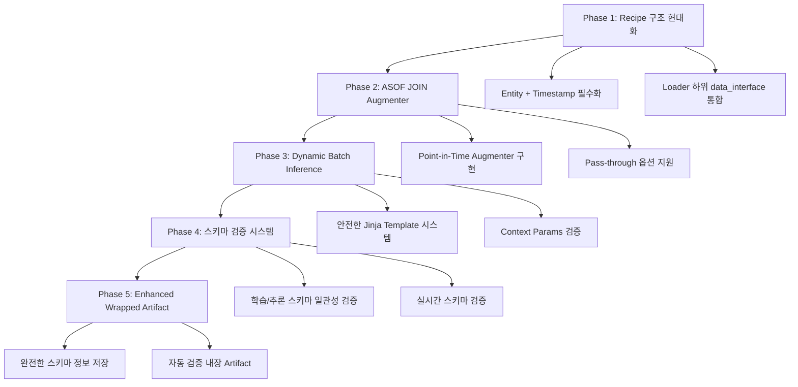

# Modern ML Pipeline: 시점 기반 데이터 관리 시스템 구현 계획

## 🎯 **프로젝트 목표 (Project Vision)**

현대적 MLOps 표준에 부합하는 **Point-in-Time Correctness** 기반 데이터 관리 시스템을 구축하여:

- **Data Leakage 완전 방지**: ASOF JOIN으로 미래 데이터 원천 차단
- **Schema Drift 조기 발견**: 학습/추론 간 스키마 일관성 자동 검증  
- **Dynamic 시점 지원**: 안전한 범위 내에서 Batch Inference 유연성
- **업계 표준 준수**: Feast, Databricks와 동일한 Point-in-Time 패턴

이를 통해 **Hopsworks, Databricks Feature Store 수준의 시점 기반 데이터 관리**를 달성합니다.

---

## 🚀 **전체 개발 로드맵 (5-Phase Architecture)**



| Phase | 목표 | 핵심 기술 | 예상 기간 | 완료 기준 |
|:------|:-----|:----------|:----------|:----------|
| **Phase 1** | Recipe 구조 현대화 | Pydantic 모델, YAML 검증 | **1주** | Entity+Timestamp 필수 Recipe 로딩 성공 |
| **Phase 2** | ASOF JOIN 구현 | Feast Historical Features, pandas asof_join | **1주** | Pass-through/FeatureStore 모드 모두 동작 |
| **Phase 3** | Dynamic Inference | Jinja 보안, Context Params | **1주** | 안전한 동적 시점 Batch Inference |
| **Phase 4** | 스키마 검증 | Schema Validator, 타입 검사 | **1주** | 학습/추론 스키마 불일치 자동 감지 |
| **Phase 5** | Artifact 강화 | MLflow 통합, 메타데이터 | **1주** | 완전한 재현성 보장 Artifact |

---

## 📋 **Phase 1: Recipe 구조 현대화 (1주차)**

### **목표**
Entity + Timestamp 기반 시점 관리를 Recipe 수준에서 강제하여 모든 ML 파이프라인이 시점 안전성을 갖도록 함

### **핵심 변경사항**

#### **Step 1.1: Pydantic 모델 확장 (2일)**
```python
# 구현 대상: src/settings/models.py

class LoaderDataInterface(BaseModel):
    """시점 기반 데이터 인터페이스 (필수 항목)"""
    entity_columns: List[str]           # 필수: ["user_id", "product_id"] 
    timestamp_column: str               # 필수: "event_timestamp"
    target_column: Optional[str]        # 선택: "target" (Train만)
    task_type: str                      # 기존: "classification"
    
    @validator('entity_columns')
    def validate_entity_columns(cls, v):
        if not v or len(v) == 0:
            raise ValueError("entity_columns는 최소 1개 이상 필요")
        return v

class LoaderSettings(BaseModel):
    """확장된 Loader 설정"""
    name: Optional[str] = None
    source_uri: str
    data_interface: LoaderDataInterface  # 🆕 추가
```

#### **Step 1.2: Recipe YAML 구조 변경 (2일)**
```yaml
# 목표 구조: recipes/models/*.yaml
model:
  loader:
    source_uri: "recipes/sql/loaders/fraud_spine.sql.j2"
    data_interface:                    # 🆕 추가
      entity_columns: ["user_id", "merchant_id"]
      timestamp_column: "transaction_timestamp"  
      target_column: "is_fraud"
      task_type: "classification"
```

#### **Step 1.3: 기존 Recipe 파일 전체 업데이트 (1일)**
- `recipes/models/` 하위 25개 모든 YAML 파일 업데이트
- 각 Recipe에 `data_interface` 섹션 추가
- Pydantic 검증 통과하도록 수정

### **완료 기준**
- [ ] 모든 Recipe 파일이 새로운 구조로 로딩 성공
- [ ] Entity/Timestamp 컬럼이 명시되지 않은 Recipe는 로딩 실패
- [ ] `pytest tests/settings/` 모든 테스트 통과

---

## ⚙️ **Phase 2: ASOF JOIN 기반 Augmenter 구현 (2주차)**

### **목표**
Point-in-Time 안전한 Feature 증강을 Augmenter 레벨에서 처리하여 Data Leakage를 원천 차단

### **핵심 구현사항**

#### **Step 2.1: 현대화된 Augmenter 아키텍처 (3일)**
```python
# 구현 대상: src/components/augmenter.py

class Augmenter(BaseAugmenter):
    """Point-in-Time 지원 Augmenter"""
    
    def augment(self, spine_df: pd.DataFrame, run_mode="batch"):
        """두 가지 모드 지원"""
        if self.augmenter_config.type == "pass_through":
            return spine_df  # SQL만으로 학습
        elif self.augmenter_config.type == "feature_store":
            return self._asof_join_features(spine_df, run_mode)
    
    def _asof_join_features(self, spine_df, run_mode):
        """ASOF JOIN으로 안전한 feature 조회"""
        if run_mode == "batch":
            # Historical features (ASOF JOIN 내장)
            return self.feast_adapter.get_historical_features(...)
        elif run_mode == "serving":
            # Online features (최신값)
            return self._get_online_features(...)
```

#### **Step 2.2: Feast Adapter 개선 (2일)**
```python
# 구현 대상: src/utils/adapters/feast_adapter.py

class ModernFeastAdapter(BaseAdapter):
    """Point-in-Time 지원 Feature Store 어댑터"""
    
    def get_historical_features(self, entity_df, feature_views):
        """과거 시점 feature 조회 (ASOF JOIN)"""
        return self.store.get_historical_features(
            entity_df=entity_df,
            features=feature_views
        ).to_df()
```

#### **Step 2.3: Pass-through 모드 구현 (1일)**
- SQL만으로 완전한 feature + target 조회하는 경우
- Feature Store 없이 단순 학습 지원
- `augmenter.type: "pass_through"` 설정

#### **Step 2.4: 스키마 검증 로직 (1일)**
- Spine 데이터 필수 컬럼 검증
- Timestamp 컬럼 타입 검증
- Augmented 결과 일관성 검사

### **완료 기준**
- [ ] Feature Store 모드에서 ASOF JOIN 정상 동작
- [ ] Pass-through 모드에서 원본 데이터 그대로 반환
- [ ] `pytest tests/components/test_augmenter.py` 통과

---

## 🔄 **Phase 3: 안전한 Dynamic Batch Inference (3주차)**

### **목표**
Context Params로 시점을 동적 변경하되, SQL Injection을 방지하고 Template 기반에서만 허용

### **핵심 구현사항**

#### **Step 3.1: 안전한 Jinja Template 시스템 (3일)**
```python
# 구현 대상: src/pipelines/inference_pipeline.py

def _is_safe_jinja_template(sql: str) -> bool:
    """위험한 SQL 패턴 감지 및 차단"""
    dangerous_patterns = [
        'DROP', 'DELETE', 'UPDATE', 'INSERT', 'ALTER', 'TRUNCATE'
    ]
    # SQL Injection 방지 로직

def _validate_context_params(context_params: dict) -> dict:
    """허용된 파라미터만 통과"""
    allowed_keys = ['start_date', 'end_date', 'target_date', 'period']
    # 날짜 형식 검증 및 안전성 보장
```

#### **Step 3.2: Template SQL 개선 (2일)**
```sql
-- 구현 대상: recipes/sql/loaders/*.sql.j2

SELECT 
    user_id, merchant_id,              -- Entity
    transaction_timestamp,             -- Timestamp
    
    is_fraud,                          -- Target (Training만)
    
    amount, location
FROM transactions 
WHERE transaction_timestamp >= '{{ start_date | default('2024-01-01') }}'
  AND transaction_timestamp < '{{ end_date | default('2024-12-31') }}'
  
  AND transaction_timestamp <= CURRENT_TIMESTAMP  -- 미래 방지
  
```

#### **Step 3.3: 제한적 Dynamic SQL 전략 (2일)**
- Train 시 Jinja template 사용한 경우에만 동적 변경 허용
- 정적 SQL로 학습된 모델은 동적 시점 변경 금지
- 보안 강화된 context params 검증

### **완료 기준**
- [ ] Jinja template 기반 Recipe의 동적 Batch Inference 성공
- [ ] 정적 SQL Recipe의 동적 변경 시 적절한 에러 메시지
- [ ] SQL Injection 패턴 완전 차단 검증

---

## ✅ **Phase 4: 강화된 스키마 검증 시스템 (4주차)**

### **목표**
학습 시점과 추론 시점의 데이터 스키마 일관성을 자동으로 검증하여 Schema Drift 조기 발견

### **핵심 구현사항**

#### **Step 4.1: Schema Consistency Validator (3일)**
```python
# 구현 대상: src/engine/schema_validator.py

class SchemaConsistencyValidator:
    """학습/추론 스키마 일관성 검증"""
    
    def validate_inference_consistency(self, inference_df: pd.DataFrame):
        """3단계 검증"""
        # 1. 필수 컬럼 존재 여부
        # 2. 컬럼 타입 호환성  
        # 3. Entity/Timestamp 특별 검증
        
    def _is_compatible_dtype(self, expected: str, actual: str):
        """타입 호환성 매트릭스"""
        # int64 ↔ int32, float64 ↔ float32 등
```

#### **Step 4.2: 실시간 검증 통합 (2일)**
- Batch Inference 시점 자동 스키마 검증
- API Serving 시점 실시간 검증
- 불일치 시 상세한 에러 메시지 제공

#### **Step 4.3: Training Pipeline 통합 (2일)**
- 학습 시점에 스키마 정보 자동 캡처
- Augmented 데이터 스키마 검증
- 전처리 후 최종 스키마 검증

### **완료 기준**
- [ ] 학습/추론 스키마 불일치 시 명확한 에러 메시지
- [ ] 호환 가능한 타입 변경은 통과 (int64 → int32)
- [ ] 호환 불가능한 변경은 차단 (string → int)

---

## 📦 **Phase 5: Enhanced Wrapped Artifact (5주차)**

### **목표**
완전한 스키마 정보와 자동 검증 기능이 내장된 MLflow Artifact로 100% 재현성 보장

### **핵심 구현사항**

#### **Step 5.1: 완전한 스키마 메타데이터 (3일)**
```python
# 구현 대상: src/engine/factory.py

def _create_data_schema(self, training_df: pd.DataFrame) -> dict:
    """학습 데이터로부터 완전한 스키마 정보 생성"""
    return {
        'entity_columns': [...],
        'timestamp_column': '...',
        'target_column': '...',
        'training_columns': list(training_df.columns),
        'inference_columns': [...],
        'column_types': {col: str(dtype) for col, dtype in ...},
        'schema_version': '1.0',
        'created_at': datetime.now().isoformat()
    }
```

#### **Step 5.2: 자동 검증 내장 PyfuncWrapper (2일)**
```python
# 구현 대상: src/engine/artifact.py

class PyfuncWrapper(mlflow.pyfunc.PythonModel):
    def predict(self, context, model_input, params=None):
        # 🆕 자동 스키마 검증
        if params.get("run_mode") == "batch":
            self.schema_validator.validate_inference_consistency(model_input)
        
        # 기존 예측 로직...
```

#### **Step 5.3: E2E 통합 테스트 (2일)**
- 전체 파이프라인 End-to-End 테스트
- Schema 불일치 시나리오 테스트
- Dynamic Batch Inference 테스트

### **완료 기준**
- [ ] MLflow에서 로드한 모델이 자동 스키마 검증 수행
- [ ] 스키마 정보가 완전히 보존되어 재현성 100% 보장
- [ ] `pytest tests/integration/test_point_in_time.py` 통과

---

## 🏆 **최종 검증 및 완료 기준**

### **전체 시스템 검증 체크리스트**

#### **Data Leakage 방지 검증**
- [ ] ASOF JOIN으로 미래 데이터 절대 포함 안됨
- [ ] Window 연산에서 `following=0` 강제
- [ ] Inference SQL에서 `CURRENT_TIMESTAMP` 이후 데이터 제외

#### **Schema 일관성 검증**  
- [ ] 학습 시 스키마와 추론 시 스키마 자동 비교
- [ ] 컬럼 누락/타입 불일치 즉시 감지
- [ ] Entity/Timestamp 컬럼 필수 존재 검증

#### **Dynamic 시점 지원**
- [ ] Jinja template 기반 안전한 동적 시점 변경
- [ ] SQL Injection 패턴 완전 차단
- [ ] Context params 화이트리스트 검증

#### **재현성 보장**
- [ ] Wrapped Artifact에 완전한 스키마 정보 저장
- [ ] 동일한 입력에 대해 동일한 출력 보장
- [ ] MLflow에서 로드 시 모든 검증 로직 자동 활성화

### **성능 목표**
- Batch Inference 스키마 검증: < 100ms 오버헤드
- ASOF JOIN 처리: 기존 대비 < 20% 성능 저하
- Dynamic SQL 렌더링: < 50ms

### **최종 데모 시나리오**
1. **Jinja template로 fraud detection 모델 학습**
2. **3개월 후 다른 날짜 범위로 batch inference 실행**  
3. **스키마 변경된 데이터로 inference 시도 → 자동 차단**
4. **Pass-through 모드로 SQL 기반 단순 모델 학습**
5. **Feature Store 모드와 동일한 결과 검증**

---

## 📅 **일정 및 마일스톤**

| 주차 | Phase | 핵심 Deliverable | 검증 기준 |
|:-----|:------|:----------------|:----------|
| **1주** | Recipe 현대화 | Entity+Timestamp 필수 Recipe | 25개 Recipe 로딩 성공 |
| **2주** | ASOF JOIN | Point-in-Time Augmenter | Feature Store/Pass-through 모드 동작 |
| **3주** | Dynamic Inference | 안전한 Jinja Template | SQL Injection 방지 + 동적 시점 |
| **4주** | 스키마 검증 | Schema Consistency Validator | 학습/추론 불일치 자동 감지 |
| **5주** | Artifact 강화 | Enhanced PyfuncWrapper | 완전한 재현성 보장 |

### **Critical Path Dependencies**
```
Recipe 구조 → Augmenter → Dynamic Inference → Schema 검증 → Artifact
    ↓           ↓            ↓               ↓            ↓
  필수 기반   Point-in-Time  시점 유연성    검증 체계    완전성
```

이 계획을 통해 **Hopsworks, Databricks Feature Store 수준의 현대적 시점 기반 데이터 관리 시스템**을 5주 내에 완성합니다! 🚀 